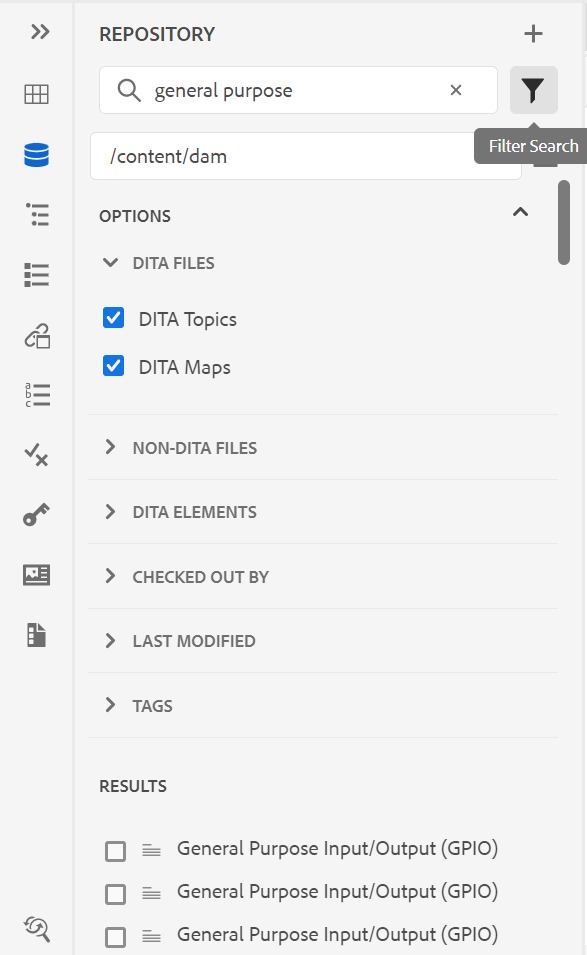

# 8月版Adobe Experience Manager指南as a Cloud Service

## 升级到8月版

升级您当前的Adobe Experience Manager指南as a Cloud Service(以后称为 *AEM指南as a Cloud Service*)设置：
1. 查看Cloud Services的Git代码，并切换到在与要升级的环境对应的Cloud Services管道中配置的分支。
1. 更新 `<dox.version>` 属性 `/dox/dox.installer/pom.xml` 文件中的“Cloud ServicesGit代码”到2022.8.167。
1. 提交更改并运行Cloud Services管道以升级到8月版AEM指南as a Cloud Service。

## 兼容性矩阵

本部分列出了AEM指南as a Cloud Service于2022年8月发布的软件应用程序所支持的兼容性矩阵。

### FrameMaker和FrameMaker Publishing Server

| FMPS | FrameMaker |
| --- | --- |
| 不兼容 | 2020更新4及更高版本 |
|  |  |

*从2020.2开始的FMPS版本支持在AEM中创建的基线和条件。

### 氧连接器

| AEM Guides as a Cloud Release | 氧连接器窗口 | 氧连接器Mac |
| --- | --- | --- |
| 2022.8.0 | 2.7.5 | 2.7.5 |
|  |  |  |

## 新增功能和增强功能

AEM指南as a Cloud Service在8月版中提供了许多增强功能和新增功能：

### 地图编辑器中的布局视图

现在，您可以在映射编辑器中查看DITA映射的完整布局。 打开地图进行编辑时，它会打开 **布局** 映射编辑器的视图。 在此视图中，您可以在树视图中查看映射层次结构，还可以在映射中组织或构建主题。

“布局”视图包含一个单独的工具栏，可帮助您对映射中存在的主题执行许多任务。
您可以在映射中插入主题引用、主题组、键定义。 您可以通过将地图中的主题向上、向下、左或右移动来重新组织它们。 您还可以拖放主题以在映射中移动它们。 地图编辑器还提供了用于锁定或解锁文件、检查版本历史记录以及执行版本标签管理的图标。

“布局”视图还提供 **查看选项** 显示或隐藏行号、显示或隐藏复选框，或显示映射中主题的文件名或标题。

您还可以根据对主题应用的条件过滤器查看主题。

除了组织映射文件中的主题之外，您还可以使用 **选项** 菜单中。 您还可以将主题或映射从存储库面板拖放到在映射编辑器中打开的映射。

右侧面板在映射编辑器的“布局”视图中显示内容属性和映射属性。 在“布局”视图中，将针对该主题显示为选定主题定义的内联属性。 例如，您可以快速找到将平台属性定义为 `IOS`.

现在，您还可以设置主题或映射的元数据信息。 您可以为所选主题或映射定义导航标题、链接文本、简短描述和关键词。

有关更多详细信息，请参阅 *布局视图* 部分中的“使用Adobe Experience Manager指南”as a Cloud Service。

### 编辑器设置中的内联属性

AEM指南现在允许配置 **内联属性** 由管理员从 **编辑器设置**. 您还可以添加新的内联属性，或从 **内联属性** 选项卡。
在布局视图中，将针对该主题显示为主题定义的配置内联属性。

### “存储库”视图中的其他过滤器

现在，存储库视图中的过滤器搜索功能变得更加强大。 两个新的搜索标准， **上次修改时间** 和 **标记** 已添加，用于筛选文件并缩小AEM存储库中的搜索范围：
* **上次修改时间**:您可以查找在选定日期之后但在选定日期之前最后修改的文件。 您还可以选择使用预定义标准，并查找过去2小时、上周、上月或去年内上次修改的文件。
* **标记**:您还可以查找已对其应用特定标记的文件。 您可以键入标记或从下拉列表中选择该标记。

## 修复的问题

下面列出了各个区域中修复的错误：

* /core/article-publish/src/main/java/com/adobe/dxml/article/publish/util/DoxUtils.java中使用已弃用的Lucene索引(9291)
* 更新的Node.js不用于发布。 (9835)
* DITA主题不会通过对 **属性** 页面。 (8745)
* 添加到DITA书签时，Frontmatter元素无法正确运行。 (9507)
* 本机PDF |在使用 **快速生成** 选择空元素时用于多个文件。 (9822)
* 本机PDF |附录作为PDF输出中的章节发布。 (9829)
* 本机PDF |编辑SVG图像时，该图像不会在页面布局中显示更新。 (9069)
* 当 `Nonbreaking Hyphen` 字符会使用 **插入特殊字符** 对话框。 (8919)
* 如果已编辑更新的图像，则XML编辑器不会在主题中显示这些图像。 (9500)
* 通过编辑器发布输出时，无法从 **输出** 选项卡。 (9100)
* DITA映射的子映射不会使用 **全选** 选项。 (9814)
* 无法从 **模板** 中的自定义映射模板。 (9846)
* 无法在映射或主题模板的子文件夹中创建新主题或映射模板。 (9888)
* 浏览映射或主题模板的子文件夹中存在的主题或映射时，不提供任何选项。 (9889)
* 当架构文件与DITA文件一起更新和保存时，右侧面板将不显示（如果DITA文件中断了架构文件中存在的验证）。 (9986)
* 如果新的重复输出预设的名称与现有预设相同，则可以创建该预设。 (9997)
* SVG图像已损坏，在生成HTML输出时无法正确发布。 (9949)

## 已知问题

Adobe已在2022年8月版的AEM指南中发现以下已知问题。

### 解决方法的已知问题

对于以下已知问题，请使用给定的解决方法：

* “布局”视图在“映射编辑器”中不可见。

   **解决方法**:更新文件夹配置文件中的ui_config.json 。

* Symbols.json被覆盖，因此出现问题8919。

   **解决方法**:更新的symbols.json必须与覆盖的symbols.json合并。

### 其他已知问题

* 如果在对存储库执行搜索时从显示的结果部分中选择了多个文件，然后在创作视图中拖放，则只会添加一个文件。
