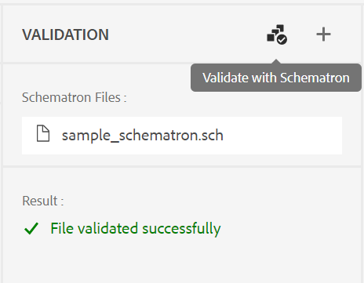
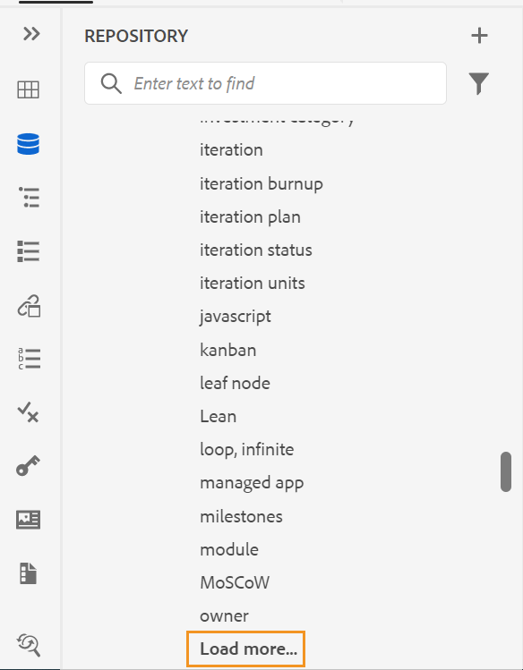
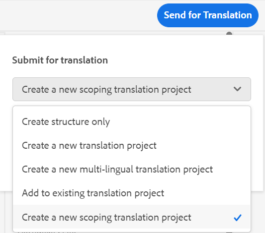
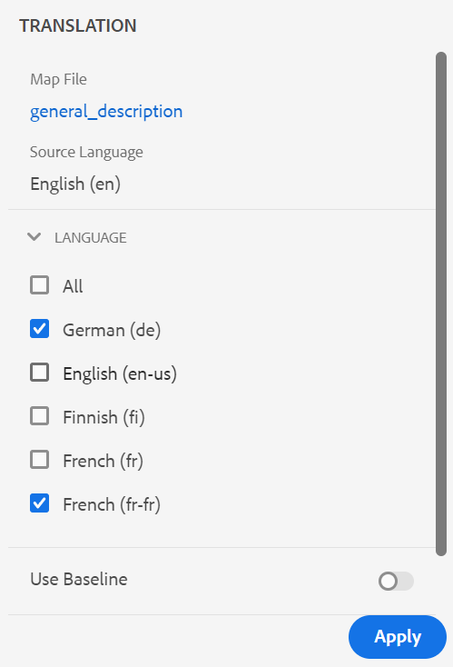

# 最新版本的Adobe Experience Manager指南

## 升级到最新版本

您可以轻松升级当前版本的Adobe Experience Manager指南(以后称为 *AEM指南*)升级到版本4.1。在继续升级到版本4.1的AEM指南之前，必须考虑以下几点：

* 如果您使用的是版本4.0.x，则可以直接升级到版本4.1。您需要先升级到版本4.0.x，然后再升级到版本4.1。
* 如果您使用的是版本3.8.5，则需要先升级到版本4.0.x，然后再升级到版本4.1。
* 如果您使用的是3.8.5之前的版本，请参阅产品特定安装指南中的升级部分。

有关详细信息，请参阅 [升级说明](https://helpx.adobe.com/content/dam/help/en/xml-documentation-solution/4-1/Adobe-Experience-Manager-Guides_Upgrade-Instructions_EN.pdf).

## 兼容性矩阵

本部分列出了AEM指南4.1版本支持的软件应用程序的兼容性矩阵。

### Adobe Experience Manager

**非UUID**
版本6.5 Service Pack 13、12、10或11

**UUID**
版本6.5 Service Pack 13、12、10或11

有关更多详细信息，请参阅安装和配置Adobe Experience Manager指南中的技术要求部分。

### FrameMaker和FrameMaker Publishing Server

| 发行版本 | FMPS 2020 | 2019年FMPS | Fm 2020 | Fm 2019 |
| --- | --- | --- | --- | --- |
| 4.1（非UUID） | 2020.2或更高版本* | 2019年 | 2020.3或更高版本 | 2019.8（最新更新） |
| 4.1(UUID) | 2020.2或更高版本* | 不兼容 | 2020.4或更高版本 | 不兼容 |
|  |  |  |  |

*从2020.2开始的FMPS版本支持在AEM中创建的基线和条件。

### 氧连接器

| 发行版本 | 氧连接器窗口 | 氧连接器Mac | 在氧气窗口中编辑 | 在Oxon Mac中编辑 |
| --- | --- | --- |--- |--- |
| 4.1（非UUID） | 2.0 | 2.0 | 1.6 | 1.6 |
| 4.1(UUID) | 2.7 | 2.7 | 2.3 | 2.3 |
|  |  |  |

## 新增功能和增强功能

AEM指南在最新版本中提供了许多增强功能和新增功能：

### 增强的Web编辑器

* **改进了键分辨率**

DITA内容键引用将一部分内容从一个主题插入到另一个主题中。 它使用键来查找内容。 需要解析与DITA主题关联的键引用。 选定的根映射具有最高的优先权来解析键引用。

现在，关键引用会根据根映射集按以下优先级顺序进行解析：

1. 用户首选项
2. “映射视图”面板
3. 文件夹配置文件

有关更多详细信息，请参阅 *解决键引用* 部分。

* **在左侧面板中添加自定义面板**

现在，您可以在Web编辑器的左侧面板中添加自定义面板。 您可以将自定义面板用于各种目的，例如提供帮助或对项目进行测试。 如果已配置自定义面板，则它也会显示在 **编辑器设置**. 您可以切换开关以显示或隐藏自定义面板。

* **能够更改DITA映射中主题的文档状态**

现在，您可以轻松地在DITA映射中更改所选主题的文档状态。 您还可以从 **更多选项** 菜单。

* **在预览模式下显示的版本信息**

Web编辑器可帮助您管理您的版本。 现在，您还可以在主题的预览模式下，在主题文件选项卡的右上角查看活动主题或DITA映射的版本。

* **改进了Web编辑器刷新行为**

现在，在Web编辑器中执行浏览器刷新操作时，可以使用以下增强功能：

* 现在，您在Web编辑器中编辑内容时，可以获得刷新浏览器的支持。 如果在打开一个或多个具有未保存更改的文件进行编辑时点击浏览器刷新图标，则系统会提示您保存文件或取消刷新操作。

* 即使刷新浏览器，左侧面板和右侧面板的视图也会保留。

* 活动主题或DITA映射在内容编辑区域中重新打开。

* **根据自定义模板创建映射**

现在，您可以获得创建自定义地图模板的强大功能。 您可以使用它们创建DITA映射，以及映射模板中引用的主题模板和映射模板。

您还可以从自定义映射模板中引用其他映射模板和主题模板。 引用的映射模板可以指各种映射模板、主题模板、主题、映射、图像、视频和其他资产。

自定义的映射模板可帮助您非常轻松地复制映射模板和整个引用的文件夹结构。 这些自定义模板对于创建和重新创建具有递归结构和引用的多个映射特别有用。

* **架构支持**
“架构”是指用于定义XML文件测试的基于规则的验证语言。 使用架构文件，您可以定义特定规则，然后验证DITA主题或映射的规则。 Web编辑器支持架构文件。 您可以导入架构文件，并在Web编辑器中对其进行编辑。 Web编辑器中的架构支持可帮助您根据一组规则验证文件，并维护各主题之间的一致性和正确性。

* **改进了文件关闭时的对话框**

AEM指南会在您尝试关闭在Web编辑器中打开的文件时提示您保存更改并解锁锁定的文件。 提示根据 **在关闭时要求签入** 和 **关闭时请求获取新版本** 由管理员配置的设置。

根据配置，您可以选择保存更改并创建文档的新版本。 或者，您也可以签入文件并保存对当前版本所做的更改。

有关更多详细信息，请参阅 *文件关闭和保存方案* 部分。* **插入关键词** 功能已得到改进。 现在，您可以更轻松地找到要插入的关键词，因为关键词按字母顺序列出。 您还可以通过在搜索框中键入搜索字符串来搜索关键词。

* **支持Markdown文档**
Markdown是一种轻量级标记语言，可帮助您向纯文本文档添加格式元素。 Web编辑器允许您将Markdown文档(.md)与DITA文档一起使用。 您可以在Web编辑器中轻松创作和预览Markdown文档，还可以通过DITA映射编辑器将其添加到映射文件中。  有关更多详细信息，请参阅 
*从Web编辑器创作Markdown文档* 章节。

* **能够配置默认标记视图**
如果用户从Web编辑器中启用“标记视图”，则即使在会话中也会保持启用状态。  这意味着您无需再次启用“标记视图”即可在以后访问该视图。 管理员可以在Web编辑器中配置“标记”视图的默认状态。 新用户会话的“标记视图”的默认值由ui_config.json文件中的tagsView属性决定。

* 现在，“存储库视图”文件会批量加载。 主文件或 `/content/dam folder` 列出。 但从下一级或辅助文件夹中，每次加载75个文件。 此批量加载非常有效，与加载文件夹中现有的所有文件相比，您可以更快地访问文件。

### 新建基线仪表板

AEM指南4.1版本提供了集成在Web编辑器中的基线功能。 现在，您可以从Web编辑器创建基线，并使用这些基线发布或翻译不同版本的主题。

**注意**:对于已升级的系统，请更新 **ui_config.json** 文件夹配置文件。

使用此功能可创建基线，基线中包含特定日期和时间提供的主题的特定版本。 此外，您还获得API支持，以使用为主题版本定义的标签来创建或更新基线。

您可以根据文件名或文件位置搜索文件。 您还可以过滤要在基线编辑窗口中显示的主题，并根据特定列对它们进行排序。

基线创建过程的性能已得到进一步改进。 创建基线的过程是异步的，因此在创建基线时，您可以在Web编辑器中继续编辑其他文件。 有关更多详细信息，请参阅 *从Web编辑器创建和管理基线* 中的“使用Adobe Experience Manager指南”。

注意：默认情况下，“映射”功能板上的“基线”选项卡处于隐藏状态。 您的管理员可以在映射功能板上启用“基线”选项卡。

* 要下载映射的API中的基线参数现在使用基线的标题来检索版本控制的内容。

### 改进了翻译流程

* **能够创建范围翻译项目**
如果您只需要为要翻译的项目创建范围，则可以选择 
**创建新的范围翻译项目**. 这不会发送要翻译的副本，并且文件的原始翻译状态会得到维护。

* 的 **语言** 列表显示语言文件夹及其语言代码。 例如，法语(fr)和德语(de)。

有关翻译的更多详细信息，请参阅 *从Web编辑器翻译文档* 章节。

### 增强的发布功能

* 您还可以访问 **发布功能板** 从“输出”选项卡中生成输出。 发布功能板中提供了所有活动发布任务的列表。

* 在映射仪表板中，您可以选择多个DITAVAL文件以生成条件化内容。 您可以通过添加或删除文件来维护文件顺序。 您还可以将鼠标悬停在文件名上，以查看存储文件的AEM存储库中的路径。

* 已为AEM网站输出的元数据遵循基线。 您还可以将基线版本的属性作为元数据进行处理。 如果未定义基线，则最新版本的属性将作为元数据进行处理。

* 的 **文件名** 和 **DITA-OT命令行参数** 已为HTML5、EPUB和自定义输出预设添加选项。 现在，您可以指定要保存输出的文件名。 您还可以指定希望DITA-OT在生成输出时处理的其他参数。

### 地图功能板

当您选择下载DITA映射时，请求将排入队列，当映射准备好下载时，您会收到通知。 您可以选择立即下载映射文件，或稍后从AEM通知收件箱中提供的链接下载。

### 其他功能增强

* AEM指南现在支持Oxon XML创作版本24.1。
* 要下载映射的API中的基线参数现在使用基线的标题来检索版本控制的内容。

### 已弃用功能

AEM指南不再支持为FrameMaker文档生成DITA输出格式。 此DITA选项也已从“映射”功能板的“输出预设”中删除。

## 修复的问题

下面列出了各个区域中修复的错误：

* 创作支持不可用作用于发布的基于文件路径的引用的替代。 (8076)
* DITA添加到包可阻止DAM重复资产检测。 (8417)
* 将文档从Oxo签入AEM后，文档中的日语内容将被问号(???)替换。 (9124)
* 在Ox中使用Web身份验证进行登录时，刷新签出的文件不起作用。 (9179)
* 在氧气中打开时，文件未签出。 (9192)
* 将文档从Oxo签入AEM后，文档中的日语内容将被问号(???)替换。 (9276)
* Web身份验证在氧气中不起作用。 (9296)
* 当文件已存在于AEM中且位于同一位置时，Oxon中重新上传失败。 (9328)
* 无法在AEM和本地系统之间强制同步内容的选项。 (9439)
* 对于使用 **插入可重用内容** 对话框。 (5826)
* 通过编辑器上传与现有文件同名的图像时，不显示确认对话框。 (6011)
* 字符托盘中不提供非中断空间。 (7523)
* 元素列表(Alt+Enter)在“深色/最暗”主题中显示为灰色。 (7913)
* 在从映射面板工具栏保存主题的修订版本时，版本未更新。 (8228)
* 即使在有效位置，xref也无法插入。 (8354)
* “getversionlabels”操作存在限制，无法提供预期的性能。 (8513)
* 在关闭当前未在编辑器中打开的锁定或编辑文件时，出现确认对话框问题。 (8692)
* 当用户ID为数字时，在文件夹配置文件中将用户添加为管理员时出错。 (8908)
* 即使在映射编辑器中打开DITA映射时，翻译面板也可见。 (9053)
* “翻译”面板中的语言代码不随语言一起显示。 (9108)
* 翻译和基线选项卡在“地图”功能板上显示一段时间。 (9146)
* 翻译完成后，将为已翻译资产创建其他版本。 (9310)
* 当目标语言代码包含五个字符(如 `fr_ca`. (9357)
* 如果创建的目标语言代码被指为 `fr-fr, `, `en-us`. (9527)
* 加载语言文件夹以外的DITA映射时，后端会记录异常。(9543)
* 无法使用编辑器中的自定义DITA模板创建DITA文件。 (7262)
* 通过FMPS发布UUID DITA映射时，DITA映射会丢失。 (7278)
* AEM指南在复制和粘贴资产时不会复制资产的非唯一属性。 (8241)
* 创建时，DITA映射文件名未转换为小写。 (8383)
* 分配新审核任务时，正在发送的电子邮件通知中不显示审核任务描述。 (8507)
* 下载映射API |在下载过程出错时，未清理临时文件夹。 (8523)
* `columnpreview.jsp` 依赖于SP。  (8543)
* 状态为“正在等待”或“正在执行”的输出作业不会在发布功能板中清除。  (8569)
* 在使用“生成”按钮生成报表时选取的默认图标，即使定义了图标属性也是如此。 (8573)
* 从3.8.X升级到4.0时，审核过程中出现问题。 (8788)
* 在Web编辑器的“审阅”面板中，如果用户名较长，则接受/拒绝的图标将不会显示清楚。 (8793)
* 删除主题并执行移动操作后，引用树会中断。 (8804)
* 用户定义的自定义DTD不优先于DITA-OT中嵌入的标准DITA DTD。 (9104)
* 在并排视图中，高亮显示的位置不正确。 (9305)
* 按引用使用脚注不会滚动到AEM网站输出中的脚注部分。 (9061)
* 脚注顺序在AEM Site输出中不正确。 (9327)
* 新创建的DITA资产始终由其他用户签出。 (9387)
* 创建新内容时始终会记录错误。 (9388)
* 审核任务创建过程中的第三个屏幕不显示术语表列表。 (4558)
* 从FrameMaker/Oxon Connector上传多个文件时分配的UUID引用不正确。 (8269)
* 在收件箱中重新分配审核任务时，不会发送电子邮件通知。 (8376)
* 无法将第二个管理员用户作为第一个管理员用户添加到文件夹。 (8430)
* **应用标签** “基线”选项卡上的对话框不在下拉菜单中显示标签。 (8455)
* 在主题中使用将图像作为参考的基线发布时，图像不会在输出中发布。 (8564)
* 如果存在大量剩余的输出历史记录节点，则输出清除功能会失败。 (8568)
* 在版本历史记录面板中，当前版本部分显示错误的时间戳并由信息修改。 (8765)
* 基线不会根据定义的标签进行更新。 (8799)
* 在“Ox”(使用 **在氧气中编辑** 按钮)。 (8918)
* 将文件从Oxon上传到AEM失败。 (9157)
* 如果内容被移动到其他文件夹，则下载基线映射不起作用。 (9331)
* 在AEM中还原某个版本后，Ox会检出一个不正确的主题版本。 (9411)
* 在“存储库”面板中搜索，当内容较大时，topicref浏览对话框将冻结屏幕。 (9432)
* 如果设置 **为已上传的文件创建新版本** 开启时，会在还原并保存任何冻结节点时创建一个新版本。 (9473)
* 还原文件版本时，资产UI中显示的时间戳差异不正确。 (9480)
* 文件在还原到任何版本时自动签出。 (9482)
* 即使从编辑器中签入文件，“锁定”图标也会显示在存储库视图中。  (5756)
* 无法使用Web编辑器的“创作”视图在书签中添加Frontmatter和Backmatter元素。 (7652)
* 预览模式不支持 `deliveryTarget` DITA中的条件处理属性。 (7685)
* 在XML编辑器中打开术语表主题时，AEM会强制保存该主题，即使它未被修改也是如此。 (8105)
* 使用UI将主体添加到映射时，会打开“插入引用”对话框。 (8212)
* 搜索特殊字符时重复使用内容面板崩溃 `[` 或 `*` .(8279)
* 在创作Glossentry时，Web编辑器将内容显示为注释。 (8384)
* XML编辑器删除代码块中的换行符。 (8522)
* 在源模式和创作模式之间切换会将主题标记为脏乱，并要求再次保存内容。(8524)
* 无法关闭已解锁的主题。 (8545)
* 在基于文章的发布预设中，不存在选择知识库路径的选项。 (8636)
* 使用“收藏夹”视图中的拖放将章节添加到书签时，缺少属性。 (8746)
* “插入关键词”对话框没有搜索功能，关键词未按排序顺序列出。 (9094)
* 在XML编辑器中执行搜索会导致页面冻结。 (9452)
* “输出”选项卡下的AEM预设中缺少站点。 (9567)
* SVG在XML编辑器的创作模式下无法正确呈现的图像。 (9426)
* 通过salesforce发布时，基线不被接受。 (8953)
* 无法从用户首选项设置中清除rootmap。 (8534)

