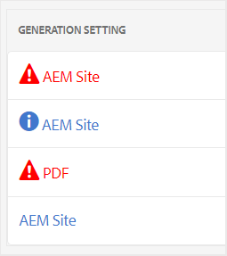
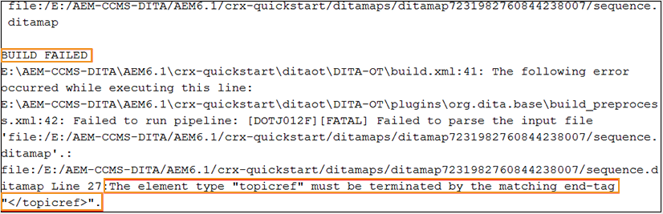

# 基本故障诊断 {#id1821I0Y0G0A}

使用AEM指南时，在发布或打开文档时可能会遇到错误。 此类错误可能位于DITA映射、主题或AEM指南进程本身中。 本节提供有关如何访问和解析输出生成日志文件中信息的信息。 此外，如果DITA主题过大，则可能会看到JSP编译错误。 本节还提供了有关如何解决JSP编译错误的信息。

## 查看并检查日志文件 {#id1822G0P0CHS}

执行以下步骤以查看和检查输出生成日志文件：

1. 启动输出生成过程后，单击 **输出** 在DITA映射控制台中。

   的 **常规** 列 **生成的输出** 显示用于提供有关输出生成成功或失败的可视提示的图标。

   {width="300" align="left"}

   在上述屏幕截图中，第一个和第三个图标显示失败的输出生成。 第二个图标显示成功的输出生成，但显示消息。 最后一个是成功生成输出，且没有任何消息。

1. 单击 **生成于** 列。

   日志文件将在新选项卡中打开。

   {width="800" align="left"}

1. 应用以下过滤器以突出显示日志文件中的文本：
   - 致命：突出显示日志文件中具有粉红色的致命错误。
   - 错误：以橙色突出显示日志文件中的错误。
   - 警告：以紫色突出显示日志文件中的警告。
   - 信息：以蓝色突出显示日志文件中的信息消息。
   - 例外：以黄色突出显示日志文件中的异常。
1. 使用向上和向下导航按钮跳转到日志文件中突出显示的文本。

   或者，滚动浏览日志文件并检查消息。

## 在文本编辑器中复制并检查日志文件

执行以下步骤，在文本编辑器中复制并检查输出生成日志文件：

1. 启动输出生成过程后，单击 **输出** 在DITA映射控制台中。

1. 单击 **生成于** 列。

   日志文件将在新选项卡中打开。

1. 单击 **复制日志** 按钮。 日志文件将复制到剪贴板。
1. 打开文本编辑器，并将日志文件粘贴到编辑器中。

1. 滚动浏览日志文件并检查消息。

   以下信息将帮助您确定DITA文件或AEM指南流程中是否存在错误：

   - *DITA映射文件相关错误*:如果在DITA映射文件或DITA映射中包含的任何其他文件中发现错误，则日志文件将包含字符串“生成失败”。 您可以检查日志文件中提供的信息，以找到错误文件并修复问题。

   在以下示例日志文件代码片段中，您可以看到 `BUILD FAILED` 消息以及错误的原因。

   {width="650" align="left"}

   - *AEM指南相关错误*:在日志文件中可以识别的另一种错误类型与AEM指南进程本身相关。 在这种情况下，DITA映射文件已成功解析，但输出生成过程因AEM指南中的某些内部错误而失败。 如果出现此类错误，您必须向技术支持团队寻求帮助。

   在以下示例日志文件代码片段中，您可以看到 `BUILD SUCCESSFUL` 消息，然后是其他技术错误。

   {width="650" align="left"}

## 解决JSP编译错误

如果您的DITA主题太大，则可能会看到JSP编译错误\(`org.apache.sling.api.request.TooManyCallsException`\)。 当您打开主题以进行编辑、审阅或发布时，可能会显示此错误。

请执行以下步骤以解决此问题：

1. 从全局导航中，选择工具，然后选择操作\> Web控制台。

   此时将显示Adobe Experience Manager Web控制台配置页面。

1. 搜索并单击 *Apache Sling主Servlet* 组件。

   将显示Apache Sling主Servlet的可配置选项。

1. 将 *每个请求的调用数* 参数。

**父主题：**[&#x200B;输出生成](generate-output.md)
