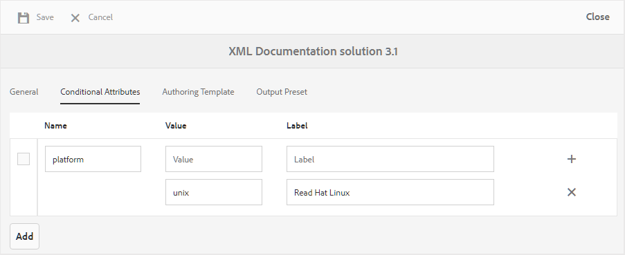

# 条件属性分析 {#id1843I0HN0Y4}

在企业级别，确保您拥有标准的标记系统非常重要。 标记或条件属性可以与存储库中的数字资产关联，这有助于根据所选条件发布输出。 例如，您可以为Windows和Mac内容创建条件属性。 然后，将这些属性添加到主题中的相关内容。 在发布内容时，您可以选择是要发布Windows还是仅发布Mac内容。

AEM指南允许您使用相关的DITA属性轻松创建和关联条件属性。 您可以在全局级别或文件夹级别定义条件属性。 全局定义的条件在所有项目中都可见，而特定于文件夹的条件仅在指定文件夹内创建的项目中可见。 内容作者可以使用这些条件属性对其DITA主题中的内容进行条件化处理，或对其创建或使用的映射进行条件化处理。 然后，发布者可以使用这些条件创建条件预设。 使用条件预设，发布者可以决定要在已发布的输出中包含和排除的条件。

>[!NOTE]
>
> 您可以在您有权访问的文件夹配置文件中创建或编辑条件属性。 如果您的系统管理员没有授予您访问文件夹配置文件的权限，则无法在文件夹配置文件中创建或编辑条件属性。

要定义条件属性，请执行以下步骤：

1. 单击顶部的Adobe Experience Manager链接，然后选择 **工具**.

1. 选择 **指南** 工具列表中。

1. 单击 **文件夹配置文件** 拼贴，然后选择“文件夹配置文件”。

   >[!NOTE]
   >
   > 您无法编辑全局配置文件。

1. 单击 **条件属性** 选项卡，单击 **编辑**.

   此时将显示条件属性表。

1. 单击 **添加**.

1. 输入 **名称**, **值**&#x200B;和 **标签** ，以访问该属性。

   您可以保存仅具有属性名称的配置文件。 但是，仅当属性具有指定的值时，才能使用该属性。 如果为属性指定 — 值和标签，Web编辑器仍将仅显示属性的值。 创建条件预设时，将向发布管理员显示标签。

   以下屏幕截图显示了 `platform` 值为 `unix` 和 `Red Hat Linux`.

   {width="800" align="left"}

1. 如果要为同一属性添加更多值，请单击 **+** 图标，然后输入其他值和标签。

1. 如果要添加更多属性，请单击 **添加**.

1. 单击 **保存** 以保存更改。

的 `platform` 属性存储在系统中。 每当作者决定使用 `platform` 属性，则文件夹中的DITA主题中的值将在Web编辑器的“属性”选项卡中显示。

{width="350" align="left"}

**父主题：**[&#x200B;输出生成](generate-output.md)
