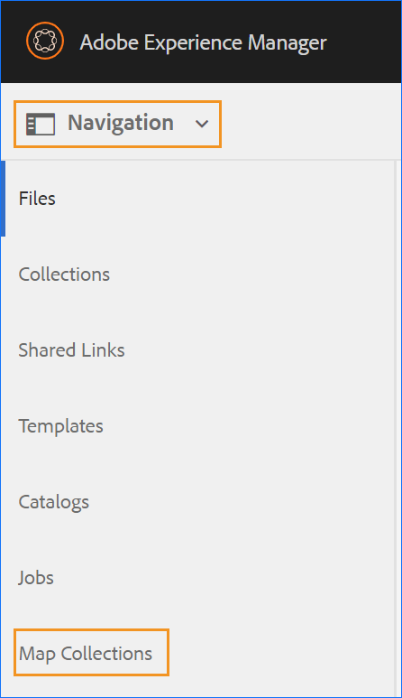

# 使用映射集合生成输出 {#id1723F20G0HS}

在任何组织中，一个产品都可以有多种类型的文档。 作为发布专家，您希望控制要为哪个文档生成什么输出。 此外，还应该有一种方法，只需单击一下即可批量发布多个文档。

AEM Guides让您能够使用名为映射收藏集的功能板来组织内容以供发布。 地图收藏集允许您在一个单元中组合所有不同类型的文档。 您可以选择要为地图收藏集中的每个文档生成的输出类型。 此外，您还可以从发布仪表板生成输出并查看输出生成进度。

通过映射收藏集，您可以选择查看自上次发布输出以来的任何映射中是否有任何更改。 您可以在映射集合的映射和预设选项卡中查看详细信息，然后根据需要重新发布输出。 有关更多信息，请参阅将地图添加到地图集合。

## 创建映射集合并添加DITA映射

要创建映射收藏集并将DITA映射添加到收藏集，请执行以下步骤：

1. 在Assets UI上，单击 **映射收藏集**.

   如果“映射收藏集”链接不可用，请选择 **导航** 选项，然后单击 **映射收藏集**.

   {width="350" align="left"}

1. 输入地图收藏集的标题。
1. 单击&#x200B;**创建**。

   创建地图集合时会显示一条成功消息。

1. 单击 **关闭** 在“Success（成功）”消息上。

   新创建的映射文件将显示在“映射收藏集”页面上。

1. 单击要编辑的收藏集拼贴中的灰色框。
1. 单击 **编辑** 然后单击 **添加映射**.
1. 找到并添加要添加到映射集合中的DITA映射。

   默认情况下，会自动添加与映射关联的所有预设和区域设置。

1. 通过打开或关闭滑动按钮选择所需的输出。
1. 单击&#x200B;**完成**。

   DITA映射文件将添加到映射集合中。

   {width="800" align="left"}

收藏集页面上会显示以下筛选选项和映射详细信息：

- **筛选条件：** 左边栏显示以下过滤器：
   - **修改时间**：您可以选择“是”或“否”。 如果选择“是”，则只有修改过的DITA映射将显示在“映射和预设”表中。
   - **预设**：选择要过滤掉映射文件的预设。 例如，如果您选择 *AEM站点* 则仅显示具有 *AEM站点* 已配置输出预设。
   - **语言**：您可以选择任何可用的语言代码，并在“映射和预设”表中仅显示选定的语言。
- **映射和预设** 表：“映射和预设”表显示以下各列的信息：
   - **映射**：显示DITA映射文件的标题。
   - **语言**：显示DITA映射的语言。
   - **预设**：显示映射文件上配置的输出预设类型。
   - **修改时间**：指示DITA映射是否在上次发布后更新。 根据此信息，您可以决定是否要重新发布此DITA map的输出。
   - **上次生成时间**：显示上次生成输出的日期和时间。

## 使用映射集合配置和生成输出

要使用“Map Collection（映射收集）”配置和生成输出，请执行以下步骤：

1. 打开映射收藏集。您可以查看各种输出预设，如AEM网站、PDF(包括本机PDF)、HTML5、EPUB和自定义预设。 您还可以查看管理员创建的全局配置文件预设和文件夹配置文件预设。

   此  图标表示文件夹配置文件级别预设。
1. \（可选\）根据您的要求执行以下任一操作：
   - 应用左边栏中的筛选器以筛选修改后的映射、输出预设或语言。
   - 如果需要，请单击 **编辑** 并通过打开或关闭滑动按钮来更改所需的输出。

     >[!NOTE]
     >  
     > 默认情况下，将禁用任何新预设。

   - 您可以选择 **启用/禁用所有文件夹配置文件预设** DITA map只需一次即可为其选择所有文件夹配置文件。

1. 执行下列操作之一：

   - 要生成所选映射的输出，请选择映射文件并单击 **生成选定项**.
   - 要生成所有DITA映射及其配置的预设的输出，请单击 **全部生成**.
   >[!IMPORTANT]
   >
   > 如果预设或DITA map的输出生成过程处于队列中或正在进行中，则无法为同一预设或映射启动另一个输出生成任务。

## 从映射集合中删除映射集合或DITA映射

- 要删除映射收藏集，请在“映射收藏集”页面中选择一个收藏集，然后单击 **删除**.
- 要从映射集合中删除DITA映射，请在编辑模式下打开映射集合，选择DITA映射文件，然后单击 **从收藏集中删除**.

  这还将从映射集合中删除与DITA映射关联的任何预设或区域设置。

## 从映射集合中取消输出生成任务

类似于从取消输出生成任务的方式 [DITA映射控制台](generate-output-for-a-dita-map.md#id2061H100T5Z) 或 [发布功能板](generate-output-publish-dashboard.md#)中，您可以从映射集合中取消输出生成任务。 访问映射集合的“输出”选项卡，转到要取消的发布任务，然后单击 **取消此作业** 图标以取消发布任务。

{width="800" align="left"}

**父主题：**[&#x200B;输出生成](generate-output.md)
