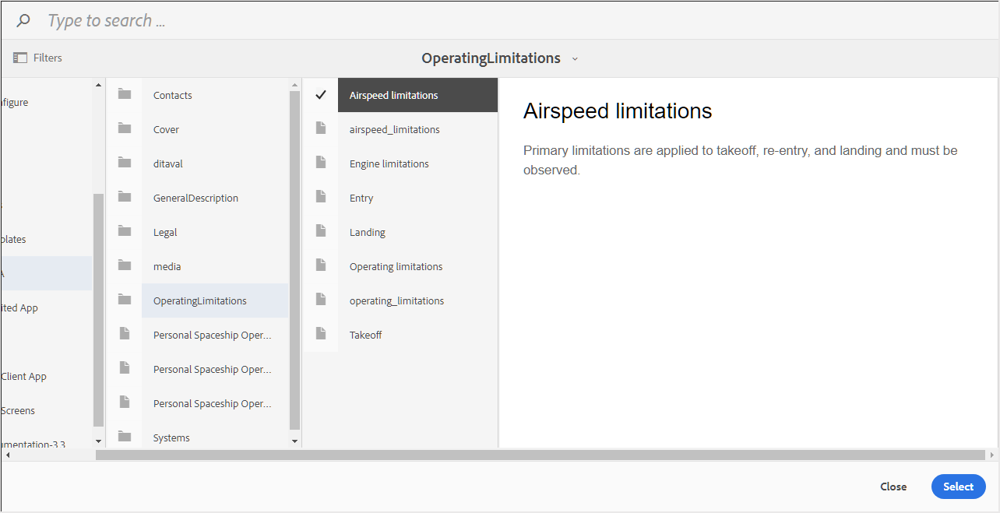
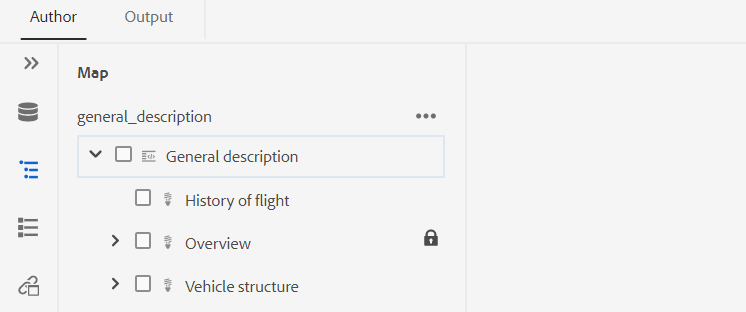
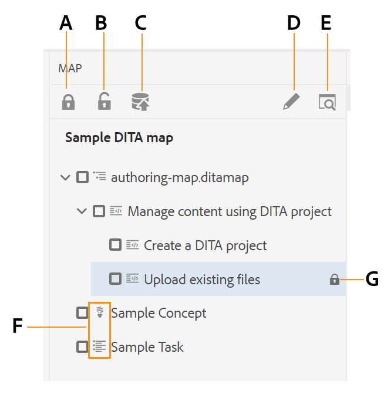
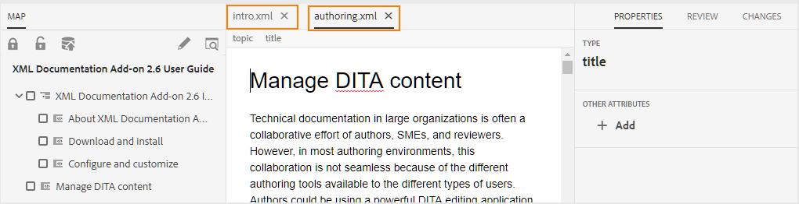

# 使用高级映射编辑器 {#id1942D0S0IHS}

高级映射编辑器提供了直观的用户界面，它类似于Web编辑器。 在Web编辑器中打开映射文件时，您可以选择使用高级映射编辑器界面编辑映射文件。 高级映射编辑器允许您添加主题引用、键引用、结构内容等。

除了直接从Web编辑器编辑映射文件之外，您还可以在映射中打开主题文件以编辑Web编辑器。 本主题将指导您逐步了解高级映射编辑器中的功能，以及如何在Web编辑器中打开和编辑DITA映射中的文件。

## 将主题添加到映射文件

执行以下步骤以使用高级映射编辑器构建映射文件：

1. 在资产UI中，导航到要编辑的映射文件。

   >[!NOTE]
   >
   > 确保尚未启用资产选择模式。

1. 要在映射文件上获得独占锁，请选择映射文件并单击 **结帐**.

   >[!NOTE]
   >
   > 一旦您对地图文件具有独占锁定，其他用户将无法编辑地图。 但是，他们将能够处理映射文件中的主题。 如果管理员已将Web编辑器配置为在编辑之前签出文件，则在签出文件之前，您将无法编辑该文件。 同样，如果已配置，则系统将要求您在关闭文件之前签入任何签出的文件

1. 选择映射文件后，单击 **编辑主题**.

   {width="800" align="left"}

   或者，您也可以选择 **编辑主题** 选项：

   {width="800" align="left"}

   此时会打开映射文件，以在Web编辑器中进行编辑。

1. 单击 **编辑** 图标。

   {width="550" align="left"}

   此时将在高级映射编辑器界面中打开映射。 如果已打开新的映射文件，则编辑器中只显示映射的标题。

   {width="800" align="left"}

   - **A** - \(*主工具栏*\):这类似于Web编辑器的主工具栏。 请参阅 [主工具栏](web-editor-features.md#id2051EA0G05Z) ，以了解更多详细信息。

   - **B** - \(*辅助工具栏*\)这是允许您处理映射文件的辅助工具栏。 有关通过辅助工具栏提供的功能的更多信息，请参阅 [高级映射编辑器工具栏中的可用功能](#id205DEC0005Z).

   - **C** - \(*地图视图*\):用于在布局、作者、源和预览之间切换映射编辑器。 的 **布局**&#x200B;利用视图，可组织DITA映射中的主题。 这会显示地图的树或层次视图。 的 **作者** 利用视图，可编辑映射编辑器中的主题。 这还可以显示WYSIWYG的地图文件视图。 的 **来源** 使用视图，可使用映射文件的基础XML。 预览为您提供映射文件中所有主题和子映射的统一视图。 的 **关闭** 链接会关闭映射文件。

   - **D** - \(*左面板*\):允许访问左侧面板，以访问“收藏夹”、“存储库”、“映射”、“大纲”和其他功能。 您可以通过单击展开侧栏图标\(\)。 有关左侧面板中可用功能的更多详细信息，请参阅 [左面板](web-editor-features.md#id2051EA0M0HS) 中。

   - **E** - \(*中间区域*\):映射内容编辑区域。

   - **F** - \(*右侧面板*\):授予对“属性”面板的访问权限。 您可以查看所选主题或映射的内容属性和映射属性。 有关此面板中可用功能的更多详细信息，请参阅 [右面板](web-editor-features.md#id2051EB003YK) 中。

1. 在左侧面板中，切换到 **存储库视图**.

1. 在AEM存储库中，导航到包含要添加的主题或子映射的文件夹。

1. 在 **存储库视图** 并将其拖放到\（中间\）映射内容编辑区域。

   该主题将添加到映射中。

   {width="800" align="left"}

1. 要添加后续主题或子映射，请将主题或子映射拖放到映射中的所需位置。

   构建映射文件时请考虑以下几点：

   - 文件会添加到地图编辑区域中水平条显示的位置。 在以下屏幕截图中， *概述* 主题将在 *常规描述* 和 *启动和登陆站点* 主题。

      {width="350" align="left"}

   - 要替换主题，请将主题放在要替换的主题的顶部、左侧或右侧。 主题左侧或右侧的垂直栏表示将替换为该主题上所放置的主题。

      {width="550" align="left"}

      但是，在替换主题之前，您会收到确认提示。 只有在您进行确认后，才会替换主题。

      {width="300" align="left"}

   - 如果将子映射添加到DITA映射，则子映射将在DITA映射中显示为链接。 要查看子映射的所有主题，请按住Crtl并单击子映射链接。 子映射的内容将显示在新选项卡中。 同样，要从DITA映射中打开一个主题，请按住Crtl并单击主题链接，该链接会在新选项卡中打开。

   - 您可以使用快捷键CTRL+Z和CTRL+Y或工具栏中相应的图标，撤消或重做映射中的任何更改。

   - 要更改主题的位置，请选择主题\（通过单击主题图标\），然后将其拖放到映射文件中的所需位置。 确保水平条在要放置主题的位置可见。 在以下屏幕截图中，主题 *启动和登陆站点* 在 *概述* 主题。

      {width="350" align="left"}

   - 要检查映射文件的属性，请右键单击映射编辑区域中的任意位置，然后选择 **属性** 中。 根据您的AEM版本，您可以看到诸如元数据、计划\(de\)激活、引用、文档状态等属性。

1. 单击“**保存**”。

## 高级映射编辑器工具栏中的可用功能 {#id205DEC0005Z}

高级映射编辑器中的工具栏与Web编辑器主题类似。 在这两个编辑器中，切换左侧面板、保存映射、创建映射的新版本、撤消/重做上一个操作以及删除选定元素等基本操作都是通用的。 有关这些操作如何工作的详细信息，请参阅 [了解Web编辑器功能](web-editor-features.md#) 中。

布局视图和作者视图的工具栏上还提供以下特定于地图的操作：

## 布局视图 {#id205DEC0005Z_layout_view}

当您打开地图进行编辑时，它会打开地图编辑器的布局视图。布局视图在树视图中显示地图层次结构，并允许您在地图中组织主题。

>[!NOTE]
>
> “布局”视图仅显示映射中存在的引用。 如果有任何参照被损坏，则在参照的左侧显示一个小的交叉符号

您可以在“布局”视图中执行以下任务：

**插入主题参考** - 

显示主题搜索对话框。 导航到要插入的主题/映射文件，然后单击选择以将其添加到映射中。
{width="800" align="left"}

**插入主题组** - 

插入 `topicgroup` 元素。 有关分组主题的更多信息，请参阅 [topicgroup](https://docs.oasis-open.org/dita/v1.0/langspec/topicgroup.html) 文档。

**插入键定义** - 

显示“插入键定义”对话框。 使用此对话框可定义要在映射中使用的任何键定义。

{width="300" align="left"}

**此项前插入/此项后插入** -  / 

显示插入元素对话框。 选择要插入映射中的元素。 根据操作，新元素会插入到映射中当前元素之前或之后。

**插入前件** - 

此图标在您打开书签进行编辑时显示。 您可以在书的开头插入组件，如目录、索引和表列表。

**插入回料** - 

此图标在您打开书签进行编辑时显示。 您可以为书的结尾插入组件，如索引、术语表和图表列表。

**左/右移动选定项目** -  / 

单击左箭头以在层次结构中将主题向左移动。 这实质上将层次结构中各个主题提升一级。 例如，在选择子主题时单击左箭头，可将其作为该主题上方的同级主题。 同样，如果单击右箭头，则主题会向右推，使其成为其上方主题的子主题。

**上下移动选定项目** - / 

单击向上或向下箭头图标的，以在层级中上下移动主题。

>[!NOTE]
>
> 您还可以拖放引用以在映射中移动它们。

**锁定/解锁** -  / 

获取映射文件上的锁并释放锁。 如果您的映射文件中存在未保存的更改，则在释放锁定时，系统会提示您保存映射文件。 更改将保存在映射文件的当前版本中。

**合并** - 

有关合并来自同一文件或其他文件不同版本的内容的更多详细信息，请参阅 [合并](web-editor-features.md#id205DF04E0HS) 中。

**版本历史记录** - 

检查活动主题上的可用版本和标签，并从编辑器本身还原到任何版本。

**版本标签** - 

显示版本标签管理对话框。 从下拉列表中选择一个版本。 选择要应用于所选版本的标签，然后单击 **添加标签** 来添加。

**查看选项** - 

显示一个下拉列表，其中提供了“显示行号”、“显示复选框”和“显示文件名”选项。

- **显示行号**

显示或隐藏每个主题的行号。 根据层次结构中的级别显示行号。

- **“显示”复选框**

显示或隐藏每个主题的复选框。 您可以使用此复选框选择主题并使用选项菜单执行各种任务。 有关更多详细信息，请参阅 [选项](#id228ID8006H8) 菜单。

- **显示文件名**

显示主题标题的文件名。

>[!NOTE]
>
> 将指针悬停在主题标题上时，将显示文件路径。

**根据条件过滤器查看主题**&#x200B;如果您对主题应用了任何条件，则该主题右侧会显示一个过滤器图标。 将指针悬停在过滤器图标上时，将显示应用的条件及其属性值。

**“布局”视图中的“选项”菜单**

除了组织映射文件中的主题之外，您还可以使用布局视图中某个元素可用的选项菜单执行以下操作：

{width="650" align="left"}

- **添加**:您可以选择从映射编辑器中添加新主题或空引用：
   - **空引用**:此选项允许您在DITA映射中添加空引用。 您以后可以双击插入的空引用，并添加主题详细信息。 有关更多详细信息，请参阅 [创建主题](web-editor-features.md#id228ICI0105U) 中。
   - **新主题**:选择从菜单创建新主题时，将显示“创建新主题”对话框。 在创建新主题对话框中，提供所需的详细信息，然后单击创建。 有关更多详细信息，请参阅 [创建主题](web-editor-features.md#id228ICI0105U) 中。
- **移动**:您可以选择在层次结构中向上/向下/向右/向左移动主题。您还可以将主题或映射从存储库面板拖放到在映射编辑器中打开的映射。
- **撤消**:撤消“布局”视图中的最后一个操作。
- **重做**:在“布局”视图中重做最后一个操作。
- **复制**:从映射文件复制所选引用。

   >[!NOTE]
   >
   > 您可以显示并选中复选框以复制多个引用。

- **粘贴**:将复制的引用粘贴到层次结构中的当前位置。
- **删除**:从映射文件中删除所选引用。

   >[!NOTE]
   >
   > 您可以显示，然后选中复选框以删除多个引用。

## 地图编辑器中的右侧面板

右侧面板在映射编辑器的“布局”视图中显示内容属性和映射属性。

**内容属性**

“内容属性”面板包含有关映射中当前选定主题的类型、其链接URL及其属性的信息。 有关更多详细信息，请参阅 [内容属性](web-editor-features.md#id228IDB00HMM) 中。

- **其他属性** 如果您的管理员为属性创建了配置文件，则您将获得这些属性及其配置的值。 使用“内容属性”面板，您可以选择这些属性，并将其分配给主题中的相关内容。 您还可以在 **显示属性** 选项卡。 为元素定义的属性显示在“布局”和“大纲”视图中。 这有助于您快速查看映射中定义了特定属性的所有主题。 例如，所有将平台属性定义为“Android”的主题。

   {width="650" align="left"}

   有关更多详细信息，请参阅 *显示属性* 在 *编辑器设置* 中的功能描述 [左面板](web-editor-features.md#id2051EA0M0HS) 中。

- **元数据** 使用元数据，您可以设置元数据信息。 您可以定义导航标题、链接文本、简短描述和关键词。

有关标准主题属性和元数据的更多信息，请参阅 [托皮切夫](https://docs.oasis-open.org/dita/v1.2/os/spec/langref/topicref.html) 文档。

**映射属性**

显示映射属性对话框，您可以在其中设置映射的属性和元数据信息。

## 创作视图 {#id205DEC0005Z_author_view}

的 **作者** 视图允许您在Web编辑器中编辑DITA映射。 这显示了地图编辑器的WYSIWYG视图，并且“创作”视图中显示的某些图标与“布局”视图相同。 有关更多详细信息，请参阅 [布局视图](#id205DEC0005Z_layout_view). 此外，您还可以从“创作”视图中看到以下图标并执行相关任务：

**此项前插入/此项后插入** -  / 

显示插入元素对话框。 选择要插入映射中的元素。 根据操作，新元素会插入到映射中当前元素之前或之后。

**插入元素** - 

显示插入元素对话框。 选择要插入的元素。 您可以使用键盘滚动浏览元素列表，然后按Enter键插入所需的元素。 或者，您也可以直接单击元素以将其插入映射中。

**插入关系表** - 

在映射中插入关系表。 由于使用关系表的概念与基本映射编辑器部分中所述的相同，请参阅 [在基本地图编辑器中使用关系表](map-editor-basic-map-editor.md#id1944B0I0COB) 以了解更多详细信息。

**插入可重用内容** - 

显示“重复使用内容”对话框。 使用此对话框插入要在映射中重复使用的内容。

**刷新导航标题属性** - 

同步 `title` 映射中引用文件的元素，其值在 `@navtitle` 属性。 您可以在映射中添加不同类型的引用文件，例如主题、引用、任务、\（子\）映射等。 这些文件中的大多数都支持 `@navtitle` 属性。 如果文件包含 `@navtitle` 属性，然后 `@navtitle` 映射中同一文件的属性会更新。 如果 `@navtitle` 属性不存在，则 `@navtitle` 属性添加到该引用文件及其 `title` 也会更新以显示 `@navtitle`.

>[!NOTE]
>
> 您的管理员可以配置自动添加 `@navtitle` 属性添加到映射中的每个引用文件。 有关配置自动添加的更多详细信息 `@navtitle` 属性，请参阅 *默认包@navtitle属性* ，以安装和配置Adobe Experience Manager指南as a Cloud Service。

单击刷新导航标题属性图标可同步 `title` 元素和 `@navtitle` 属性的值。

**切换标记视图** - 

显示或隐藏XML标记。 标记用作指示元素边界的视觉提示。 在此模式下，如果要插入主题/映射引用，请在标记之前或之后拖放所需的文件。 “标记”视图模式下不显示水平条。

**启用/禁用跟踪更改** - 

您可以通过启用“跟踪更改”模式来跟踪映射文件中所做的所有更新。 启用跟踪更改后，将在文档中捕获所有插入和删除内容。 有关更多详细信息，请参阅 [启用/禁用跟踪更改](web-editor-features.md#id205DF0203Y4) 中。

**创建审核任务** - 

您可以直接从Web编辑器创建当前主题的审阅任务或映射文件。 打开要为其创建审阅任务的文件，然后单击创建审阅任务以启动审阅创建过程。 按照 [查看主题或映射](review.md#) 以了解更多详细信息。

## 通过DITA映射编辑主题 {#id17ACJ0F0FHS}

编辑单个主题不会为作者提供完整的上下文。 作者将没有关于主题在DITA映射中的位置的信息。 如果没有这些上下文信息，作者创建内容会变得有些困难。

AEM指南允许作者在Web编辑器中打开DITA映射，并查看主题在映射中的放置位置。 这有助于作者了解主题在映射中的确切位置，并创建更相关的内容。 此外，如果有多个作者在一个项目上工作，则他们可以知道地图中提供的所有主题以及根据需要重复使用的内容。

要通过DITA映射编辑主题，请执行以下步骤：

1. 在资产UI中，导航到包含要编辑的主题的DITA映射。
1. 单击DITA映射以在DITA映射控制台中将其打开。
1. 选择 **主题** 选项卡，查看DITA映射中可用的主题列表。

   >[!TIP]
   >
   > “主题”(Topics)选项卡提供了下载映射文件及其依赖项的选项。 有关更多详细信息，请参阅 [导出DITA映射文件](authoring-download-assets.md#id218UBA00IXA).

1. 在主工具栏中，单击 **编辑主题**.

   DITA映射在Web编辑器中打开。

   >[!NOTE]
   >
   > 您还可以在资产UI中选择DITA映射文件，然后单击 **编辑主题** 在主工具栏中启动Web编辑器。

   {width="350" align="left"}

1. \(*可选*\)您还可以在编辑之前从映射中选择主题并签出文件。 要签出文件，请从左窗格中选择一个或多个文件，然后单击 **结帐**. 您还可以通过选择检出的文件并单击 **取消签出和解锁** 图标。

   >[!IMPORTANT]
   >
   > 如果您的管理员已配置 **禁用编辑而不结帐** 选项，则必须先签出文件，然后才能进行编辑。 如果不签出文件，则文档将在编辑器中以只读模式打开。

   以下屏幕截图突出显示了以下图标：“签出”和“锁定”\(A\)、“取消签出”和“解锁”\(B\)、“另存为新版本和解锁”\(C\)、“编辑”\(D\)、“预览”\(E\)、显示不同DITA文件类型\(F\)的不同图标，以及签出的文件\(G\)。

   {width="550" align="left"}

1. 单击任意主题链接可在Web编辑器中将其打开以进行编辑。

   您可以在编辑器中打开多个主题，每个主题都会在编辑器的新选项卡中打开。 即使DITA映射包含子映射，子映射中的主题也会在新选项卡中打开以进行编辑。 如果要查看子映射下的主题，可以单击并展开子映射。

   {width="800" align="left"}

   如果单击映射文件，则会在Web浏览器的新选项卡中打开该映射。

1. 编辑完主题后，可以执行以下操作：

   - 您可以单独保存它们。 如果单击 **关闭而不保存** 您的主题将看到一个对话框，提示您保存未保存的主题：

      {width="550" align="left"}

      您可以选择保存所有选定的主题或取消选择您不希望保存的主题。

   - 您可以使用 **另存为新版本并解锁** 按钮。 保存主题的修订版本时，将创建一个新修订版本，并且锁也会释放。
   - 如果管理员已启用关闭时签入文件的选项，则在关闭签出的文件时，系统会提示您保存文件。 启用此选项后，当您使用更改的文件关闭编辑器时，将显示需要保存的已签出文件的列表。 签出的文件会显示一个锁图标：

      {width="550" align="left"}

      - 单击 **关闭而不保存** 按钮关闭文件而不保存任何更改。

      - 单击 **保存** 按钮会保存更改，但不会签入文件。

      - 选择 **检查文件** ，然后单击 **保存** 按钮会检查文件\（创建另一个版本\），并保存文件。

## 预览地图

除了能够在地图中查看每个主题文件的位置之外，还希望在一个连续的流程中查看地图内容。 “预览映射”功能允许您一键查看映射文件的整个内容。 您无需生成映射文件的输出，即可查看发布后整个映射的外观。 您只需访问地图的预览，所有主题和子地图都以书的形式呈现。

您可以从以下位置访问地图的预览：

- **资产UI**:在资产UI中，导航到映射位置，选择映射文件，然后选择 **预览图** 中。 地图的预览将显示在新选项卡中。 您可以在预览模式下查看所有主题的内容。 在此视图中，无法编辑任何主题。

   >[!NOTE]
   >
   > 如果 *预览图* 选项在主工具栏中不可见，它可能已移动到 **更多** 工具栏菜单。

- **高级映射编辑器**:在高级映射编辑器中，单击预览图标以查看当前映射的预览。

   {width="350" align="left"}

   您可以在预览模式下执行以下其他任务：

   - 右键单击主题，然后选择 **编辑** 以在新选项卡中打开要编辑的主题。

      >[!NOTE]
      >
      > 如果您没有编辑权限，则主题将以只读模式打开。

   - 通过单击映射树\中的主题标题跳转到所需的主题（在左侧面板中）。

   - 地图预览中的当前主题也会在地图树中突出显示。

**父主题：**[&#x200B;使用地图编辑器](map-editor.md)
