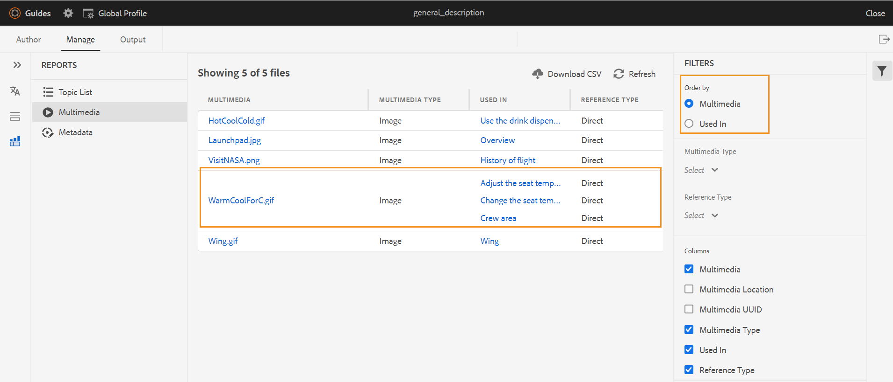

# Web编辑器中的DITA映射报表 {#id231HF0Z0NXA}

AEM Guides在Web编辑器中提供的一项功能使您能够检查引用的整体完整性并为其生成报告。

您可以查看主题列表，管理所有引用的元数据，以及从查看当前映射的多媒体列表 **报告** 选项卡。

## 从“主题列表”视图中生成CSV

此 **主题列表** 视图提供有关您的主题的详细信息，如引用类型、文档状态和作者。

可通过执行以下步骤来创建主题报告：

1. 在 **存储库** 面板中，在映射视图中打开DITA映射文件。
1. 单击 **管理** 选项卡。
1. 双击 **主题列表** 左边。 此时将显示DITA映射中存在的主题列表。

   {width="800" align="left"}

1. 从 **筛选器** 面板您可以根据 **引用类型** \（直接或间接\）， **文档状态** \(您主题的当前状态。 例如，如果您的主题处于“编辑”、“正在审阅”或“已审阅”状态，则会列出这些主题\)或 **作者** 主题的。

1. 您还可以使用以下主题过滤选项来选择在列表中显示以下列：

   - **主题** 主题的标题在DITA映射中指定。 您可以单击该主题进行编辑。
   - **文件名** 文件的名称。
   - **UUID** 文件的通用唯一标识符\(UUID\)。
   - **文件位置** 主题的完整路径。
   - **引用类型** 引用类型 — 直接或间接引用。
   - **文档状态** 主题的当前状态。
   - **作者** 最后处理该主题的用户。
   - **父映射** 直接引用主题的所有映射的列表。

   >[!NOTE]
   >
   > 单击 **刷新** 获取新的主题列表，并查看映射文件中的任何更改或主题文件中的任何引用是否已更新。

1. 单击 **下载CSV** 下载DITA映射中主题的当前快照。 CSV包含选定的列以及在中过滤的主题 **主题列表** 视图。 然后，您可以使用任何CSV编辑器打开此主题列表CSV文件。

**从元数据报表批量管理元数据**

AEM Guides允许您从Web编辑器标记DITA内容。 可以在单个主题中应用标记，也可以使用批量标记功能在多个主题、DITA映射或子映射中应用多个标记。 您也可以将所有选定主题的文档状态更改为下一个可能的公用文档状态。

## 查看元数据

要在当前DITA map中查看引用的元数据，请执行以下步骤：

1. 在“存储库”面板中，在映射视图中打开DITA映射文件。
1. 单击 **管理** 选项卡。
1. 双击 **元数据** 左边。 将显示DITA映射中所有引用的元数据列表。 这也包括媒体引用。

   {width="800" align="left"}

1. 从 **筛选器** 面板您可以根据 **文档状态** \(您主题的当前状态。 例如，如果您的主题处于“编辑”、“正在审阅”或“已审阅”状态，则会列出这些主题\)， **引用** \（直接或间接\）， **文件类型** \（映射、主题和图像\）引用。
1. 您也可以选择仅查看 **没有标记的文件** 或者也可以从以下位置选择特定标记 **标记** 筛选以查看与其关联的文件。
   1. 您还可以使用以下主题筛选选项来选择在元数据列表中显示以下列：
      - **标题** \（默认选中\）在DITA映射中指定引用文件的标题。 您可以单击该文件进行编辑。您还可以在Web编辑器中单击并播放音频或视频文件。 您可以更改视频的音量或视图。 在快捷菜单中，您还可以选择下载、更改播放速度或查看画中画。

         >[!NOTE]
         >
         > 签出文件的标题旁边还会显示一个签出图标。 您可以将鼠标悬停在图标上以查看用户的名称。

      - **文件名** 文件的名称。
      - **文件位置** 文件的完整路径。
      - **标记** \（默认选中\）应用于文件的标记。

         >[!NOTE]
         >
         > 默认情况下，您可以查看文件的两个标记。 要查看更多标记，请单击 **显示更多**. 单击 **显示更少** 再次对名单进行合同。

      - **引用类型** 引用类型 — 直接或间接引用
      - **文档状态** \（默认选中\）引用文件的当前状态。
      - **文件类型** \（默认选中\）源文件的类型。 可用的选项有“映射”、“主题”和“图像”。
      - **签出者** 已签出文件的用户。
1. 单击 **下载CSV** 下载DITA映射中引用的当前快照。 CSV包含所选列和在“主题列表”视图中过滤的引用。 然后，您可以使用任何CSV编辑器打开此元数据CSV文件。

**更新元数据**

1. 要更新元数据，请选择要更新的文件。

   >[!NOTE]
   >
   > 您不能选择任何签出文件。 签出文件的标题旁边还会显示一个签出图标。 您可以将鼠标悬停在图标上以查看用户的名称。

1. 选择 **管理** 从头开始。

   {width="350" align="left"}

1. 如果要添加任何新标记，请从下拉列表中选择新标记，以将其应用于所有选定的主题。 您还可以通过单击标记附近的交叉图标来删除任何标记。

   >[!NOTE]
   >
   > 将列出应用于所有选定主题的常见标记。

1. 如果要更改所有选定参照的文档状态，请选择新文档状态。 下拉菜单显示所有选定主题的常见可能状态。 例如，如果主题的当前状态为“正在审阅”，则可以查看“草稿”、“已批准”或“已审阅”状态。
1. 单击 **更新** 以更新元数据。 无论元数据更新成功还是更新失败，都会显示元数据确认消息。 您还可以单击 **下载报告** 以从确认对话框下载元数据CSV。 此CSV包含所选引用的更新状态的详细信息。

## 生成多媒体报告

此 **多媒体**&#x200B;报告提供地图中使用的多媒体的详细信息，如标题、类型\（音频、视频和图像\）、使用多媒体的文件以及使用多媒体的文件的引用类型。 您还可以查看多媒体在存储库中的UUID和位置。 您可以执行以下步骤来创建多媒体的报告：

1. 在 **存储库** 面板中，在映射视图中打开DITA映射文件。
1. 单击 **管理** 选项卡。
1. 双击 **多媒体** 左边。 显示DITA映射中存在的多媒体列表。
1. 从 **筛选器** 面板可以按多媒体或引用中使用的名称对列表进行排序。

   - 订购方式 **多媒体**，多媒体的****name显示在第一列中，然后使用它们的所有引用的名称显示在同一行的另一列中。 例如，以下屏幕截图显示多媒体WarmCoolForC.gif在第一列以及使用该多媒体的三个引用显示在同一行的第三列中。

      {width="650" align="left"}

   - 如果您按以下方式订购 **使用位置** 列中，您将查看变换视图，其中已使用多媒体的参照名称列在第一列中，而多媒体名称列在单独行上的另一列中。 例如，下面的屏幕截图显示了第一列中三个参考\（调整座椅温度、更改座椅温度显示器和机组区域\）的名称，多媒体WarmCoolForC.gif显示在第三列中的三个单独行中。

      {width="650" align="left"}

1. 您可以根据以下条件筛选多媒体： **多媒体类型**、和 **引用类型**. 根据您在下拉列表中的选择，显示多媒体文件列表。 例如，您可以选择在DITA map中仅显示音频引用，而文件只显示其中使用的音频引用。

   >[!NOTE]
   >
   > 根据地图中使用的多媒体类型，图像、视频和音频会列在 **多媒体类型** 下拉列表以及“直接或间接”均列在 **引用类型** 下拉菜单。

1. 您还可以使用以下筛选选项来选择在列表中显示以下列：

   - **多媒体** \（默认选中\）多媒体的标题在DITA映射中指定。 您可以单击多媒体进行编辑。
   - **多媒体位置** 多媒体的完整路径。
   - **多媒体UUID** 文件的通用唯一标识符\(UUID\)。
   - **多媒体类型** \（默认选中\）多媒体的类型。 可用的选项包括音频、视频或图像。
   - **使用位置** \（默认选中\）已使用多媒体的引用。 可单击参照对其进行编辑。
   - **引用类型** \（默认选中\）引用类型 — 直接或间接引用。

   >[!NOTE]
   >
   > 单击 **刷新** 获取新的多媒体列表，并查看映射文件中的任何更改或DITA映射中的任何多媒体已更新。

1. 您还可以在Web编辑器中单击并播放音频或视频文件。 您可以更改视频的音量或视图。 在快捷菜单中，您还可以选择下载、更改播放速度或查看画中画。

   {width="800" align="left"}

1. 单击 **下载CSV** 在DITA map中下载多媒体的当前快照。 CSV包含选定的列以及在中过滤的多媒体 **多媒体** 视图。 然后，您可以使用任何CSV编辑器打开此多媒体CSV文件。

## 查看和修复断开的链接{#report-broken-links}

此 **断开的链接** 是一个有用的报表，可为您提供当前映射中存在的断开链接的详细信息。 您可以查看断开的链接，这些链接可用于DITA主题、多媒体文件引用、内容密钥引用等。 你还能自己修复它们。
报告提供了详细信息，例如断开的链接、链接类型、引用中的文件以及引用中使用的文件类型。
您可以通过执行以下步骤来查看断开链接报表：
1. 在 **存储库** 面板中，在映射视图中打开DITA映射文件。
1. 单击 **管理** 选项卡。
1. 双击 **断开的链接** 左边。 将显示DITA映射中存在的断开链接或引用列表。
1. 从 **筛选器** 面板可以按链接或引用中使用的名称对列表进行排序。

    — 订购方式 **断开的链接**，断开链接的路径会显示在第一列中，而在其中使用这些链接的所有引用的名称会显示在单独行上的另一列中。 如果在多个文件中使用了相同的断开链接，则它们会显示在一行中，并显示为分组行或子行。 例如，以下屏幕截图显示了第一列和引用中的三个断开链接， `TestMap.ditamap` 显示在第三列的三个单独的行中。
   {width="800" align="left"}

    — 如果您按以下方式订购 **使用位置** 列中，您将查看变换视图，其中已使用断开链接的参照名称列在第一列中，而断开链接列在同一行的另一列中。 例如，以下屏幕截图显示了引用（其中使用断开的链接） `TestMap.ditamap` 和断开的链接显示在同一行的第三列中。
   {width="800" align="left"}
1. 您可以根据以下内容筛选断开的链接： **文件类型** 和 **链接类型**. 系统会根据您在下拉列表中的选择显示断开的链接列表。 例如，您可以选择在DITA map中仅显示内容引用，而文件只显示其中使用的内容引用。

   根据映射中使用的引用类型，文件中列出了“文件引用”、“键引用”、“内容引用”、“内容键引用”、“图像引用”和“多媒体文件引用” **链接类型** 下拉列表，和 **DITA主题** 或 **DITA映射** 列于 **文件类型** 下拉菜单。
1. 您还可以使用以下筛选选项来选择在列表中显示以下列：

   - **断开的链接** （默认选中）断开链接的路径在DITA映射中指定。

   - **链接类型** （默认选中）链接的类型。 可用选项有“内容键引用”、“内容引用”、“DITA主题”、“文件引用”、“图像引用”、“键引用”和“多媒体文件引用”。

   - **使用位置** （默认选中）已使用断开链接的引用。 您可以单击引用以在创作模式下查看它。

   - **文件类型** （默认选中）引用类型 — DITA映射或DITA主题。
单击 **刷新** 以获取断开链接的新列表，并查看映射文件中的任何更改或DITA映射中的任何断开链接是否已更新。
1. 您可以单击 **修复链接** 图标()以修复断开的链接。

   >[!NOTE]
   >
   > 将鼠标悬停在“断开链接”列下的断开链接路径上，以查看修复链接()图标。

   您可以修复两个视图中的链接 — 在您排序时，排序依据 **断开的链接** 或 **使用位置**.

   >[!NOTE]
   >
   > 如果在按断开链接排序时修复断开的链接，则该链接将在使用该链接的所有文件（这些文件被分组在一行中）中修复。

1. 您需要更新中所需的参考详细信息 **更新链接** 对话框。 中所需的详细信息 **更新链接** 对话框将取决于引用的类型。\
   修复链接后，该链接不会显示在断开链接列表下。 相反，您可以在主题列表或元数据下查看它。

1. 单击 **下载CSV** 下载DITA映射中断开链接的当前快照。 CSV包含在“断开链接”视图中过滤的选定列和断开链接。 然后，您可以在任何CSV编辑器中打开并查看此CSV文件。

**父主题：**[&#x200B;报告](reports-intro.md)
