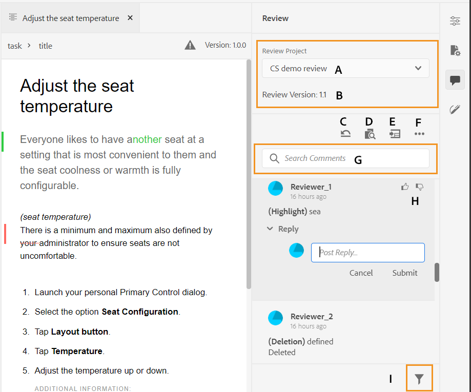

# 地址审阅注释 {#id2056B0X0KBI}

作为作者，您可以使用Web编辑器处理主题中的注释。 以下各节介绍了在Web编辑器中编辑注释的方法。

作者可以从Web编辑器处理文档中的注释。 提供了可视指示器，指示是插入了\(text\)、删除了还是突出显示的注释。 每个评论条目的顶部还提到评论类型。

>[!NOTE]
>
> 在处理审阅注释\（对于活动审阅文档\）时，请确保您 — 不要在启用了完整标记视图的多个选项卡中打开审阅中的主题，不要在“创作”和“源”视图模式之间切换。

在Web编辑器模式下，右侧面板包含“审阅”和“跟踪的更改”图标。 “审阅”面板显示审阅人在文档中所做的所有注释。 “跟踪的更改”面板显示文档中所有插入和删除的注释的状态。

- **A**:选择审核项目以查看审核注释。 如果已共享主题以供在多个审核任务中进行审核，则您将看到此下拉列表中列出的这些任务。

   从列表中选择审阅任务时，您将看到审阅人在该任务中的注释。 您可以在任务中独立地处理审阅注释，这意味着注释的任何更新仅对相应任务的审阅人可见。

- **B:** 每个 **审核项目** 在文档的特定版本上创建。 的 **审阅版本** 显示与选定审阅项目关联的版本。 这有助于您跟踪已共享以供审阅的版本。

- **C**:如果在启动审阅后更新了主题，则单击将主题还原到审阅版本图标会将工作副本还原到共享以供审阅的版本。 这样，您就可以更轻松地将审阅反馈直接纳入共享以供审阅的版本中。 合并反馈后，您可以在还原版本中保存更改或创建主题的新修订版本。 如果选择创建主题的新修订版本，则会从共享以供审阅的主题版本创建新分支。 例如，如果您共享了版本 `1.2` 的主题，但当前创作版本为 `1.3`，则可以使用此图标切换回版本 `1.2` 以纳入审核意见。 如果选择在将更改纳入到版本后创建新修订版本 `1.2`，则为具有版本的新分支 `1.2.0` 为主题创建。

   通常，在合并审阅反馈后，您会希望合并来自主题最新版本的更改。 为此，请使用 [合并](web-editor-features.md#id205DF04E0HS) 功能获取在共享主题以供审阅后进行的所有更新。

- **D**:打开并排视图，以显示主题的注释版本。 如上面的屏幕截图所示，最左侧部分是主题的最新版本，您可以在该版本中进行更改。 下一部分是主题的注释版本。 在主题中的注释之间导航时，侧视图会发生更改并显示在其中发表了注释的主题的该版本。 注释面板中的每个注释都链接到此部分中的相应文本。 它有助于您识别已评论的文本。 注释按文档中注释文本的顺序显示。

   您可以在侧视图顶部查看版本号。 再次单击此图标会隐藏主题的注释版本。

- E:直接在主题中导入插入和删除的\（或删除的\）注释。 单击“导入”图标后，所有文本插入和删除内容都会显示在主题的工作副本中。 现在，有两种方法可以接受或拒绝评论。

   如果要一次合并建议的更改\（插入或删除\），只需右键单击内容中的注释，然后选择“接受更改”或“拒绝更改”。 根据您的选择，将接受或拒绝该评论。 接受评论的，在内容中添加内容；如果被拒绝，则从内容中删除。 此外，评论的状态会在“审阅”面板中发生更改。

   

   您还可以使用右侧面板中的审阅功能接受或拒绝注释。 单击任何注释会突出显示文档中的注释。

   

   >[!IMPORTANT]
   >
   > 导入注释功能仅适用于共享以供审阅后未更改的文档。 如果在发送文档以供审阅后进行了任何更改，您将收到 **强制导入** 注释到文档中。 但是，这样做将导致您在文档中所做的所有更新丢失。 的 **强制导入** 如果文档是在外部创建并共享以供审阅，则也会显示警报。 您可以继续并导入评论。

   当您接受或拒绝某个评论时，该评论会从“跟踪的更改”列表中删除。 这也是文件中需要处理多少评论的指标。

- **F**:从“更多选项”菜单中，下载审阅主题中可用的所有附件。
- **G**:在注释中搜索文本。
- **H**:接受或拒绝评论。

- **我**:对注释应用过滤器。 您可以根据审阅类型\（全部、高亮显示、删除、插入或附注\）、审阅状态\（全部、已接受、拒绝或无\）、审阅人\(全部或特定审阅人\\(s\)\)或主题版本来筛选注释。

**父主题：**[&#x200B;查看主题或映射](review.md)

