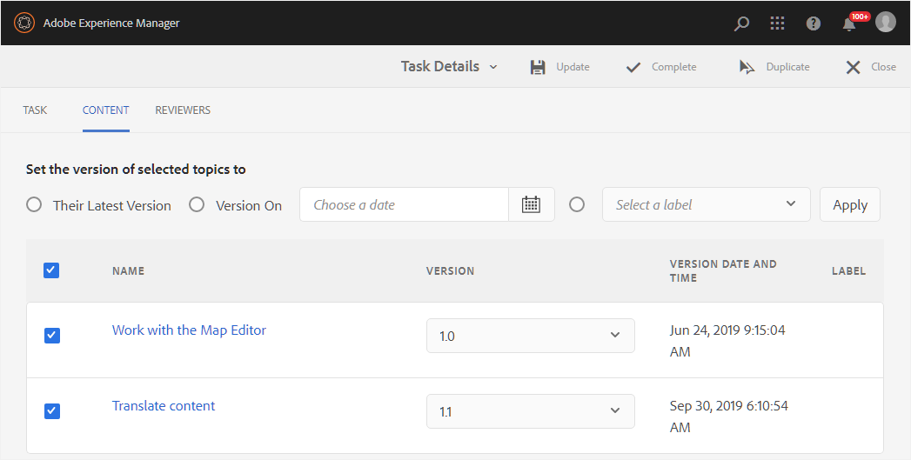

# 使用审阅仪表板管理审阅任务 {#id2056B0Y70X4}

审核管理工作流程可以包括各种任务。 例如，您可能希望为特定主题添加审阅人或延长审阅截止日期。 如果您认为所有利益相关者都提供了反馈，那么您可能还希望将审阅任务标记为完成。 可以使用“审阅仪表板”管理这些任务。

执行以下步骤以访问和使用“复查仪表板”：

>[!NOTE]
>
> 您只能管理您是作者\（或发起人\）的项目的审阅任务。 即使您是查看者或发布者\（用户\），您也无法访问任何项目任务。

1. 在 **项目** 控制台中，单击要管理的审阅项目。

   此时会显示一个带有任务拼贴的“项目”面板。

   {width="800" align="left"}

1. 单击 **审核** 图块。

   此时将显示“审阅仪表板”。 仪表板列出您已创建的所有审阅任务。

   {width="800" align="left"}

   “审阅仪表板”显示有关审阅任务的详细信息，如任务名称、开始审阅的人员、开始审阅的日期、到期日、状态、尚未被作者接受或拒绝的新注释数以及审阅人姓名。 这些任务按新创建的任务到旧任务的顺序列出。

   >[!NOTE]
   >
   > 如果单击“审阅任务”链接，将打开发送供审阅的主题或映射文件。

1. 选择审核任务。

   此时将显示编辑属性和 [状态](#check-review-status-id199RF0A0UHS) 选项。

1. 如果您单击 **编辑属性**，此时会显示“任务详细信息”页面。

   “任务详细信息”页面上有三个选项卡 — “任务”、“内容”和“审阅者”。 以下部分说明了每个选项卡下可用的各种功能。

## “任务”选项卡

{width="800" align="left"}

您可以在 **任务** 选项卡：

- 在中修改任务的标题 **标题** 字段。
- 在中添加默认被分配人 **分配给** 下拉列表。 从此处添加的审阅人有权审阅属于此审阅任务的所有主题。 您可以选择从以下位置删除或选择性地向特定主题添加更多审阅人： [“审阅者”选项卡](#reviewer-tab-id199RF0N0MUI).
- 更新中任务的描述 **描述** 字段。
- 修改 **到期日期**. 您可以提前或推迟完成任务的截止日期。
- 选择选项可限制用户仅查看那些分配给他们的主题。
- 单击 **更新** 以更新修改后的详细信息。
- 单击 **完成** 在到期日期之前将审阅任务标记为完成。 当单个主题的任务标记为“完成”时，将结束对选定主题的复查。 但是，对于通过DITA map共享以进行审阅的主题，将DITA map任务标记为完成将关闭对映射中共享以进行审阅的所有主题的审阅。
- 单击 **复制** 创建审阅任务的副本。 创建重复审阅任务的过程与创建新审阅任务的过程类似。 启动复制任务工作流后，您会看到“创建审阅任务”页面。 您需要提供新任务详细信息，如中所述 [发送主题以供审阅](review-send-topics-for-review.md#).

   如果您选择了从DITA映射创建的审阅任务，则会显示属于该映射的主题。 然后，您可以选择要在新审阅任务中包含的主题。

   如果审阅任务与一个或多个主题审阅任务重复，则只有这些主题会显示在审阅任务列表中。 您可以选择将这些主题与一组不同的审阅人共享，以供审阅。

- 单击 **关闭** 以转到“收件箱”页面。

## “内容”选项卡

{width="800" align="left"}

您可以在 **内容** 选项卡：

- 更改发送供审阅的主题版本。 您可以选择主题的最新版本、版本为日期、版本为具有特定标签，或者版本为具有特定基线\（对于DITA映射\）。

- 单击 **更新** 与审阅人共享主题的更新版本。 审阅人会收到电子邮件通知，说明已发送较新版本的主题以供审阅。 下次查看者打开主题时，他们会看到主题的更新版本。

   >[!NOTE]
   >
   > 如果主题有更新版本，则旧注释也会保留在较新版本中。 审阅者还可以查看两个版本之间的差异。

- 单击 **完成** 在到期日期之前将审阅任务标记为完成。 当单个主题的任务标记为“完成”时，将结束对选定主题的复查。 但是，对于通过DITA map共享以进行审阅的主题，将DITA map任务标记为完成将关闭对映射中共享以进行审阅的所有主题的审阅。

- 单击 **复制** ，以使用当前任务作为基础来创建新的审阅任务。

## “审阅者”选项卡 {#reviewer-tab-id199RF0N0MUI}

{width="800" align="left"}

您可以在 **审阅者** 选项卡：

- **全选**：选择主题列表中的所有主题。 选择所有主题后，可以轻松执行批处理操作。
- **清除选定内容**：取消选择在主题列表中选定的主题。

   >[!NOTE]
   >
   > 您还可以通过单击主题旁边的复选框单独选择或取消选择主题。

- **添加**：显示“添加审阅者”对话框。 您可以键入要作为审阅者添加到所选主题的审阅者或用户角色\（或组\）的名称。
- **移除**：显示“删除审阅者”对话框。 您可以键入要从所选主题中移除作为审阅人的审阅人或用户角色\（或组\）的名称。
- **重新分配**：显示“重新分配审阅者”对话框。 您可以键入要为其分配审阅任务的审阅人或用户角色\（或组\）的名称。 这将从所选主题中删除所有现有审阅人，并将新选择的审阅人分配给这些主题。
- **导出**：用于将审阅任务详细信息导出为CSV文件。 该文件包含详细信息，例如主题的路径和标题、审阅人姓名以及发送供审阅的主题版本。
- **编辑审阅者**：单击 主题列表中的图标将显示“编辑审阅者”对话框。 可以在此对话框中添加或删除所选主题的审阅者。

## 检查审核任务的状态 {#check-review-status-id199RF0A0UHS}

从主“审阅仪表板”页面中，如果您选择审阅任务并单击 **状态**，则会显示审核任务的状态报告：

{width="800" align="left"}

审阅任务的状态报告包含以下详细信息：

- 审阅任务被分配到的审阅人的姓名。
- “状态”列指示审阅状态。 “状态”可以是以下任一状态：
   - **未开始**：查看者尚未打开查看链接。
   - **进行中**：查看者已打开查看链接，正在查看主题。
   - **完成**：审阅人通过完成分配给他们的审阅任务已完成审阅。 审核任务位于每个审核者的AEM通知收件箱中。
- 当审阅人打开审阅链接并导航到特定主题时，该主题将添加到“已审阅主题”列表中。 这有助于作者确定查看者是否打开了各自的部分。 如果提供了任何注释，则这些注释会显示在括号中。
- 在所有主题上发表的评论总数。 若有多个正在审查的主题，则每个主题的评论数量都以\（在方括号中\）的形式与主题名称相对应。
- 查看者上次访问任何主题的日期。

**父主题：**[&#x200B;查看主题或地图](review.md)
