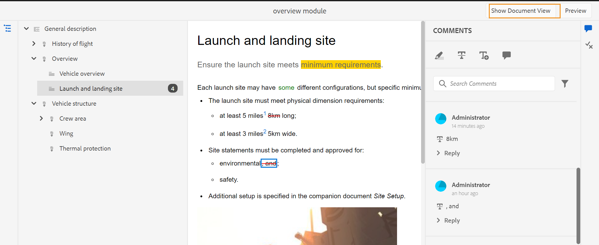
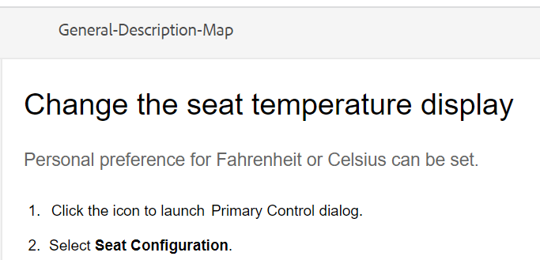

# 查看主题 {#id2056B0W0FBI}

如果您是审阅人，则会收到一封审阅请求电子邮件，其中包含指向审阅主题的链接。 单击该链接将转到审核页面，您可以在其中添加对共享主题的反馈。

执行以下步骤以查看主题：

1. 单击审阅请求电子邮件中提供的直接链接。

   主题或映射链接在浏览器中打开。

   >[!NOTE]
   >
   > 您还可以从AEM用户界面的收件箱通知区域访问主题审阅链接。

1. 根据主题审阅的启动方式，您可以看到以下两个屏幕中的任意一个：

   >[!NOTE]
   >
   > 如果您在中创建了审阅，则UI可能会有所不同：
   >
   > - AEM指南as a Cloud Service于2022年11月版或更早版本
   > - AEM指南版本4.1或更低版本

   当使用DITA映射启动审阅工作流时，将显示以下屏幕：

   

   此屏幕上提供以下选项：

   - **A**:审核任务的名称。
   - **B**:单击主题视图图标以显示或隐藏主题面板。

   - **C**:突出显示的数字 ***F*** 可以通过从此处选择所需的过滤器选项来过滤。 您可以按注释类型、状态、审阅者或版本过滤注释。 例如，如果要查看在审阅主题中的每个主题中已做出多少次删除注释，请单击过滤器图标，然后选择 **审阅类型** \> **删除**.

      >[!NOTE]
      >
      > 应用过滤器时，“注释”面板中仅显示与选定过滤器匹配的注释。 过滤的评论数显示在主题面板的左侧。

   - **D**:为当前审阅人分配的审阅主题显示为黑色且可单击。 当审阅人单击某个主题链接时，该主题会被置于屏幕顶部。
   - **E**:无法供审阅的主题呈灰显状态。 该主题以只读模式显示，您不允许对此类主题添加任何审阅注释。

   - **F**:收到的关于主题的评论数。 此数字会根据您应用的过滤器而发生更改。

   图中的所有主题都显示为一个复合文档。 通常会显示允许审阅人审阅的主题。 不显示不允许审阅的主题。

   

   在上面的屏幕截图中，将共享常规描述主题以查看当前审阅人，该主题正常显示。 但是，下一个主题“飞行内容的历史记录”不会共享以供审阅，它将以只读模式显示。 目录中还突出显示了当前关注的主题。

   选择并共享一个或多个主题以供审阅时，将显示以下屏幕：

   

   >[!NOTE]
   >
   > 如果有多个主题，它们将在文档视图中显示为一个复合文档。 上面的屏幕截图突出显示了在单个视图中一个接一个地呈现的两个不同主题。

1. 单击 **评论** 图标。

   从工具栏中选择相应的评论类型，然后按Enter提交评论，以提供评论。

   >[!NOTE]
   >
   > “注释”面板仅显示对当前主题提供的注释。 将焦点移到其他主题时，将显示针对其他主题提供的评论。

1. 单击 **关闭** 按钮。 单击 **关闭** 按钮，您将被重定向到访问审阅主题的页面。

## 审阅屏幕上提供的其他功能

**文档视图和主题视图**  — 默认情况下，如果共享多个主题以供审阅，则会向审阅人显示主题的复合文档视图。 如果是DITA映射审阅，映射中的所有主题都以单个文档的形式呈现，类似于书籍视图。 如果需要，您还可以单击某个特定主题，然后只在审阅屏幕上显示该主题。

当您查看单个主题时，您会获得一个额外的选项，以切换回文档视图。 在以下屏幕截图中，将打开映射文件中的特定主题以供审阅。 突出显示的选项 —  **显示文档视图** 允许用户切换回映射文件的文档视图。

**使用不同类型的注释工具**  — 您可以通过突出显示文本、点进文本、插入文本或添加注释来添加内联注释。 “注释”工具栏中提供的不同类型的注释工具如下所述：

- **突出显示** \(\):要添加高亮显示注释，请选择文本并单击高亮显示图标。 或者，单击高亮图标并选择所需的文本：

   

   “注释”面板中会出现一个弹出窗口，您可以在其中为突出显示的内容添加注释。

- **三振** \(\):如果要提出删除内容的建议，可通过选择内容并单击删除线图标来执行此操作。 或者，选择所需的文本并单击删除键：

   “注释”面板中会出现一个弹出窗口，您可以在其中为已删除的内容添加注释。

- **插入文本** \(\):如果要插入文本，请单击“插入文本”图标，并将光标放在要插入文本的位置并键入信息。 或者，将光标放在要插入文本的位置并开始键入。 添加的信息以绿色字体显示：

- **添加注释**\(\):如果要添加附注类型的评论，请单击添加评论图标，然后在弹出窗口中输入评论。

**上下文工具栏**

您还可以使用上下文工具栏快速突出显示或删除文本。 使用上下文工具栏执行以下步骤以进行注释：

1. 选择要突出显示或点进的文本。 此时会出现上下文工具栏。

   

1. 单击 **突出显示**&#x200B;或 **三振** 图标。
1. 您可以在注释面板中为高亮显示或删除操作添加注释。

**使用“注释”面板查看** - “注释”面板显示针对当前主题给出的注释列表。 如果主题被发送给多个审阅人，则此面板还会列出其他审阅人的注释。 注释面板中的每个注释都链接到当前主题中的相应文本。 它有助于您识别已评论的文本。 每个注释都显示添加了注释的审阅人的名称以及时间戳。

注释按文档中注释文本的顺序显示。 例如，第一句有高亮注释，第一段第二句有插入文本注释，然后高亮文本注释显示在插入文本注释之前。

使用“注释”面板可以执行的任务如下所述：

- 单击注释会突出显示并显示相应注释在文档中的位置。
- 您可以向评论添加回复。
- 您可以编辑自己的评论，方法是在“评论”面板中单击评论的文本，然后选择 **编辑** 的双曲余切值。
- 您可以删除自己的注释，方法是单击“注释”面板中的注释，然后选择 **删除** 选项。

   

   >[!NOTE]
   >
   > 仅当您将鼠标悬停在您自己的注释上时，才会显示“选项”菜单。 其他审阅人不会显示该注释。

- 所有参与用户都可以回复其他用户提交的评论。 在评论中，单击 **回复** 并按Enter键提交响应。

**预览模式**

- 在“预览”模式下打开主题可显示在作者应用所有更改后查看主题时该主题的显示方式。 例如，所有插入的文本都显示为普通文本，而所有从内容中删除的\（已删除\）文本都将被删除。

- 以下屏幕截图显示了 *审阅* 模式：

以下屏幕截图显示了 *预览* 模式：

**将附件添加到评论**  — 如果要通过提供其他文件中提供的其他信息来补充注释，则可以通过将注释附加到该文件来添加注释。 作为审阅人，您可以轻松地从本地系统向注释添加一个或多个文件。 可以将文件添加到所有支持的注释形式 — 高亮、删除线、插入文本或注释。

插入任何注释时，将显示注释弹出窗口。 在弹出窗口中提供其他评论或信息后，按Enter键提交。 添加评论后，您将获得用于向该评论添加附件的选项。

在上面的屏幕截图中，文档包含高亮显示注释的弹出窗口，该注释也会添加到“注释”面板中。 文件附件图标 可在这两个位置随注释一起访问。

执行以下步骤，将附件添加到注释：

1. 单击 *添加附件* 图标  在要添加附件的注释中。

   将出现文件“打开”对话框。

1. 选择一个或多个要附加的文件。

   所选文件与注释一起显示在“注释”面板中。

   在“注释”面板中，您可以看到文件名及其大小。 您还可以选择通过单击删除图标来删除文件  与文件名关联。

1. 单击 **提交**.

   附件会上传并添加到评论中。

**有关处理附件的其他说明：**

- 默认情况下，只显示与注释一起附加的两个文件。 如果有更多文件，则 **查看附件** 按钮可显示与评论关联的所有附件\（其数量多于两个\）的数量。 您可以单击编号以查看所有附件。 例如，如果您有四个带有评论的附件，则会在按钮上看到+2。

- 将鼠标指针悬停在附件上可提供用于下载或删除附件的选项。 仅当当前审阅人已添加该注释时，才可删除附件，如以下屏幕截图所示：

其他审阅人或作者只获得下载附件选项。

- 您可以从 **查看附件** 对话框。 选择附件并单击 **下载** 图标。

- 您还可以从 **查看附件** 对话框。 选择附件并单击 **删除** 图标。

**“条件”面板**  — 如果您的主题包含条件内容，则您将看到 **条件** \(\)图标。 单击 **条件** 图标会打开“条件”面板，通过该面板，您可以根据主题中的可用条件突出显示内容。

:默认情况下 **突出显示所有条件** 选项，选择所有条件，显示整个内容，并在审阅和预览模式下条件化内容以高亮显示。

:您可以禁用 **突出显示所有条件** 选项，并将主题中存在的所有内容视为普通文本，且不会突出显示任何内容。

您可以选择隐藏或显示特定条件。

- 如果隐藏条件，则在审阅模式下不会突出显示具有该条件的内容。
- 如果显示条件条件化内容，则会在审阅模式下突出显示。 例如，在以下屏幕截图中，只有内容使用两个条件 —  `win` 和 `mac` 中。

在预览模式下，非条件内容和使用两个显示条件的条件的条件内容 —  `win` 和 `mac` 中。 将不显示隐藏条件的其余条件化内容。

**实时审阅** - “评论”面板会实时更新评论以及作者对评论所采取的反馈或操作。

- 多个审阅人可以在同一文档上同时发表意见或回复意见。 将鼠标悬停在屏幕右上角的用户图标上，可以找到当前正在审阅文档的人员。

- 如果主题是多个审阅任务的一部分，则在一个任务中做出的注释不会显示在另一个任务中。

- 单击“已过时的注释”图标\(\)在中显示文档的最新版本和注释版本之间的差异。 文档顶部将显示版本号\（正在比较的版本）。

   

   >[!NOTE]
   >
   > 将鼠标悬停在“过期的评论”图标上时，会显示添加评论的主题的版本号。 例如，如果对版本1.0提供了评论，则会显示相同的评论。

- 单击过期的注释会在左侧面板中打开该注释的版本。 左面板中显示了以前的版本，而右侧面板中显示了当前版本。 在左侧，将导入过时版本中的所有评论。 您可以将之前的版本与当前版本进行比较。

**过滤注释**  — 您可以过滤文档中的注释，以根据需要查看特定的注释。 要过滤注释，请单击 **过滤器** 图标\(“搜索注释”文本框右侧菜单中显示的“注释”复选框。

从 **过滤器类型** 对话框，单击 **应用**.

- **审阅类型**  — 根据注释类型进行过滤 — 突出显示、删除、插入或注释。
- **审核状态**  — 根据评论的状态（如已接受、已拒绝或无）进行筛选。
- **审阅人**  — 根据审阅人的名称进行过滤。

- **版本**  — 根据收到的对特定主题版本的评论进行过滤。

   使用过滤器时，会根据选择过滤右侧面板上的注释，并相应地更新左侧面板中的注释数。

要删除过滤器并查看所有注释，请从 **过滤器类型** 对话框，单击 **应用**.

**父主题：**[&#x200B;查看主题或映射](review.md)

