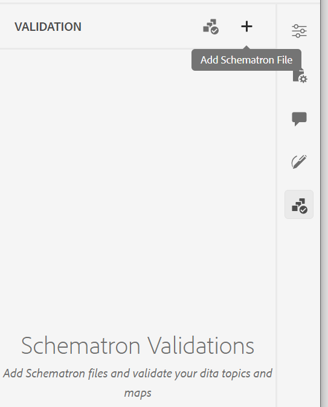

# 支持Schematron文件

“架构”是指用于定义XML文件测试的基于规则的验证语言。 Web编辑器支持Schematron文件。 您可以导入Schematron文件，也可以在Web编辑器中编辑它们。 使用Schematron文件，您可以定义某些规则，然后针对DITA主题或映射验证这些规则。

>[!NOTE]
>
> Web编辑器支持ISO架构。


## 导入Schematron文件

执行以下步骤以导入Schematron文件：

{width="300" align="left"}

1. 导航到所需的文件夹（您要将文件上传到的文件夹） *存储库视图*.
1. 单击 **选项** 图标以打开上下文菜单并选择 **上传资产**.
1. 在 **上传资产** 对话框，您可以在 **选择资源文件夹** 字段。
1. 单击 **选择文件** 并浏览以选择Schematron文件。 您可以选择一个或多个架构文件，然后单击 **上传**.

## 使用模式验证DITA主题或映射

导入Schematron文件后，可以在Web编辑器中编辑它们。 可以使用Schematron文件验证主题或DITA映射。 例如，您可以为DITA映射或主题创建以下规则：

* 为DITA映射定义标题。
* 添加了特定长度的简短描述。
* 地图中应至少有一个topicref。

在Web编辑器中打开主题时，右侧将显示“架构验证”面板。 执行以下步骤以添加和验证主题或包含架构文件的映射：
{width="300" align="left"}

1. 单击架构图标()以打开架构面板。
1. 使用“添加模式文件”添加Schematron文件。
1. 如果Schematron文件没有错误，则会添加该文件并将其列在“验证”面板中。 对于包含错误的Schematron文件，将显示一条错误消息。
   >[!NOTE]
   >
   >可以使用Schematron文件名附近的交叉图标将其删除。
1. 单击使用架构验证以验证主题。

   * 如果主题未破坏任何规则，则会为文件显示验证成功消息。
   * 如果主题破坏了规则，例如，如果它不包含标题并为上述给定架构进行验证，则会显示验证错误。

1. 单击错误消息可突出显示打开的主题/映射中包含错误的元素。

Web编辑器中的架构支持可帮助您根据一组规则验证文件并维护主题的一致性和正确性。

## 使用assert和report语句检查规则{#schematron-assert-report}

AEM Guides还支持Schematron中的声明和报告语句。 这些语句可帮助您验证DITA主题。

### Assert语句

当测试语句评估为false时，assert语句会生成消息。 例如，如果希望标题为粗体，则可以为其定义声明语句。

```XML
<sch:rule context="title"> 
    <sch:assert test = "b"> Title should be bold </sch:assert>
  </sch:rule>
```

使用模式验证DITA主题时，您会收到一条消息，指出标题不粗体。

### 报表语句

当测试语句的计算结果为true时，报告语句会生成消息。 例如，如果希望简短描述少于或等于150个字符，则可以定义一个报告语句以检查简短描述多于150个字符的主题。
使用模式验证DITA主题时，您会获得报告语句评估为true的规则的完整报告。 因此，您将收到一条有关短描述超过150个字符的主题的消息。


```XML
<sch:rule context="shortdesc"> 
        <sch:let name="characters" value="string-length(.)"/> 
        <sch:report test="$characters &gt; 150">  
        The short description has <sch:value-of select="$characters"/> characters. It should contain more than 150 characters.      
        </sch:report>   
    </sch:rule> 
```

>[!NOTE]
>
> 在编写Schematron规则时仅使用Xpath 2.0表达式。

## 使用正则表达式{#schematron-regex-espressions}

您还可以使用Regex表达式定义包含matches()函数的规则，然后使用Schematron文件执行验证。

例如，如果标题只包含一个单词，则可以使用该标题显示消息。

```XML
<assert test="not(matches(.,'^\w+$'))"> 
No one word titles.
</assert>  
```


## 定义抽象模式{#schematron-abstract-patterns}

AEM Gudies还支持Schematron中的抽象模式。 可以定义通用的抽象模式并重用这些抽象模式。  可创建指定实际模式的占位符参数。


使用抽象模式可减少规则的重复并简化验证逻辑的管理和更新，从而简化Schematron架构。 这还可以使您的架构更易于理解，因为您可以在单个抽象模式中定义复杂的验证逻辑，该模式可以在整个架构中重用。


例如，下面的XML代码创建一个抽象模式，然后实际模式使用id引用它。

```XML
<sch:pattern abstract="true" id="LimitNoOfWords"> 

<sch:rule context="$parentElement"> 

<sch:let name="words" value="string-length(.)"/> 

<sch:assert test="$words &lt; $maxWords"> 

You have <sch:value-of select="$words"/> letters. This should be lesser than <sch:value-of select="$maxWords"/>. 

</sch:assert>  

<sch:assert test="$words &gt; $minWords"> 

You have <sch:value-of select="$words"/> letters. This should be greater than <sch:value-of select="$minWords"/>. 

</sch:assert>  

</sch:rule> 

</sch:pattern> 

<sch:pattern is-a="LimitNoOfWords" id="extend-LimitNoOfWords"> 

<sch:param name="parentElement" value="title"/> 

<param name="minWords" value="1"/> 

<param name="maxWords" value="8"/> 

</sch:pattern> 
```
