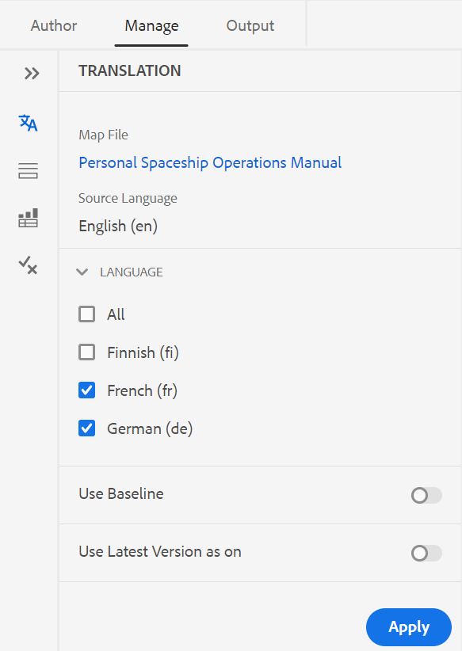
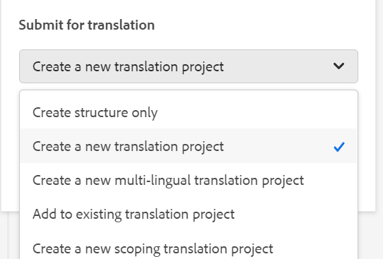
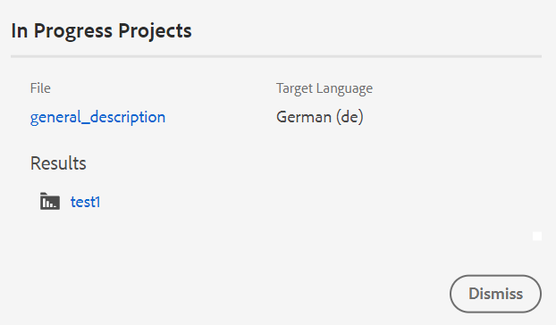

# 从Web编辑器翻译文档 {#id21BKF0Z0YZF}

>[!TIP]
>
> 如果您已升级到AEM Guidesas a Cloud Service版2022年2月版或更高版本，则建议从Web编辑器使用此翻译功能。

AEM Guides在Web编辑器中提供了一项强大的功能，可让您将内容翻译成多种语言。 您可以创建新翻译项目，稍后将翻译作业添加到现有翻译项目。 您还可以创建一个多语言翻译项目，该项目包含所有选定语言的翻译作业。

>[!NOTE]
>
> 您的管理员可以在Web编辑器中配置“管理”选项卡\（用于翻译\）。 有关更多详细信息，请参阅 *在Web编辑器中配置翻译功能* 安装和配置Adobe Experience Manager Guidesas a Cloud Service中的部分。

## 开始之前

在执行此过程中的步骤之前，请确保已创建所需的语言根目录和目标文件夹

1. 创建根文件夹以存储源内容。 根文件夹必须使用语言名称\（如英语）或语言代码\(en\)创建。
1. 创建要将内容翻译到的目标文件夹。 例如，如果要将内容翻译为德语或法语，则必须创建名为 — de \（表示德语\）或 — fr \（表示法语\）的文件夹。

>[!NOTE]
>
> 根文件夹和目标文件夹必须在同一级别创建。

## 创建翻译项目

1. 在存储库面板中，在映射视图中打开DITA映射文件。
1. 单击 **管理** 选项卡。 “翻译”面板显示DITA map的超链接标题以及 **语言** 列表。
1. 从 **语言** 列表，选择要将项目翻译到的区域设置。 您可以选择 **全部** 将项目翻译成所有可用语言。

   >[!NOTE]
   >
   > 该列表包含语言文件夹及其语言代码。 例如，法语\(fr\)和德语\(de\)。

   >[!IMPORTANT]
   >
   > 语言仅显示其语言文件夹与源语言并行创建的语言。 在任何其他级别创建的语言文件夹（例如从源语言文件夹往下一个级别）也不会显示。 请确保创建的所有目标语言文件夹与源语言文件夹处于同一级别。

   {width="350" align="left"}

1. 您还可以使用以下选项：

   **使用基线：** 您可以选择基线来翻译项目。 单击使用基线，然后选择在映射中创建的基线。 属于所选基线的所有文件都将显示在“翻译”页中。 翻译内容后，即可导出翻译后的基线。 有关导出转换后的基线的更多详细信息，请参见 [导出已翻译基线](generate-output-use-baseline-for-publishing.md#id196SE600GHS).

   **使用最新版本为**：选择根据主题的创建日期和时间筛选主题的版本。 当您选择日期和时间时，只显示所选日期和时间或之前创建的文件的最新版本。

1. 单击 **应用**. 此时将显示一个列表，其中包含主题和相关资产的详细信息。
1. 选择要发送以进行翻译的主题。

   您还可以使用以下主题过滤选项：

   - **标题**：源文件的标题
   - **文件名**：源文件的名称
   - **文件类型**：源文件的类型。 可用的选项有“映射”、“主题”和“图像”。
   - **引用类型**：直接或间接引用
   - **版本**：源文件的版本号
   - **版本标签**：源文件的选定版本的标签
   - **目标版本**：目标文件的版本号
   - **文档状态**：源文件的状态。 可用的选项包括草稿、审核中和已审核。
   - **目标语言**：要将源文件翻译成的语言
   - **翻译状态**：可用选项为：不同步、缺少副本、进行中和同步。
   - **目标标签**：目标文件的选定版本的标签
1. 单击 **发送以进行翻译** 右上角。

   {width="800" align="left"}

1. 从下拉菜单中，选择 **创建新翻译项目**.

   {width="350" align="left"}

   除了新翻译项目外，您还可以从以下选项中进行选择：

   - 您可以选择 **创建结构** 仅适用于翻译项目。
   - 您可以选择 **创建新的多语言翻译项目** 其中包括您选择进行翻译的所有语言的翻译作业。 例如，如果您选择了法语、德语和西班牙语，则会创建一个项目，其中包含所有三种语言的翻译作业。
   - 如果您已经有一个翻译项目，则可以向该项目添加主题。 选择添加至 **现有翻译项目** 选项，然后从现有翻译项目列表中选择一个项目。 您可以按最近、升序或降序对这些项目进行排序。

      >[!NOTE]
      >
      > 如果现有项目是一个范围项目，则其名称中会附加“\(Scoping\)”。

   - 如果需要为要翻译的项目创建范围，则可以选择 **创建新的范围设定翻译项目**. 这不会发送要翻译的副本，并且文件的原始翻译状态将保持不变。 对于为了设定范围而发送的引用主题的目标语言副本没有影响。
1. 在&#x200B;**项目标题**&#x200B;字段中，输入项目标题。
1. 单击 **创建** 以创建新翻译项目。

   将使用所选的主题版本创建新翻译项目。 此时，会显示一个弹出消息，确认已创建翻译项目。 一旦翻译项目中的所有目标语言副本都可用，您就会在收件箱中收到通知。 一旦翻译项目中提供了目标语言副本，您就可以开始翻译作业。 有关详细信息，请参阅， [启动翻译作业](translation-first-time.md#id225IK030OE8).

   >[!NOTE]
   >
   > 如果您拒绝翻译作业中一个或多个主题的翻译，则 **进行中** 所有被拒绝主题的翻译状态都将恢复到其原始状态。 将根据最新的翻译状态检查并还原引用主题的状态。 此外，即使拒绝在目标项目中创建的翻译文件，也不会删除这些文件。

## 将版本标签传递到目标版本

AEM Guides允许您将源文件的标签传递到目标文件。 这将帮助您轻松识别已翻译文件的源版本。

要在目标副本中添加源版本标签，您的系统管理员必须选择选项 **将源版本标签传播到目标版本** 在 **翻译** 按Tab键进入 **编辑器设置**.

例如，如果您有一些源文件带有版本标签 `Release 1.0` 应用到这些标签，则还可以传递源标签\(`Release 1.0`\)到已翻译文件。

{width="650" align="left"}

>[!NOTE]
>
> 源标签仅附加到一个目标版本。 如果将源标签移动到其他版本，它会自动反映在最新的目标标签中。

## 查看不同步文件的版本差异 

AEM Guides提供了检查主题的选定版本与上次翻译的源版本之间差异的功能。 您可以选择翻译 **不同步** 基于所做的更改的文件。

{width="800" align="left"}

选择 **显示差异**&#x200B;图标\(\)查看选定文件上次翻译版本与当前版本之间的差异的主题。

>[!NOTE]
>
> **显示差异** 图标\(\)仅对具有翻译状态的DITA文件显示 **不同步**.

此 **版本差异** 对话框。 它显示 **上次翻译的版本** 和 **选定的版本** 左边的号码。 预览窗口显示上次翻译版本与所选主题版本之间的差异。

{width="650" align="left"}

## 取消不同步的资产

如果对某些资源进行更改，这些资源将变得不同步。 您可以重新翻译修改的资产，也可以选择取消不同步状态。 例如，如果您进行了一些非常次要的更改，而这些更改真的不需要翻译，则可以将它们的状态标记为“同步”。

要关闭“Out of Sync（不同步）”状态，请执行以下步骤：

1. 选择要更改其状态的不同步资产。
1. 选择 **标记同步** 按钮\(\)在顶部。 此 **标记同步** 对话框。

   {width="550" align="left"}

1. 单击 **强制同步**. 它会将选定的“不同步”资产的状态设置为“同步”。

>[!NOTE]
>
> **标记同步** 按钮\(\)仅对翻译状态为“不同步”的资产显示。

## 查看映射或主题的正在进行中的翻译项目

翻译仪表板上的某些引用可能处于正在进行状态。 这些参考资料具有 **进行中** 链接位于 **翻译状态** 列。 单击该链接时， **进行中的项目** 对话框打开。 在对话框中，您可以看到包含选定引用的所有正在进行的翻译项目\（以及目标语言\）的列表。

>[!NOTE]
>
> 您可以查看在AEM Guides 2023年2月as a Cloud Service版或更高版本中创建的已翻译项目的进行中链接。

单击对话框中的参照名称以在预览模式下将其打开。 您还可以单击翻译项目以开始翻译。

{width="550" align="left"}

**父主题：**[&#x200B;使用Web编辑器](web-editor.md)
