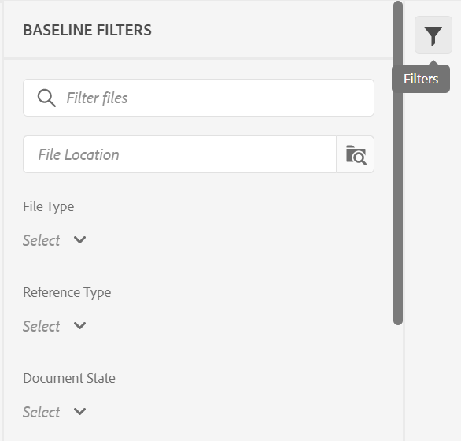

# 从Web编辑器创建和管理基线 {#id223MB0ZF043}

>[!TIP]
>
> 如果您已升级到AEM Guidesas a Cloud Service的3月版或更高版本，则建议从Web编辑器使用此基线功能。

AEM Guides提供了集成在Web编辑器中的基线功能，允许用户创建基线，并使用它们发布或翻译不同版本的主题。

## 创建基线

可以通过执行以下步骤从Web编辑器创建基线：

1. 在“存储库”面板中，在映射视图中打开DITA映射文件。
1. 单击 **管理** 选项卡。 此 **基线** 面板显示DITA map的基线。

   {width="800" align="left"}

1. 在 **基线** 面板中，单击右上方的+图标。 您可以创建一个基线，其中包含特定版本的主题和在特定日期和时间可用的引用内容，或者为某个版本的主题定义标签。
1. 输入中基线的名称 **基线名称**.
1. In **基线选项**，您可以选择 **使用文件版本** 选项或 **使用标签** 选项：

   **使用文件版本**：您可以创建一个静态基线，其中包含特定版本的主题和在特定日期和时间可用的引用内容，或者为某个版本的主题定义标签：

   - In **根据设置最新版本，** 选择以下选项之一：

      1. **日期** &lt;time stamp=&quot;&quot;>：选取在指定日期和时间的主题版本。
      1. **标签**：选择此选项可根据应用于主题的标签选择主题。 如果主题具有为其指定的标签，则标签会列在下拉列表中。 您可以从列表中选择标签。 您还可以在文本框中添加标签。\
         当您选择时 **标签，** 您可以选择直接引用和间接引用。
      - 对于DITA map中的直接引用，可以选择使用未对其应用指定标签的最新版本主题。

      >[!NOTE]
      >
      > 如果输入的标签不存在，请选择选项 **不创建基线** 然后，基线创建会失败，并在“基线”面板中的基线名称附近显示错误消息。

      - 对于DITA map中的间接引用，为您提供了一个附加选项，用于使用未对其应用指定标签的最新版本主题。 您还可以选择 **自动挑选** 对于引用的内容，系统会自动选取与引用该内容的内容版本对应的引用内容版本。

   选择标签或版本作为日期后，将相应地选择映射中所有引用的主题和媒体文件。 用户界面上不显示所选主题，但将其保存在后端。

   **使用标签**：选择创建基线的此选项，以根据应用于主题的标签选择主题。

   基于标签的基线会动态更新。 如果您生成基线、下载基线或使用基线创建翻译项目，则系统会根据更新的标签动态选取文件。 例如，如果您使用标签版本为1.0的主题版本作为基线，使用了标签版本为1.0的更新版本1.5，则将动态更新基线，并使用版本1.5。

   {width="550" align="left"}

   - **选择标签**：如果主题具有为其指定的标签，则标签会列在 **选择标签** 下拉菜单。 您可以从列表中选择标签。 首先选定的标签优先顺序高于后面的标签。
1. **间接引用**：对于DITA map中的间接引用，提供了以下选项：

   - **自动挑选**：您可以选择 **自动挑选** 对于引用的内容，系统会自动选取与引用该内容的内容版本对应的引用内容版本。

   - **使用选定的标签**：您可以使用为某个版本的主题定义的选定标签创建基线。
   - **使用最新版本或工作副本**：使用未应用指定标签的主题的最新版本，或者如果未创建任何版本，则使用主题的工作副本创建基线。
1. 单击 **应用**.

将创建基线。 基线创建是异步进行的，因此您可以继续在Web编辑器中处理其他文件。 创建基线后，将显示一条弹出消息，确认基线已创建，并且您还会收到该基线的收件箱通知。

## 管理基线

您可以使用“基线”操控板上的各种功能来管理现有基线。

- 可以使用“基线”面板中的文本框搜索现有基线。 使用 **应用筛选器** 图标显示所有基线，或列出创建状态为“成功”、“进行中”或“失败”的基线。
- 使用 **刷新** 图标，以重新检查所有基线，并显示在“映射视图”中打开的DITA映射的新的基线列表。
- 通过双击“基线”面板中的列表中的基线，可以查看或编辑现有基线的内容。 中心位置的基线编辑窗口显示DITA映射文件、映射的内容或主题以及引用的内容。

{width="550" align="left"}

也可以从“选项”菜单对基线执行以下操作：

- **编辑**， **复制，** 或 **删除** 现有基线。
- 从添加、删除或更改现有标签 **管理标签** 选项。 如果您的管理员配置了预定义标签，则您会在添加标签下拉列表中看到这些标签。 有关添加标签的详细信息，请参阅 [使用标签](web-editor-use-label.md#).

   >[!NOTE]
   >
   > 添加或删除标签的过程是异步进行的，因此您可以在Web编辑器中继续处理其他文件。 添加或删除标签后，会显示一条弹出消息，确认标签已添加或移除，并且您还会收到该标签的收件箱通知。

- **编辑属性** 创建基线时设置的现有基线的属性。
- 将基线的快照导出为CSV文件，并使用 **导出基线** 选项。

**基线过滤器**

使用 **基线筛选器** 面板可以对在基线编辑窗口中打开的基线应用筛选器：

{width="350" align="left"}

- 根据文件名或文件位置筛选文件。
- 根据不同列（如“文件类型”、“引用类型”等）的值筛选文件。
- 选择要显示在基线编辑窗口中的列。

>[!NOTE]
>
> 可以单击列标题并根据基线编辑窗口中的列对文件进行排序。

**保存或重置基线**

编辑基线后，可以单击 **保存** 按钮保存对基线的更改。 您可以单击 **重置** 按钮（如果不想保存更改并重置基线）。 当您单击 **重置** 按钮会显示警告，指出未保存的更改将丢失。

**父主题：**[&#x200B;使用Web编辑器](web-editor.md)
