# 了解Web编辑器功能 {#id176NC500V5Z}

本节将介绍Web编辑器中提供的各种功能。 我们可以将Web编辑器分为以下部分或区域：

- [主工具栏](#id2051EA0G05Z)
- [辅助工具栏](#id2051EA0J0Y4)
- [左侧面板](#id2051EA0M0HS)
- [内容编辑区域](#id2051EB000UI)
- [右侧面板](#id2051EB003YK)

以下小节详细介绍了Web编辑器的各个部分。

## 主工具栏 {#id2051EA0G05Z}

主工具栏位于Web编辑器界面的顶部，它提供Web编辑器中可用的文件级功能和各种创作模式。 顶部工具栏中可用的功能说明如下：

**全部保存** - 

保存在所有打开的主题中所做的更改。 如果在Web编辑器中打开了多个主题，请单击 **全部保存** 或使用 **Crtl**+**S** 快捷键只需单击一下即可保存所有文档。 您不必单独保存每个文档。

>[!NOTE]
>
> 保存操作不会创建主题的新版本。 要创建新版本，请选择“另存为新版本”。

**另存为新版本** - 

保存您在主题中所做的更改，并创建主题的新版本。 如果您正在处理新创建的主题，则版本信息显示为 **无**.

{width="800" align="left"}

版本号会随为主题或映射文件创建的每个新版本而更改。

当您选择使用保存主题或映射时 **另存为新版本**，则会出现以下对话框：

{width="300" align="left"}

输入注释和版本标签以标识更改，然后单击 **保存** 以创建新版本的文件。

当您选择 *另存为新版本*，该主题的第一版本是在DAM中创建的，它也会成为您主题的当前活动版本。 之后，如果您还原到该主题的早期版本，则该版本将成为您当前该主题的活动版本。

如果您的管理员预先配置了版本标签，则您将在下拉列表中看到这些标签。 您可以从可用标签列表中选择标签并保存文档。

{width="300" align="left"}

在保存主题时，可以添加注释，以指定在主题中所做的更改。 此注释显示在主题的“版本历史记录”中。

如果您的主题正在审核中，审核者将收到通知，指出有较新版本的主题可用。 他们可以轻松访问文档的最新修订版，并继续查看您主题的最新版本。

当您将指针悬停在主题的标题上时，会显示文件路径和版本号。

{width="800" align="left"}

>[!NOTE]
>
> 在主题的一个版本可用后，您还可以向主题添加标签。 然后，可以使用这些标签创建用于发布文档特定版本的基线。 有关在主题中使用标签的详细信息，请参阅 [使用标签](web-editor-use-label.md#).

**撤消和重做** -  / 

撤消或重做上一个操作。

**删除元素** - 

删除当前选定的元素或光标所在的元素。

**查找和替换** - 

“查找”和“替换”功能在“创作”和“源”视图模式下可用。 “查找和替换”文本栏显示在主题编辑区域的底部。 您可以使用快捷键 **CTRL**+**F** 以调用查找和替换栏。

{width="800" align="left"}

使用设置图标\(\)，您可以切换 **忽略大小写** 和 **仅全字** 搜索选项。 要执行不区分大小写的搜索，请打开\（或选择\） **忽略大小写** 选项。 否则，如果要执行区分大小写的搜索，请关闭\（或取消选择\） **忽略大小写** 选项。 您还可以选择搜索整个单词。

搜索是即时的，这意味着当您键入搜索短语或单词时， **查找** 字段，将立即搜索并在主题中选择术语。 同样，要替换主题中的文本，请在相应的字段中输入搜索词及其替换词，然后单击 **Replace** 或 **全部替换** 按钮。

在“源”视图中，“查找和替换”对于搜索特定元素或属性非常有用。 例如，如果要替换 `@product` 属性，可以从“源”视图中轻松完成此操作。 “创作”视图不允许您根据属性或元素进行搜索。 但是，在使用时，您必须谨慎 **全部替换** 功能，因为它可能会覆盖XML代码。

**编辑器设置** - 

编辑器设置仅对管理用户可用。 管理员可以使用首选项配置以下设置：

>[!NOTE]
>
> 如果要更新任何默认设置，则应重新打开文档，以使更改生效。

- **常规**：常规设置允许您配置要用于Web编辑器的字典。 此选项卡包含三个部分： **拼写检查**， **条件**、和 **创作**.

  {width="650" align="left"}

   - **拼写检查**：有两个选项 —  **AEM拼写检查** 和 **浏览器拼写检查**. 默认情况下，编辑器使用浏览器拼写检查功能，其中拼写检查使用浏览器的内置词典执行。 您可以切换到AEM拼写检查以使用AEM词典，也可以自定义该词典以添加自定义单词列表。 有关自定义AEM词典的更多信息，请参阅 *自定义AEM默认词典* 安装和配置Adobe Experience Manager Guidesas a Cloud Service中的部分。


   - **条件**

      - **在作者视图中高亮显示条件文本**：选择此项以在创作视图中突出显示条件文本。 使用为条件定义的颜色突出显示条件内容。

      - **使用条件属性进行验证**：选择此项以允许验证为属性定义的值。 这样可防止您添加任何不正确的值。

      - **在“主题方案”面板中显示带有标题的键**：选择此项以在主题方案中显示键和标题。 如果不选择此选项，则只显示标题。 例如，此处的“os”、“audience”和“other”键也会与标题一起显示。

        {width="550" align="left"}

      - **在“条件”面板中显示主题方案**：选择此项可在条件面板中查看主题方案。 如果取消选择此选项，则定义的条件将显示在条件面板中。

   - **创作**

      - **启用全部替换**：选择此选项可在“查找和替换”面板中看到全部替换图标。

**面板**：此设置控制编辑器左侧面板中显示的面板。 您可以切换开关以显示或隐藏所需的面板。

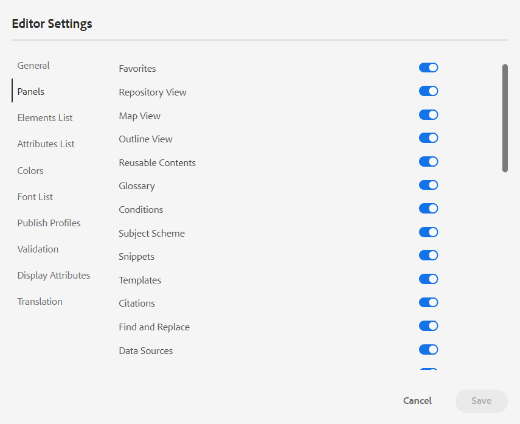{width="650" align="left"}

>[!NOTE]
>
> 如果已配置自定义面板，则它也会显示在面板列表中。 您可以切换开关以显示或隐藏自定义面板。 有关配置的更多详细信息，请参阅 *在左侧面板中配置自定义面板* 安装和配置Adobe Experience Manager Guidesas a Cloud Service中的部分。

- **元素列表**：作为管理员，您可以控制作者可以使用插入的元素列表 [插入元素](#id204SG30105Z) 弹出窗口，还可以定义元素的显示名称。 “元素列表”设置允许您根据DITA规范指定元素名称以及要使用的标签而不是DITA定义的元素名称：

  {width="650" align="left"}

在上面的屏幕快照中， `b` 元素已被赋予粗体标签， `codeblock` 为代码块以及某些其他元素提供了标签。 如果您选择 **仅使用以上元素** 选项，则只有此列表中的有效元素\（在当前插入点\）将显示在“插入元素”弹出窗口中。

在以下屏幕快照中，当前上下文中只显示前一个屏幕快照中4个已配置元素中的3个：

{width="300" align="left"}

- **属性列表**：与元素列表类似，您可以控制要在元素的属性列表中显示的属性列表及其显示名称。 在以下屏幕截图中，只有3个属性已配置为显示在元素的属性列表中：

{width="650" align="left"}

通过此设置，当您尝试将属性添加到元素时，您只会看到列表中配置的属性列表。

{width="300" align="left"}

- **显示属性**：与属性列表一样，您可以控制要在元素的属性列表中显示的属性列表。 默认情况下，四个 **显示属性**  — 受众、平台、产品和prop已配置为显示在元素的属性列表中。 您还可以使用添加显示属性 **添加** 图标。 您还可以使用删除任何显示属性 **删除** 图标。

为元素定义的属性将显示在“布局”和“大纲”视图中。

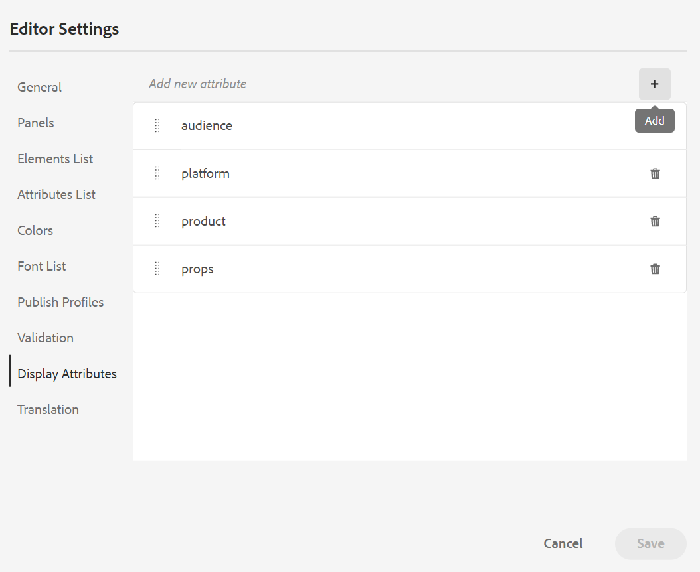{width="550" align="left"}

- **翻译**：此选项卡包含用于将源标签传播到目标版本的选项。

   - **将源版本标签传播到目标版本**：选择此选项可将源文件版本的标签传递到已翻译的文件。 默认情况下，该选项处于禁用状态。

  {width="550" align="left"}


**用户首选项** - 

“用户首选项”适用于所有作者。 通过使用首选项，作者可以配置以下设置：

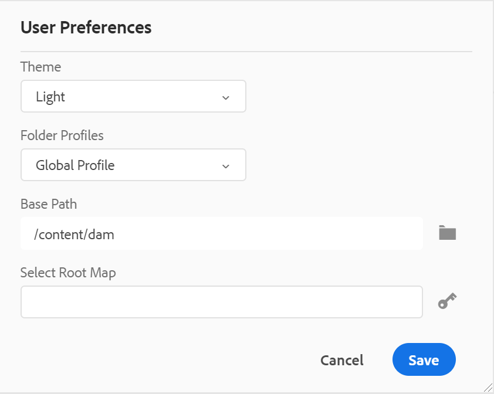{width="550" align="left"}

- **使用设备主题**：选中此复选框可允许AEM Guides根据设备的主题在浅色和深色主题之间自动切换。
- **主题**：您可以从编辑器的浅色、最亮、深色或最深色主题中进行选择。 对于最浅的主题，工具栏和面板使用更浅的灰色背景。 对于浅色主题，工具栏和面板使用浅灰色背景。 对于最深的主题，工具栏和面板使用更深的黑色颜色背景。 对于深色主题，工具栏和面板使用黑色颜色背景。 在所有主题中，内容编辑区域都以白色背景显示。

- **文件夹配置文件**：文件夹配置文件控制与条件属性、创作模板、输出预设和Web编辑器配置相关的各种配置。 默认情况下，将显示“全局配置文件”。 此外，如果您的管理员在系统中配置了文件夹配置文件，则这些文件夹配置文件也会显示在文件夹配置文件列表中。

  管理员可以在文件夹配置文件中定义的Web编辑器配置包括：自定义用户界面，包括工具栏图标、Web编辑器的布局、代码片段和根映射。 有关更多详细信息，请参阅 *配置全局或文件夹级别的配置文件* 在“安装和配置Adobe Experience Manager Guides”as a Cloud Service中。

  >[!NOTE]
  >
  > 当前文件夹配置文件的名称在主工具栏中显示为“用户首选项”图标的标签。

- **基本路径**：默认情况下，当您从Web编辑器访问AEM存储库时，您会看到来自/content/dam位置的资源。 您的工作文件夹很可能是/content/dam/文件夹中的几个文件夹。 每次单击几下即可到达工作文件夹。 您可以将基本路径设置为工作文件夹，然后存储库视图会预先显示该位置的内容。 这可以缩短访问工作文件夹的时间。 此外，当在主题中插入任何引用或媒体文件时，文件浏览位置以“基本路径”中设置的文件夹开始。

- **选择根映射**：选择一个DITA映射文件以解析键引用或术语表条目。 解析键引用时，所选根映射的优先级最高。 有关更多详细信息，请参阅 [解析键引用](map-editor-other-features.md#id176GD01H05Z).


>[!NOTE]
>
> 如果您不想使用任何根映射，请确保 **选择根映射** 字段为空。

**“创作”、“源”和“预览”模式**

有关各种创作和文档查看模式的详细信息，请参阅 [Web编辑器视图](web-editor-views.md#).

## 辅助工具栏 {#id2051EA0J0Y4}

在Web编辑器中打开主题进行编辑时，将显示辅助工具栏。 辅助工具栏中可用的功能说明如下：

**插入元素** - 

在当前或下一个有效位置插入有效元素。 如果您在块元素内工作，例如 `note`，然后使用插入元素图标在 `note` 元素。 在以下屏幕快照中，注释元素已插入p \(paragraph\)元素中：

{width="800" align="left"}

如果在注释元素中按Enter键，则会在注释元素本身中创建一个新段落。 要在注释外部插入新元素，请在元素痕迹导航中单击p元素\（在屏幕快照中高亮显示\），然后单击“插入元素”图标或按 ***Alt***+***输入*** 以打开“插入元素”弹出窗口。 然后，选择所需的元素并按Enter键将选定的元素插入到注释元素之后。

当出现闪烁的块光标时，您还可以在两个元素之间添加一个元素。

{width="300" align="left"}

例如，如果您正在处理DITA主题，并且块光标在简短描述和正文之间闪烁，则可以添加 `prolog` 元素，然后添加版权、作者和其他详细信息。

输入新元素的另一种方法是使用上下文菜单。 在文档中的任意位置单击鼠标右键以调用上下文菜单。 从该菜单中选择“插入元素”以显示“插入元素”对话框，然后选择要插入的元素。

{width="300" align="left"}

**插入段落** - 

在当前或下一个有效位置插入段落元素。

**插入/删除编号列表** - 

在当前或下一个有效位置创建编号列表。 如果您在编号列表上并单击此图标，该项目将转换为普通段落。

**插入/删除项目符号列表** - 

在当前或下一个有效位置创建项目符号列表。 如果您位于项目符号列表上并单击此图标，该项目将转换为普通段落。

**插入表** - 

在当前或下一个有效位置插入表。 单击“插入表”图标以打开“插入表”对话框：

{width="550" align="left"}

您可以指定表中所需的行数和列数。 如果要将第一行保留为表头，请选择“将第一行设置为表头”选项。 要在表格中添加标题，请在标题字段中输入该标题。

插入表后，可以使用上下文菜单修改表。

{width="550" align="left"}

使用该表的上下文菜单，您可以：

- 插入单元格、行或列

- 在右侧和向下方向合并单元格

- 水平或垂直拆分单元格

- 删除单元格、行或列

- 从表中创建代码片段

- 生成Id


您还可以在表的多个单元格、整行或列上定义属性。 例如，要对齐表格单元格，请拖动并选择所需的单元格。 在“内容属性”面板\（位于右侧）中，属性 **类型** 更改 **多个条目**. 在“其他属性”部分中，选择 `@valign` 属性下拉列表中的属性。 从值下拉列表中，选择要应用于选定表单元格的所需文本对齐方式。

{width="800" align="left"}

**插入图像** - 

在当前或下一个有效位置插入图像。 单击“插入图像”图标以打开“插入图像”对话框，然后搜索并选择想要插入的图像。

>[!NOTE]
>
> 您还可以通过将图像从本地系统拖放到文章中来添加图像。 在这种情况下，将使用添加图像文件 **上传资产** 工作流。  欲知更多详情，请参见 **上传资产** 中的工作流 [左侧面板](web-editor-features.md#id2051EA0M0HS) 部分。


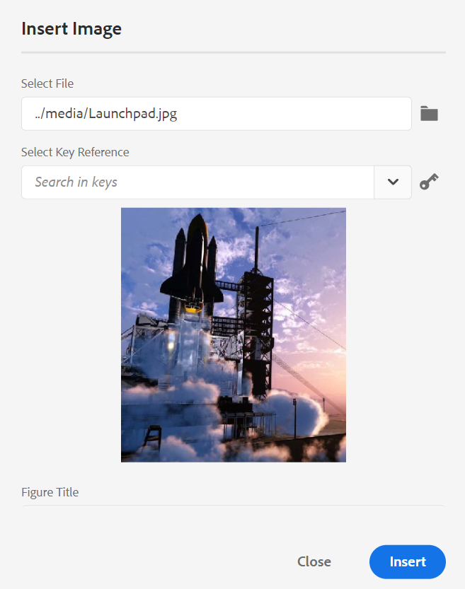{width="650" align="left"}

可以在“插入图像”对话框中为图像添加图像/图形标题和替换文本。

您可以在顶部的“要搜索的类型”栏中输入文件名，以搜索所需的图像文件，还可以按“路径\（要搜索的位置\）”、“收藏集”、“文件类型”和“标记”筛选搜索结果。 找到所需的图像文件后，选择该文件并单击“选择”以将图像插入到文档中。 可以插入各种格式的图像文件，例如 `.png`， `.svg`， `.gif`， `.jpg`， `.eps`， `.ai`， `.psd`，等等。

插入图像后，您可以从“内容属性”面板中更改高度、宽度、版面和属性。 单击某个图像文件，然后在右边栏的“内容属性”面板中进行更改。

{width="800" align="left"}

“源”字段显示插入的图像文件的UUID。 通过将鼠标指针悬停在“源”字段上，可以找到插入图像文件的完整路径。 该路径将显示在工具提示中。

您可以通过为图像文件提供“高度”或“宽度”值来调整图像大小。 图像的纵横比会自动得到保持。 如果需要，还可以选择不保持图像文件的纵横比，方法是单击“保持纵横比”(Maintain Aspect Ratio)的锁图标\(of Maintain Aspect Ratio\)并提供“高度”和“宽度”值。

也可以将图像的“放置”设置指定为“内联”或“破断”。 如果选择使用“破断位置”选项，则可以选择对齐图像的位置\（左、中或右\）。

您还可以为图像文件添加其他属性，方法是在 **属性** 字段。

>[!NOTE]
>
>您还可以在图像中定义可单击区域\（图像映射\）。 欲知更多详情，请参见 **插入/编辑图像映射** 中的功能描述 [左侧面板](web-editor-features.md#id2051EA0M0HS) 部分。

**图像或媒体文件的上下文菜单**

也可以使用上下文菜单对图像和媒体文件执行一些常见操作。 在图像上的任意位置单击鼠标右键以调用上下文菜单。

上下文菜单提供剪切、复制或粘贴图像或媒体的选项。 可在所选元素之前或之后插入元素。 您还可以选择重命名或取消环绕元素。 您可以在存储库中找到选定的图像或媒体，或在Assets UI中查看文件预览。

上下文菜单中的其他选项允许您复制路径、编辑图像映射、创建代码片段或为所选元素生成ID。

**插入多媒体** - 

插入不同类型的多媒体文件。 单击“插入多媒体”图标，然后选择要插入的文件类型。 支持的多媒体格式包括：

- 音频文件
- 视频文件
- YouTube
- Vimeo

选择“音频或视频文件”选项时，将显示存储库视图，以浏览并选择所需的文件。 如果选择YouTube或Vimeo，则会显示“插入多媒体”对话框。 将视频文件的链接粘贴到Web链接字段中，然后单击“插入”以将视频添加到文档中的当前或下一个有效位置。

>[!NOTE]
>
> 添加YouTube视频链接时，您需要替换字符串 `watch?v=` 替换为 `embed` 在URL中。 例如，要添加YouTube视频链接，请执行以下操作： `https://www.youtube.com/**watch?v**=WlIKQOrmZcs`，您需要将其添加为： `https://www.youtube.com/**embed/**WlIKQOrmZcs`. 此更改可确保在AEM站点和PDF输出中嵌入视频。

也可以从“插入多媒体”对话框添加音频或视频文件。 选择“音频/视频文件”选项，然后单击浏览图标以启动存储库视图。 从存储库中选择音频或视频文件，然后单击选择，以在音频/视频文件字段中添加该文件的链接。 如果选择视频文件，则预览区域也会显示文件的预览。 您可以播放视频文件以查看其预览。

{width="650" align="left"}

**插入交叉引用** - 

插入类型引用 — 内容引用、内容键引用、键引用、文件引用、Web链接或电子邮件链接。

单击 **选择文件** 图标\（用于内容引用和文件引用\）或 **选择映射** 图标\（适用于内容键引用和键引用\）并选择要链接到的所需文件或内容。

{width="650" align="left"}

所选参照的链接将添加到文档中。 链接上的上下文菜单为您提供了以下选项：

- **插入元素**：显示可在给定上下文中插入的有效元素列表。
- **复制UUID**：复制插入引用的UUID。
- **复制路径**：复制插入引用的完整路径。
- **创建代码片段**：从插入的引用创建可重用的代码片段。
- **生成Id**：为插入的引用生成唯一ID。

您还可以使用要引用的文件的UUID进行搜索。 对于“内容”和“键引用”链接，输入要链接到的文件的UUID，将自动搜索该文件并将其显示在“预览”部分中。 指定文件的UUID时，无需明确提及.xml文件的文件扩展名。 .xml扩展名会自动附加到UUID中。

{width="650" align="left"}

如果您的管理员在中启用了UUID选项 *XMLEditorConfig*，则您将会在中看到引用内容的UUID **链接** 属性。

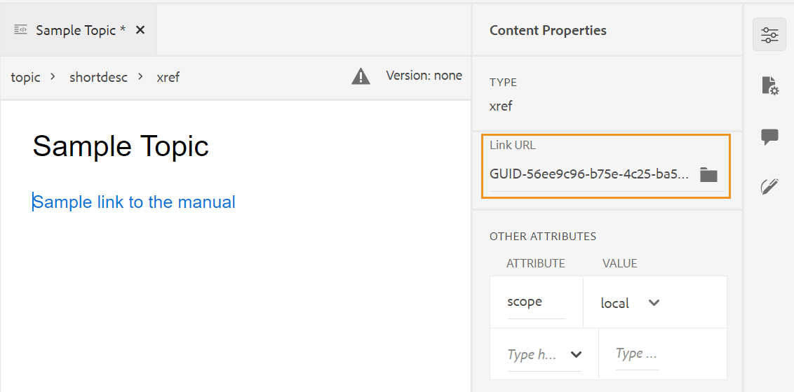{width="800" align="left"}

>[!NOTE]
>
> 如果 **启用UUID** 选项，则会显示引用内容的相对路径。

>[!IMPORTANT]
>
> 即使引用内容的相对路径显示在 **链接** 属性，链接是在内部使用引用内容的UUID创建的。

>[!TIP]
>
> 有关引用内容的最佳实践，请参阅最佳实践指南中的引用部分。

**筛选条件搜索**

您可以在AEM存储库选定路径上的文件中搜索一些文本。 例如，在下面给定的屏幕快照中搜索“general”。 您还可以使用增强型筛选器缩小搜索范围。 您可以查找选定路径中存在的所有DITA文件，如DITA主题和DITA映射。

您可以在所选路径中搜索非DITA文件，如图像文件、多媒体和文档。 您还可以在DITA元素的属性中搜索特定值。 您还可以查找由指定用户签出的文件。

{width="650" align="left"}

>[!NOTE]
>
> 系统管理员还可以配置文本过滤器，并显示或隐藏其他过滤器。 有关更多详细信息，请参阅安装和配置Adobe Experience Manager Guidesas a Cloud Service中的配置文本过滤器部分。

将显示包含搜索文本的已过滤文件的列表。 例如，在上面的屏幕截图中，列出了包含文本“general”的文件。 您还可以预览文件的内容。

**插入可重用内容** - 

重用项目中的任何其他文档中存在的内容。 您可以通过直接链接到文件中的内容或使用键引用插入内容，请参见 [解析键引用](map-editor-other-features.md#id176GD01H05Z). 单击插入可重用内容图标时，会获得重用内容对话框：

{width="650" align="left"}

在“重用内容”对话框中，为文件引用选择DITA文件，或选择包含键引用的DITA map文件。 选中后，主题或关键引用将显示在对话框中。 您可以选择要插入的主题的ID/键，然后单击完成在主题中插入内容。

对于插入“内容引用”，您还可以输入文件的UUID，并且该文件中的可重用内容会列在“预览”部分。

根据插入链接的设置，您可以在“属性”面板或“源代码”视图中查看插入内容的UUID或相对路径。 链接始终使用引用内容的UUID创建。 请参阅安装和配置Adobe Experience Manager Guidesas a Cloud Service中的配置基于UUID的链接。

>[!NOTE]
>
> 要在引用的内容之前或之后添加内容，请使用 *Alt*+*左侧* 箭头或Alt+*右* 箭头键，将光标移动到所需位置。

您还可以将引用的内容嵌入主题中，方法是右键单击引用的内容，然后选择 **将引用替换为内容** 从上下文菜单中。

**插入特殊字符** -  

在主题中插入特殊字符。 单击“插入特殊字符”图标，打开“插入特殊字符”对话框。

>[!NOTE]
>
> AEM Guides提供了可移动和可调整大小的对话框。 可以在右下角调整具有两条交叉线的对话框的大小。 “特殊字符”对话框中的交叉线如下所示。

{width="550" align="left"}

在“插入特殊字符”对话框中，可以使用特殊字符的名称搜索特殊字符。 所有特殊字符都存储在各种类别下。 使用选择类别下拉列表并选择类别。 将显示所选类别中可用的特殊字符。 可以使用箭头键浏览特殊字符列表，或单击要插入的所需字符。 所选特殊字符的名称和十六进制代码显示在列表下方。 单击“插入”，在文档中插入选定的字符。

**插入关键字** - 

插入在DITA映射中定义的关键字。 单击“插入关键字”图标以打开“键引用”对话框。

{width="550" align="left"}

关键字按字母顺序列出，您也可以通过在“搜索”框中键入搜索字符串来搜索关键字。 搜索结果将返回包含ID或值中的字符串的关键字。 此对话框中列出了在DITA映射中定义的关键字。 选择要插入的关键字并单击 **插入**.

也可以通过右键单击该关键字并选择“属性”选项来更改插入关键字的属性。 将打开“关键字属性”对话框：

{width="550" align="left"}

您可以更改关键字的属性或向关键字添加新属性。

**插入代码片段** - 

在当前或下一个有效位置插入代码片段。 要使此功能正常工作，您必须在系统中定义代码片段。 有关添加代码片段的更多信息，请参阅 **代码片段** 中的功能描述 [左侧面板](web-editor-features.md#id2051EA0M0HS) 部分。

单击插入代码片段图标时，会显示插入代码片段目录。 目录是上下文相关的，这表示只有在当前位置允许显示代码片段时，才会显示代码片段。

以下示例显示了两个预配置的代码片段 — “警告”和“错误”，它们可以插入到文档中的当前位置。

{width="300" align="left"}

当您从列表中选择一个代码片段时，它会插入到文档中当前或下一个有效位置。 以下屏幕截图显示了文档中插入的错误片段：

{width="400" align="left"}

**插入/编辑图像映射** - 

在选定图像上插入图像映射。 具有链接到主题或网页的可单击区域的图像称为图像映射。

在当前主题中选择图像，然后单击插入/编辑图像映射图标以打开插入图像映射对话框。

{width="650" align="left"}

选择首选形状矩形 ，圆形 或多边形  在图像上定义要用作链接的区域。 定义区域后，将出现“引用”对话框，您需要在其中指定指向内部或外部内容的链接：

{width="650" align="left"}

如果区域重叠，您可以通过单击工具栏中相应的图标，将形状前移或后移。 您也可以通过选择某个区域并单击删除图标来删除该区域。 双击某个区域会打开“引用”对话框，您可以在其中更改目标链接。 在图像上标记了所需的区域后，单击“完成”以保存更改。

**锁定/解锁** - / 

锁定或解锁当前文件。 锁定\（或签出\）文件可授予用户对文件的独占写入权限。 当文件被解锁\（或签入\）时，更改将保存在文件的当前版本中。

如果您在“映射视图”中并展开父映射，则只需单击一下即可锁定映射中的所有文件。 只需展开父映射文件并选择父文件，这会导致选择映射中的所有文件。 然后，您可以单击“锁定”图标以获得对映射中所有文件的锁定。

**切换标记视图** - 

标记是指示元素边界的可视提示。 元素边界标记元素的开始和结束。 然后，您可以使用这些边界作为视觉提示来放置插入点或在边界内选择文本。 如果要在文档中的某个元素之前或之后插入另一个元素，可将插入点置于元素的打开或关闭边界之前或之后。

以下屏幕截图显示了打开了“标记视图”的文档：

{width="650" align="left"}

可以在标签视图开启的文档中执行以下操作：

- **选择元素**：单击元素的开始或结束标记以选择其内容。

- **展开或折叠标记**：单击+或 — 符号以展开或折叠标记。

- **使用上下文菜单**：上下文菜单提供用于剪切、复制或粘贴所选元素的选项。 您还可以在所选元素之前或之后插入元素。 通过其他选项，可生成ID或打开选定元素的“属性”面板。

- **拖放元素**：选择元素的标记并将其轻松拖放到文档上。 如果放置位置是允许元素的有效位置，则将该元素放置到放置位置。


>[!NOTE]
>
> 如果用户从Web编辑器中启用“标记视图”，则即使跨会话，该视图也保持启用状态。 这意味着您无需再次启用“标记视图”即可稍后访问它。新用户会话的“标记视图”的默认值由ui\_config.json文件中的tagsView属性决定。 欲知更多详情，请参见 *为标记视图配置默认值* 部分(在“as a Cloud Service安装和配置Adobe Experience Manager Guides”中)。

**启用/禁用跟踪更改** 

通过启用“跟踪更改”模式，您可以跟踪对文档所做的所有更新。 启用跟踪更改后，所有插入和删除操作都将被捕获到文档中。 使用删除线突出显示所有已删除的内容，并且所有插入内容都以绿色文本突出显示。 此外，您还可以在主题页面的边缘获得更改条。 再次重申，对于删除的内容，将显示红色栏，对于添加的内容，将显示绿色栏。 如果同一行中存在加法和删除操作，则会同时显示绿色栏和红色栏。

以下屏幕快照突出显示删除和插入的内容以及更改条：

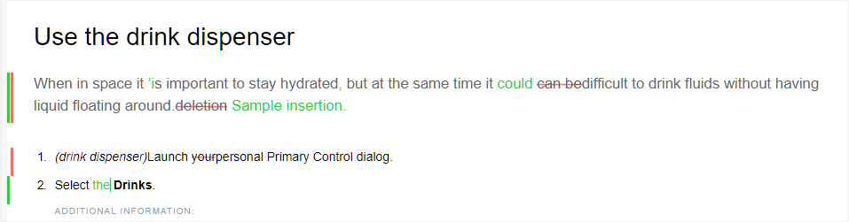{width="650" align="left"}

跟踪文档中的更改的典型用例可以是进行同行审阅。 您可以启用跟踪更改并共享您的文档以供审阅，审阅者随后进行更改并启用跟踪更改。 收到文档后，您应该具有查看建议更新的机制，以及接受或拒绝更改的便利方法。

AEM Guides提供了跟踪更改功能，该功能包含有关文档中进行的更新的信息。 “跟踪的更改”功能提供有关已进行哪些更新、谁进行了更新以及何时进行了更新的信息。 使用“跟踪的更改”功能，您还可以轻松地接受或拒绝文档中建议的更新。

要访问该功能，请单击右侧面板中的跟踪更改图标。

{width="300" align="left"}

单击更改会选择文档中的更改内容。 您可以通过选择“接受更改”图标来接受更改，或通过选择“拒绝更改”来拒绝更改。

如果要通过单击接受或拒绝所有更改，请选择 **全部接受** 或 **全部拒绝**.

>[!NOTE]
>
> “预览”模式允许您查看包含或不包含已更改内容的标记的文档。 欲知更多详情，请参见 [预览](web-editor-views.md#preview-mode-id19AAGL00163) 模式。

**Merge** - 

在多作者环境中工作时，很难跟踪其他作者在主题或地图中所做的更改。 “合并”功能不仅让您能够更好地控制更改查看，而且还可以控制哪些更改会保留在文档的最新版本中。

**合并主题文件**

要合并主题中的更改，请执行以下步骤：

1. 在Web编辑器中打开一个主题。

1. 单击 **Merge**.

   此时将显示“合并”对话框。

   {width="550" align="left"}

1. *\（可选\）* 您还可以浏览并从存储库中的其他位置选择新文件。

1. 选择要与文件的当前版本进行比较的文件版本。

1. 从“选项”中选择：

   - **跟踪选定版本中的更改**：此选项以跟踪更改的形式显示所有内容更新。 然后，您可以选择一次接受或拒绝文档中的更改，或者一次接受或拒绝所有更改。

   - **还原到所选版本**：此选项将文档的当前版本还原为所选版本。 此选项无法让您控制接受或拒绝什么内容。

1. 单击&#x200B;**完成**。

1. 如果您选择了 **跟踪从选定版本更改的内容** 选项，则所选版本的所有更改都将显示在右侧面板的跟踪更改功能中。

   您可以在“跟踪的更改”面板中选择接受或拒绝所有注释，或者接受或拒绝单个注释。


**合并映射文件**

要合并映射文件中的更改，请执行以下步骤：

1. 在Web编辑器中打开映射。

1. 单击 **Merge**.

   此时将显示“合并”对话框。

   {width="550" align="left"}

1. *\（可选\）* 您还可以浏览并从存储库中的其他位置选择新文件。

1. 选择要与文件的当前版本进行比较的文件版本。

1. 从“选项”中选择：

   - **跟踪选定版本中的更改**：此选项以跟踪更改的形式显示所有内容更新。 然后，您可以选择一次接受或拒绝文档中的更改，或者一次接受或拒绝所有更改。

   - **还原到所选版本**：此选项将文档的当前版本还原为所选版本。 此选项无法让您控制接受或拒绝什么内容。

1. 单击&#x200B;**完成**。

   1. 如果您选择了 **跟踪从选定版本更改的内容** 选项，则所选版本的所有更改都将显示在跟踪的更改面板\（右侧\）中。

      您可以在“跟踪的更改”面板中选择接受或拒绝所有更改，或者接受或拒绝映射文件中的单个更改。


**版本历史记录** - 

AEM Guides提供了多种查看为主题文件创建的版本的方法，以及还原到特定版本的方法。 但是，这些功能中的大多数在Web编辑器之外都可用。

利用Web编辑器中的版本历史记录功能，您不仅可以检查活动主题上的可用版本和标签，还可以灵活地从编辑器本身还原到任何版本。

要访问版本历史记录并还原到主题的特定版本，请执行以下步骤：

1. 在Web编辑器中打开一个主题。

1. 单击 **版本历史记录**.

   此时将显示“版本历史记录”对话框。

   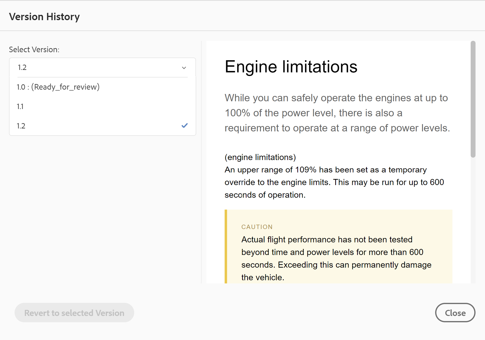{width="550" align="left"}

1. 选择要在中还原的主题版本 **选择版本** 下拉列表。

   >[!NOTE]
   >
   > 如果版本应用了标签，则这些标签还会与版本号一起显示\（在括号中）。

   从下拉列表中选择版本后，还原到所选版本选项将变为可用。 预览窗口显示当前版本与所选版本的主题之间的差异。

   {width="550" align="left"}

1. 单击 **还原到所选版本** 将工作副本还原为所选版本的主题。

   将显示“还原版本”对话框。

   {width="550" align="left"}

1. \(*可选*\)提供还原到早期版本的原因。 您还可以创建主题当前活动工作副本的新版本。

1. 单击 **确认。**

   文件的工作副本将还原为选定的版本。 如果您选择创建当前活动工作副本的新版本，则也会创建包含所有工作更改的新版本文件。


在还原到早期版本时，将显示一个视觉提示，指示您当前使用的版本不是最新版本。

{width="800" align="left"}

**版本标签管理** -  

标签可帮助您确定特定主题在DDLC \（文档开发生命周期\）中的阶段。 例如，当您处理主题时，可以将标签设置为“已批准”。 发布主题并使其可供客户使用后，您可以为该主题分配“已发布”标签。

AEM Guides允许您以自由格式文本格式指定标签或使用一组预定义标签。 自定义标签将允许系统中的任何作者根据其选择指定标签。 这提供了灵活性；但是，它会在系统中引入不一致的标签。 要解决此问题，管理员可以配置一组预定义标签。 有关配置预定义标签的详细信息，请参阅 *配置和自定义XML Web编辑器* 在“安装和配置Adobe Experience Manager Guides”as a Cloud Service中。

无论作者需要指定标签，这些标签都会以下拉列表的形式显示给他们。 这可确保系统中仅使用预定义、一致的标签。

您可以通过不同的方法将标签应用于主题 —  [版本历史记录](web-editor-use-label.md#) 资产UI中的面板， [基线](/help/tutorials/user-guide/generate-output-use-baseline-for-publishing.md#id184KD0T305Z) UI和Web编辑器。 利用Web编辑器中的版本标签功能，作者可以快速轻松地为其主题分配标签。

要通过Web编辑器向主题添加标签，请执行以下步骤：

1. 在Web编辑器中打开一个主题。

1. 单击 **版本标签**.

   此时将显示版本标签管理对话框。

   {width="650" align="left"}

   版本标签管理对话框分为两部分 — 左侧面板包含可用于主题的版本列表以及标签下拉列表\（或用于输入标签的文本框），右侧面板包含主题预览。

1. 选择要应用标签的版本。

   当您从版本列表中选择其他版本的主题时，预览面板将显示当前版本与所选版本的主题之间的更改

   >[!NOTE]
   >
   > 如果标签已应用于某个版本，则会显示在下拉列表的版本号旁边，以及选择版本列表的下方。 您可以通过单击\(**x**\)图标。

1. 如果您的管理员定义了标签列表，则会显示一个标签下拉列表，您可以从中选择要应用的标签。 您可以从下拉列表中选择多个标签。

   否则，会显示一个文本框，您可以在其中输入要添加到主题中的标签。

   >[!NOTE]
   >
   > 不能对主题的多个版本应用相同的标签。 如果尝试关联现有标签，则可以选择将其从现有版本中删除，然后将其应用于主题的选定版本。

1. 单击 **添加标签**.

1. 在应用标签确认消息中，选择 **移动标签** 选项以将标签从现有版本移动到所选版本。 如果不选择此选项，并且有标签被分配给主题的其他版本，则这些标签不会移动到所选主题的版本。 在标签申请过程中会忽略此类标签。


**创建审阅任务** -  

可直接从Web编辑器创建当前主题的审阅任务或映射文件。 打开要为其创建审阅任务的文件，然后单击“创建审阅任务”以启动审阅创建过程。

>[!NOTE]
>
> 您还可以从“审阅”面板\（位于右侧）创建审阅任务。

按照 [查看主题或地图](review.md#) 了解更多详细信息。

## 左侧面板 {#id2051EA0M0HS}

左侧面板是永久面板。 您可以通过单击展开侧栏图标\(\)。 在展开视图中，它显示在折叠视图中作为工具提示显示的图标的名称。

>[!NOTE]
>
> 左侧面板可调整大小。 要调整面板的大小，请将光标置于面板边界上，光标将变为双箭头并拖动以调整面板宽度。

通过左侧面板可访问以下功能：

**收藏夹** -  

如果您使用一组文件或文件夹，可以将它们添加到收藏夹列表以快速访问它们。 收藏夹列表显示您已添加的文档列表，以及其他用户中可公开访问的收藏文档列表。

要创建收藏夹列表或收藏集，请单击“收藏夹”面板旁边的+图标以调出“新建收藏集”媒体日志：

{width="300" align="left"}

为要创建的收藏集输入标题和描述。 如果您选择 **公共**，则其他用户也会看到此收藏。

要将文件添加到收藏夹，请使用以下任意方法：

- 在“存储库视图”中导航到所需的文件或文件夹，单击 *选项* 图标以打开上下文菜单，然后选择 **添加到收藏夹**. 在“添加到收藏夹”对话框中，您可以选择将文件/文件夹添加到现有收藏夹或创建新收藏夹。

  {width="300" align="left"}

- 在编辑器中右键单击文件的选项卡以打开上下文菜单。 选择 **添加到\>收藏夹** 将文件添加到收藏夹列表。

  {width="400" align="left"}


**用Favroties集合的“选项”菜单**\
您还可以使用收藏夹集合的“选项”菜单执行许多操作：

{width="400" align="left"}
- **重命名**：重命名选定的收藏集。
- **删除**：删除选定的文件。
- **刷新**：从存储库中获取文件和文件夹的新列表。
- **在Assets UI中查看**：在Assets UI中显示文件或文件夹内容。


>[!NOTE]
>
> 您还可以使用顶部的“刷新”图标刷新列表。


**存储库视图** - 

单击“存储库视图”图标后，您将获得DAM中可用的文件和文件夹的列表。

一次加载75个文件。 每次单击 **加载更多**...加载了75个文件，列出所有文件后，按钮即停止显示。 批量加载非常高效，而且与加载文件夹中存在的所有文件相比，您可以更快地访问文件。

您可以轻松地导航到DAM中所需的文件，并在Web编辑器中打开它。 如果您具有编辑文件所需的访问权限，则可以进行编辑。

您还可以在Web编辑器中单击并播放音频或视频文件。 您可以更改视频的音量或视图。 在快捷菜单中，您还可以选择下载、更改播放速度或查看画中画。


双击某个映射文件会在 **映射视图**. 欲知更多详情，请参见 **映射视图** 中的功能描述 [左侧面板](web-editor-features.md#id2051EA0M0HS) 部分。 双击主题文件会在 [内容编辑区域](#id2051EB000UI). 能够直接从Web编辑器中导航和打开文件可节省时间并提高生产效率。

**筛选条件搜索**

Web编辑器为搜索文本提供了增强的过滤器。 单击过滤器搜索\(\)图标以打开过滤器面板。 您可以在AEM存储库选定路径上的文件中搜索文本。 例如，在下面给定的屏幕快照中搜索“general purpose”。

{width="400" align="left"}

您还可以使用以下选项来筛选文件，并缩小AEM存储库中的搜索范围：

- **DITA文件**：您可以查找所有 **DITA主题** 和 **DITA映射** 在选定路径中存在。
- **非DITA文件**：您可以搜索 **图像文件**， **多媒体**、和 **文档** 在选定路径中。
- **DITA元素**：您还可以搜索指定DITA元素的属性中的特定值。
- **签出者**：您可以查找由指定用户签出的文件。
- **上次修改时间**：您可以查找在选定日期之后但在选定日期之前上次修改的文件。 您还可以查找过去2小时、上周、上个月或去年上次修改的文件。
- **标记**：您可以查找应用了特定标记的文件。 您可以键入标记或从下拉列表中选择标记。

**注意：** 系统管理员还可以配置文本过滤器，并显示或隐藏其他过滤器。 有关更多详细信息，请参阅 *配置文本过滤器* 安装和配置Adobe Experience Manager Guidesas a Cloud Service中的部分。

将显示包含搜索文本的已过滤文件的列表。 例如，在上面的屏幕截图中，列出了包含“general purpose”文本的文件。 您可以从筛选列表中选择多个文件，将它们拖放到打开进行编辑的映射中。

**“选项”菜单**

除了从左侧面板打开文件之外，您还可以使用

“存储库视图”中提供的“选项”菜单。 根据您选择的是文件夹、主题文件还是媒体文件，您会看到不同的选项。

**文件夹选项**

您可以使用可用于的“选项”菜单执行以下操作 *文件夹* 在“存储库视图”中：

{width="550" align="left"}


- **创建**：创建新的DITA主题、DITA映射或文件夹。 欲知更多详情，请参见  **从“存储库”视图创建主题** 中的过程 [左侧面板](web-editor-features.md#id2051EA0M0HS) 部分。


- **上传资产**：将文件从本地系统上传到AEM存储库中的选定文件夹。 您还可以将文件从本地系统拖放到当前工作主题上。 如果要将本地系统中的图像插入主题，这会非常有用。

  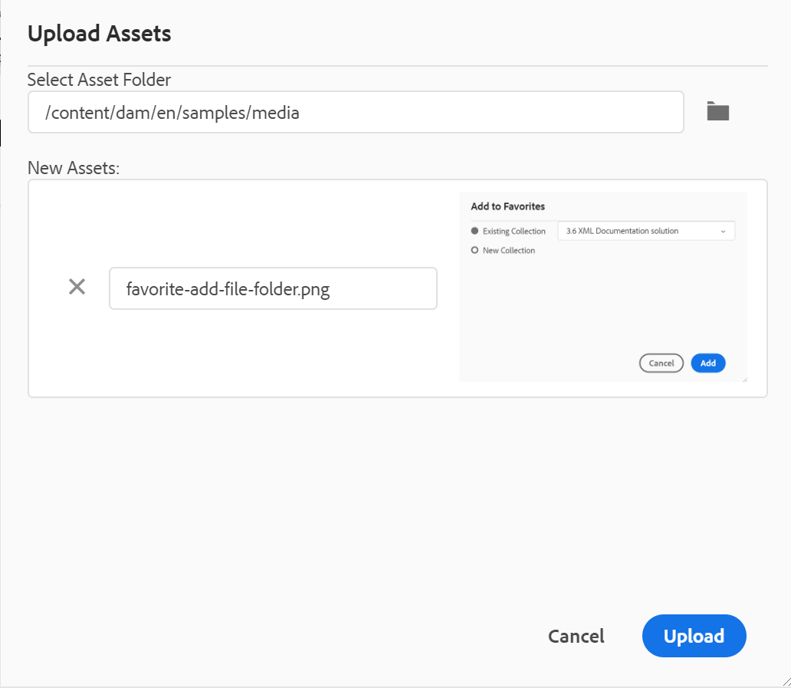{width="550" align="left"}

  您可以选择要上传文件的文件夹，并且还会显示图像预览。 如果要重命名文件，可以在“文件名”文本框中执行此操作。 单击上传以完成文件上传过程。 如果您在某个主题上拖放了图像文件，则该图像文件会添加到文章中，并且也会上传。

  如果您的管理员在中启用了UUID选项 *XMLEditorConfig*，则您将在中看到上传图像的UUID **来源** 属性。

  {width="800" align="left"}

- **在文件夹中查找文件**：将焦点转移到存储库搜索中，您可以在其中输入搜索词。 搜索在存储库中的选定文件夹下执行。 也可以应用过滤器以返回DITA文件和/或图像文件。

  {width="400" align="left"}

  您还可以使用文件的UUID进行搜索。 在这种情况下，搜索结果显示DITA/XML文件的标题，如果文件是图像文件，则显示文件的UUID。 在下面的搜索示例中，搜索图像文件的UUID，搜索结果显示原始图像文件的UUID和引用该图像的文件的主题标题。

  {width="300" align="left"}

- **全部折叠**：折叠存储库中所有打开的文件夹并仅显示根级别的文件夹。

  >[!NOTE]
  >
  > 使用 **\>** 图标，以展开文件夹。

- **添加到收藏夹**：将选定的文件夹添加到收藏夹。 您可以选择将其添加到现有收藏夹集合或新收藏夹集合。

- **刷新**：从存储库中获取文件和文件夹的新列表。
- **在Assets UI中查看**：在Assets UI中显示文件夹内容。

**文件选项**

根据您选择的是媒体文件还是DITA文件，您将在“选项”菜单中看到不同的选项。 一些可用于介质和DITA文件的常见选项包括：

- 复制
- 签出/签入
- 预览
- 移到
- 重命名
- 删除
- 复制
- 全部折叠
- 添加到收藏夹
- 属性
- 在Assets UI中查看

{width="550" align="left"}

“选项”菜单中的各种选项说明如下：

- **编辑**：打开文件以进行编辑。 如果是.ditamap/.bookmap文件，则它在 [高级映射编辑器](map-editor-advanced-map-editor.md#) 进行编辑。

- **复制**：使用此选项可创建选定文件的副本或副本。 您还可以选择在重复资产提示符下重命名重复文件。 默认情况下，创建该文件时使用的后缀\（如filename\_1.extension\）。 文件的标题与源文件相同，新文件从版本1.0开始。复制所有引用、标记和元数据，但基线不会复制到重复文件中。
- **签出**：获取选定文件的锁定以进行编辑。 对于锁定的文件，此选项将更改为 **签入**.

  >[!NOTE]
  >
  > 如果用户锁定或签出文件，将鼠标指针悬停在锁定图标上会显示已锁定文件的用户\(name\)。

- **预览**：获取文件\(.dita/.xml\)的快速预览而不打开它。

  {width="800" align="left"}

- **重命名**：使用此选项重命名选定的文件。 在新文件中输入新文件的名称 **重命名资源** 对话框。
   - 您可以重命名任何类型的文件。
   - 无法更改文件的扩展名。
   - 两个文件的名称不能相同。 因此，不能将文件重命名为已存在的名称。 显示错误。

- **移动到**：使用此选项可将所选文件移动到其他文件夹。
   - 您可以键入目标文件夹的名称，也可以选择 **选择路径** 以选择目标文件夹。
   - 您可以将任何类型的文件移动到Content文件夹中的任何目标。
   - 两个文件的名称不能相同。 因此，您不能将文件移动到已存在同名文件的文件夹中。

  如果您尝试将文件移动到某个文件夹，而该文件夹中存在具有相同名称但标题不同的文件，则会显示“重命名和移动文件”对话框，并且您需要在移动文件之前重命名该文件。 目标文件夹中移动的文件具有新文件名。

  {width="550" align="left"}

  >[!NOTE]
  > 您还可以将文件拖放到另一个目标文件夹中。

  **排除方案**

  在以下情况下，AEM Guides不允许重命名或移动文件：

   - 如果文件是审阅或翻译工作流的一部分，则无法移动或重命名文件。

   - 如果任何其他用户签出该文件，则无法重命名或移动该文件，您将看不到该文件的“重命名”或“移至”选项。

  >[!NOTE]
  > 如果管理员授予了您文件夹权限，则只有这样 **重命名** 或 **移动到** 将显示选项。

  <details>
    <summary> Cloud Service </summary>

  重命名或移动任何文件都不会中断对该文件的所有现有引用，因为每个文件都有一个唯一的UUID。
  </details>


- **删除**：使用此选项可删除选定的文件。 删除文件之前会显示确认提示。

   - 删除文件之前会显示确认提示。
   - 如果文件未从任何其他文件引用，则会删除该文件，并显示一条成功消息。
   - 如果文件已签出，则无法删除该文件，并会显示一条错误消息。

     >[!NOTE]
     >
     > 如果管理员阻止删除已签出的文件，则只会显示错误消息。 有关更多详细信息，请参阅 *阻止删除已签出的文件* 安装和配置Adobe Experience Manager Guidesas a Cloud Service中的部分。

   - 如果将该文件添加到收藏夹收藏集， **强制删除** 对话框随即显示，您可以强制删除它。
   - 如果文件是从任何其他文件引用的，则 **强制删除** 对话框并显示确认消息，您可以强制删除文件：

     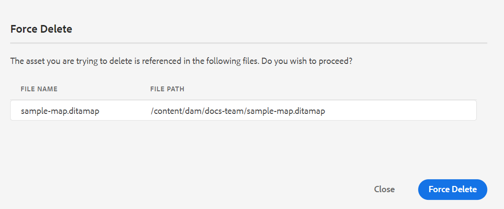{width="550" align="left"}

     >[!NOTE]
     >
     > 如果您的管理员已授予文件删除权限，则 **强制删除** 已启用。 否则， **强制删除** 禁用，并显示一条消息，指出您无权删除引用的文件。 有关更多详细信息，请参阅 *阻止删除引用的文件* 安装和配置Adobe Experience Manager Guidesas a Cloud Service中的部分。

   - 如果删除了引用的主题并且打开了包含要编辑的引用的文件，则会显示被引用文件的断开链接。

  >[!NOTE]
  >
  > 也可以使用键盘的Delete键以类似方式删除所选文件。

- **复制**：您可以从以下选项中进行选择：

   - **复制UUID**：将所选文件的UUID复制到剪贴板。

   - **复制路径**：将所选文件的完整路径复制到剪贴板。

- **全部折叠**：折叠存储库中的所有文件。 只显示存储库中的顶级文件夹。
- **添加至**：您可以从以下选项中进行选择：
   - **收藏夹**：将选定的文件添加到收藏夹。 您可以选择将其添加到现有收藏夹集合或新收藏夹集合。

   - **可重用内容**：将选定的文件添加到左侧面板中的“可重用内容”列表。

- **属性**：使用此选项可打开所选文件的属性页。 也可以从资产UI访问此属性页面，方法是选择一个文件并单击工具栏中的属性图标。

- **打开地图仪表板**：如果所选文件是DITA映射，则此选项将打开映射仪表板。

- **在Assets UI中查看**：使用此选项可在Assets UI中显示.dita/.xml文件的预览。 对于.ditamap/.bookmap文件，映射中的所有主题文件都以单个统一的逐页视图显示。

- **快速生成**：为所选文件生成输出。 只能为作为输出预设一部分的文件生成输出。 有关更多详细信息，请参阅 [从Web编辑器发布基于文章](web-editor-article-publishing.md#id218CK0U019I).


**从“存储库”视图创建主题**

您可以选择从“存储库”面板旁边的+图标或从“存储库视图”中文件夹的上下文菜单创建新主题、映射或文件夹。

***创建主题***

当您选择 *创建新主题* 从菜单中，您将看到以下对话框：

{width="300" align="left"}

在 **创建新主题** 对话框，请提供以下详细信息：

- 主题所基于的模板。 例如，对于现成的设置，您可以从“空白”、“概念”、“DITAVAL”、“引用”、“任务”、“主题”和“疑难解答”模板中进行选择。

  如果您的文件夹配置了文件夹配置文件，则您只会看到在文件夹配置文件中配置的主题模板。

- 要保存主题文件的路径。 默认情况下，存储库中当前选定文件夹的路径将显示在路径字段中。
- 主题的标题。

- *\（可选\）* 主题的文件名。 根据主题“标题”自动建议文件名。

  如果管理员启用了基于UUID设置的自动文件名，则您将不会看到如下屏幕快照所示的“名称”字段：

  {width="300" align="left"}


当您单击 **创建**，则会在指定路径中创建主题。 此外，该主题也会在Web编辑器中打开以进行编辑。

***创建DITA映射***

当您选择 *创建新的DITA映射*，您将获得以下对话框：

{width="300" align="left"}

在 **创建新映射** 对话框，请提供以下详细信息：

- 映射将基于的模板。 例如，对于现成的设置，您可以从Bookmap或DITA映射模板中进行选择。

- 保存映射文件的路径。 默认情况下，存储库中当前选定文件夹的路径将显示在路径字段中。
- A **标题** 为地图。

- *\（可选\）* 映射的文件名。 根据地图标题自动建议文件名。

  如果管理员启用了基于UUID设置的自动文件名，则您将不会看到“名称”字段。


当您单击 **创建**，则会在路径字段中指定的文件夹中创建和添加映射。 另外，将在映射视图中打开映射。 您可以在映射编辑器中打开映射文件并向其中添加主题。 有关向映射文件添加主题的详细信息，请参阅 [创建映射](map-editor-create-map.md#).

***创建文件夹***

当您选择 *创建新文件夹*，您将获得 **创建新文件夹** 对话框：

{width="300" align="left"}

输入 **标题** 文件夹名称，将自动转换为文件夹名称。 路径是保存映射文件的位置。 默认情况下，存储库中当前选定文件夹的路径将显示在路径字段中。 当您单击 **创建**，即会在执行“创建文件夹”选项的文件夹中创建并添加文件夹。

**映射视图** -  

单击“映射视图”图标后，您将获得映射文件中主题的列表。 如果尚未打开任何映射文件，则“映射视图”显示为空白。 双击任何映射文件将打开此视图中的映射文件。 您可以双击映射中的任意文件，以在Web编辑器中打开它。 在地图视图中打开地图时，当前地图的标题显示在主工具栏的中央。 如果标题太长，则会显示省略号，您还可以将鼠标悬停在标题上来查看工具提示中的完整标题。 如果您对映射文件具有编辑权限，则还可以编辑这些文件。 有关通过DITA map打开和编辑主题的详细信息，请参见 [通过DITA map编辑主题](map-editor-advanced-map-editor.md#id17ACJ0F0FHS).

您可以使用映射文件的“选项”菜单执行以下操作：

{width="550" align="left"}

- **编辑**：打开映射文件以在高级映射编辑器中编辑。

- **全选**：选择映射中的所有文件。

- **清除选定内容**：在映射中取消选择选定的文件。

- **结帐并锁定**：签出并锁定映射中选定的文件。

- **取消签出和解锁**：解锁映射文件并使其可用于编辑。 它不会将更改还原到早期版本。

- **另存为新版本并解锁**：创建较新版本并释放对映射中所选文件的锁定。

- **预览**：打开映射文件的预览。 在此视图中，映射中的所有主题文件都以单个统一的逐页视图显示。

- **复制**：您可以从以下选项中进行选择：
   - **复制UUID**：将映射文件的UUID复制到剪贴板。
   - **复制路径**：将映射文件的完整路径复制到剪贴板。

- **在存储库中找到**：显示映射文件在存储库\（或DAM\）中的位置。

- **添加至**：您可以从以下选项中进行选择：
   - **收藏夹**：将映射文件添加到收藏夹。 您可以选择将其添加到现有收藏夹集合或新收藏夹集合。

   - **可重用内容**：将映射文件添加到左侧面板中的可重用内容列表。

- **属性**：使用此项可打开映射文件的属性页。 也可以从资产UI访问此属性页面，方法是选择一个文件并单击工具栏中的属性图标。

- **打开地图仪表板**：打开地图仪表板。

- **在Assets UI中查看**：使用此选项可在Assets UI中显示映射文件的预览。 在此视图中，映射中的所有主题文件都以单个统一的逐页视图显示。

- **快速生成**：为选定的映射文件生成输出。 只能为作为输出预设一部分的文件生成输出。 有关更多详细信息，请参阅 [从Web编辑器发布基于文章](web-editor-article-publishing.md#id218CK0U019I).
- **关闭**：关闭映射文件。

以下屏幕快照显示了DITA映射视图中文件的“选项”菜单：

{width="550" align="left"}

您可以使用“选项”菜单执行以下操作：

- **编辑**：打开文件以进行编辑。 如果是.ditamap/.bookmap文件，则它在 [高级映射编辑器](map-editor-advanced-map-editor.md#) 进行编辑。

- **签出**：签出选定的文件。 对于已签出的文件，此选项将更改为 **签入**.

  >[!NOTE]
  >
  > 如果用户锁定或签出文件，将鼠标指针悬停在锁定图标上会显示已锁定文件的用户\(name\)。

- **预览**：获取文件\(.dita/.xml\)的快速预览而不打开它。
- **复制**：您可以从以下选项中进行选择：
   - **复制UUID**：将所选文件的UUID复制到剪贴板。
   - **复制路径**：将所选文件的完整路径复制到剪贴板。

- **在存储库中找到**：显示所选文件在存储库\（或DAM\）中的位置。
- **全部展开**：展开映射文件中的所有主题。

- **全部折叠**：折叠属于当前映射文件的所有主题。

- **添加至**：您可以从以下选项中进行选择：
   - **收藏夹**：将选定的文件添加到收藏夹。 您可以选择将其添加到现有收藏夹集合或新收藏夹集合。

   - **可重用内容**：将选定的文件添加到左侧面板中的“可重用内容”列表。

- **属性**：使用此选项可打开所选文件的属性页。 也可以从资产UI访问此属性页面，方法是选择一个文件并单击工具栏中的属性图标。

- **在Assets UI中查看**：使用此选项可在Assets UI中显示.dita/.xml文件的预览。 对于.ditamap/.bookmap文件，映射中的所有主题文件都以单个统一的逐页视图显示。

- **快速生成**：为所选文件生成输出。 只能为作为输出预设一部分的文件生成输出。 有关更多详细信息，请参阅 [从Web编辑器发布基于文章](web-editor-article-publishing.md#id218CK0U019I).

>[!NOTE]
>
> 您还可以从以下位置打开和编辑DITA映射中选定主题的属性 **更多选项** “地图视图”底部的菜单。

**大纲视图** -  

单击“大纲视图”图标时，将获得文档中所用元素的分层视图。

{width="300" align="left"}

“大纲视图”提供以下功能：

- 文档中使用的所有元素的树视图。

- 如果元素具有ID、属性和文本，则可以在元素中看到它们。

- 在“创作”和“源”视图中访问“大纲视图”。

- 使用筛选器下拉列表显示所有元素或仅显示损坏的引用：

- 单击“大纲”视图中的某个元素将选择“创作”或“源”视图中的元素内容。“大纲”视图与“创作”和“源”视图保持同步。 如果在任何视图中进行任何更改，则可在“大纲”视图中看到这些更改。 例如，如果在“创作”视图中添加段落或更新元素，则它将显示在“大纲”视图中。

  {width="650" align="left"}

- 拖放元素。 您可以通过将另一个元素拖放到元素上来轻松替换元素。 如果将元素拖放到另一个元素上，并且在该元素周围看到一个方框，则表示元素将被替换。 它会替换删除了元素的元素。

  {width="300" align="left"}

  如果拖放元素，虚线矩形表示元素可以放置在当前位置。 如果拖放无效，则会显示一条错误消息，指示不允许该操作。

  {width="300" align="left"}

- 此 **选项** 中的菜单 *大纲视图* 允许您执行常规操作，例如“剪切”、“复制”、“删除”、“生成ID”、“在当前元素之前或之后插入元素”、“重命名或替换元素”、“取消元素包装”以及从所选元素创建代码片段。

>[!NOTE]
>
>有关生成ID、在当前元素之前或之后插入元素以及取消元素包装的更多详细信息，请参阅 [Web编辑器中的其他功能](web-editor-other-features.md#).

**“大纲视图”面板的视图选项**

使用查看选项下拉列表，您可以选择查看以下内容（如果元素包含这些内容）：

- **显示ID**：显示元素的id。
- **显示属性**：显示属性及其值。
- **显示文本**：显示文本。 如果文本长度超过20个字符，则会显示省略号。

如果块元素具有其自身的文本，则该文本将与该块元素一起显示。 如果它没有自己的文本，则第一个子元素的文本将与该块元素一起显示。

{width="550" align="left"}

如果您的管理员已为属性创建了配置文件，则您将获得这些属性及其配置的值。 您还可以在 **显示属性** 选项卡。 为元素定义的属性将显示在“布局”和“大纲”视图中。


欲知更多详情，请参见 *显示属性* 在 *编辑器设置* 中的功能描述 [左侧面板](web-editor-features.md#id2051EA0M0HS) 部分。

**搜索功能**
使用搜索功能，您可以按元素的名称、ID、文本或属性值搜索元素。

搜索不区分大小写，并与字符串完全匹配。 搜索结果根据元素在文档中的位置排序。

如果字符串显示在“大纲视图”面板中，则可以在元素中搜索该字符串。 例如，如果字符串“Adobe”显示在元素的文本中，并且显示在“大纲视图”面板中（您已选择） **显示文本** （从查看选项下拉菜单中），则会过滤包含的元素。 但是，如果文本未显示在“大纲视图”面板中（因为您尚未选择） **显示文本** （从查看选项下拉列表中），则不会筛选包含元素。 同样，如果您已选择一个或多个属性，则您将在ID或属性中找到该字符串。


**可重用内容** -  

DITA的主要功能之一是能够重用内容。 “可重用内容”面板可以存储DITA文件，您通常可以从其中插入可重用内容。 添加后，DITA文件会保留在跨会话的可重用内容面板中。 这意味着您无需再次添加DITA文件即可稍后访问它们。

您只需将面板中可重复使用的内容拖放到当前主题上，即可轻松快速地插入该主题。 在文档中插入内容之前，您还可以获得内容的预览。

要将DITA文件添加到可重用内容面板，请使用以下任意方法：

- 单击“可重用内容”旁边的+图标以打开“浏览文件”对话框。 选择要添加的文件，然后单击 **添加** 以完成该过程。

  {width="650" align="left"}

- 在“存储库视图”中，单击所需文件的“选项”图标，然后选择 **添加到可重用内容** 从上下文菜单中。

- 在编辑器中右键单击文件的选项卡以打开上下文菜单，然后选择 **添加到可重用内容**.


添加文件后，您可以在“可重用内容”面板中看到文件中的所有可重用内容元素。 可重用内容及其ID和元素名称一起显示。

将文件添加到“可重用内容”列表时，将显示文件的标题而不是文件的UUID。 要检查文件的UUID，请将鼠标悬停在文件的标题上，此时会在工具提示中显示文件的UUID。

{width="300" align="left"}

>[!NOTE]
>
> 您可以将多个文件添加到可重用内容列表。 然后，您可以从“可重用内容”面板将所需内容插入到文档中。

**刷新**：重新检查所有可重用内容，并显示可重用内容的新列表。

要从“可重用内容”面板插入内容，请使用以下任意方法：

- 将鼠标指针悬停在要插入的元素上，单击“选项”图标，然后选择 **插入可重用内容**.

  {width="400" align="left"}

  >[!NOTE]
  >
  > 注意： **预览** 选项也可在上下文菜单中找到，这可在插入元素之前为您提供元素的快速预览。

- 从面板中将可重用内容项拖放到文档中的所需位置。


**术语表** -  

AEM Guides允许您轻松创建和使用术语表类型文档。 您可以创建术语表主题文件，然后将其包含在通用术语表映射中。 将此映射添加为根映射后，术语表条目将显示在“术语表”面板中。

{width="650" align="left"}

要从术语表中插入术语，只需将该条目从面板拖放到主题中的所需位置即可。 通过词汇表术语的“选项”菜单，您可以快速获取 **预览** 输入项的URL， **复制路径** 条目词文件，或在存储库中查找条目词文件。

执行以下步骤来搜索文本术语并将其替换为术语缩写：

1. 打开要在其中搜索和转换文本或术语的DITA主题或映射。
1. 选择术语表面板以查看根映射中存在的术语表。 您可以拖放这些术语以将其添加到打开的主题。
1. 选择 **热点** 工具\( \)以搜索特定的文本术语并将它们转换为链接的术语表缩写。 此外，您也可以使用它来搜索词汇表缩写并将它们转换为文本术语，反之亦然。

{width="300" align="left"}

您可以配置热点工具的以下设置：

{width="300" align="left"}

- **词汇表键**：从DITA映射中选择要用于在所选主题中进行搜索的术语表键。 选定的键将显示如下。 您可以通过单击 **移除** 图标。

- **主题**：选择 **当前主题** 已在Web编辑器中打开，所有 **打开的主题** 在当前映射中，或 **当前映射** 在地图编辑器中编辑以搜索搜索术语。
- **按状态筛选主题**：您可以选择将搜索限制在具有选定文档状态的主题。 主题可以处于“草稿”、“编辑”、“正在审阅”、“已批准”、“已审阅”、“已完成”状态或组织配置的任意一种状态。
- **操作**：您可以选择搜索术语表键 **为每个主题手动** 或 **自动为所有主题设置**. 如果您选择 **为每个主题手动**，它会提示您先确认，然后再转换每个主题中的每个术语。 如果您选择 **自动为所有主题设置**，它自动转换所有主题中的所有术语。
- **转换**：您可以转换搜索项 **文本到术语表** 或 **词汇表术语到文本。**
- **选项**：您可以从以下选项中进行选择：
   - **区分大小写的匹配**：搜索术语以查找具有相同大小写的匹配项。 例如，“USB”与“usb”不匹配。
   - **仅转换第一个实例**：如果一个主题中存在搜索词的多个实例，则仅转换第一个实例。
   - **转换前签出文件**：在转换术语之前，将签出搜索的文件。
   - **转换后创建新版本**：完成术语转换后创建主题的新版本。
- **下一个** 按钮显示（如果选择） **为每个主题手动** 选项。 单击 **下一个** 根据所选设置转换每个主题的术语。 它会提示转换每个主题中的术语并移到下一个文件。 您可以选择转换术语或跳过该术语并移至下一个术语。

  {width="300" align="left"}

- **转换** 按钮显示（如果选择） **自动为所有主题设置** 选项。 选择 **转换** 将文档中的所有术语转换为链接的术语缩写。

以下项的列表 **已更新主题** 转换后的条款及 **有错误的主题** 将显示。 将鼠标悬停在\( \)图标（位于带有错误的主题旁边）以查看错误的详细信息。

{width="300" align="left"}

>[!NOTE]
>
> 刷新主题以查看转换后的术语。

**条件** -  

“条件”面板显示管理员在全局或文件夹级别的配置文件中定义的条件属性。 只需将所需条件拖放到内容中，即可将条件添加到内容中。 为便于识别，使用为条件定义的颜色突出显示条件内容。

您还可以通过在元素上拖放多个条件来将多个条件应用于元素。 对一个元素应用多个条件时，“属性”面板显示应用的条件（以逗号分隔）。

{width="800" align="left"}

但是，在代码视图中，条件使用空格分隔符进行分隔。 在代码视图中添加或编辑条件时，请确保使用空格分隔多个条件。

>[!IMPORTANT]
>
> 以下屏幕截图显示具有管理权限的用户。 作为具有管理权限的用户，您可以添加、编辑和删除条件。 否则，作为普通作者，您只能选择应用条件。

{width="800" align="left"}

要添加或定义条件，请单击“条件”面板旁边的+图标以显示“定义条件”对话框：

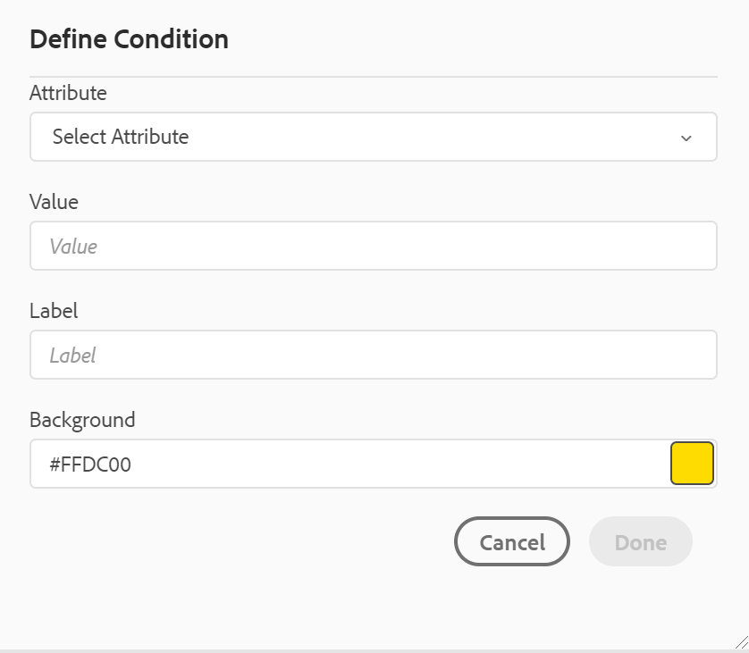{width="400" align="left"}

从“属性”列表中，选择要定义的条件属性，输入条件的值，然后指定在“条件”面板中显示的标签。 您还可以定义条件的颜色。 此颜色设置为应用条件的内容的背景颜色

要编辑条件，请选择 **编辑** 从“选项”菜单中。 此时将显示“编辑条件”对话框：

{width="400" align="left"}

以定义新条件时配置的方式指定详细信息。

**主题方案** -  

主题方案映射是一种特殊形式的DITA映射，用于定义分类主题和控制值。 根据要求，您可以创建一个主题方案映射，并在根映射文件中引用它。 AEM Guides允许您定义主题方案中主题定义的嵌套级别层次结构。

您可以轻松地在主题方案映射中创建并使用主题方案。 将此映射添加为根映射后，主题方案将显示在“主题方案”面板中。 “主题方案”面板以嵌套或分层方式显示可用的主题方案。

AEM Guides还支持嵌套级别主题方案映射，您可以在根主题方案映射下定义多个主题方案。

以下示例显示如何使用AEM Guides中的主题方案。

1. 在您选择的工具中创建主题方案文件。 以下XML代码创建主题方案，以绑定 `platform` 属性。

   ```XML
   <?xml version="1.0" encoding="UTF-8"?>
   <!DOCTYPE subjectScheme PUBLIC "-//OASIS//DTD DITA Subject Scheme Map//EN" "subjectScheme.dtd">
   <subjectScheme id="GUID-4f942f63-9a20-4355-999f-eab7c6273270">
       <title>rw</title>
       <!-- Define new OS values that are merged with those in the unixOS scheme -->
       <subjectdef keys="os">
           <subjectdef keys="linux">    </subjectdef>
           <subjectdef keys="mswin">    </subjectdef>
           <subjectdef keys="zos">    </subjectdef>
       </subjectdef>
       <!-- Define application values -->
       <subjectdef keys="app" navtitle="Applications">
           <subjectdef keys="apacheserv">    </subjectdef>
           <subjectdef keys="mysql">    </subjectdef>
       </subjectdef>
       <!-- Define an enumeration of the platform attribute, equal to       each value in the OS subject. This makes the following values       valid for the platform attribute: linux, mswin, zos -->
       <enumerationdef>
           <attributedef name="platform">    </attributedef>
           <subjectdef keyref="os">    </subjectdef>
       </enumerationdef>
       <!-- Define an enumeration of the otherprops attribute, equal to       each value in the application subjects.       This makes the following values valid for the otherprops attribute:       apacheserv, mysql -->
       <enumerationdef>
           <attributedef name="otherprops">    </attributedef>
           <subjectdef keyref="app">    </subjectdef>
       </enumerationdef>
   </subjectScheme>
   ```

   {width="300" align="left"}

1. 保存扩展名为.ditamap的文件，并将其上传到DAM中的任何文件夹。

   >[!NOTE]
   >
   > 您可以在父DITA映射中添加对主题方案文件的引用。

   {width="550" align="left"}

1. 将父映射设置为 **用户首选项**. 将此映射添加为根映射后，主题方案将显示在“主题方案”面板中。

   {width="400" align="left"}

1. 在Web编辑器中，打开要使用主题方案定义的文件。
1. 只需将所需的主题方案拖放到内容上，即可将主题方案应用于您的内容。 然后，内容会以定义的颜色突出显示。

   {width="650" align="left"}

   **处理主题定义和枚举的分层定义**

   除了处理同一映射中存在的枚举和主题定义外， AEM Guides还提供了在两个单独的映射中定义枚举和主题定义的功能。 您可以在映射中定义主题定义，在另一个映射中定义枚举定义，然后添加映射引用。 例如，以下XML代码在两个单独的映射中创建主题定义和枚举定义。

   主题定义定义见 `subject_scheme_map_1.ditamap`


   ```XML
   <?xml version="1.0" encoding="UTF-8"?> 
   <!DOCTYPE subjectScheme PUBLIC "-//OASIS//DTD DITA Subject Scheme Map//EN" "../dtd/libs/fmdita/dita_resources/DITA-1.3/dtd/subjectScheme/dtd/subjectScheme.dtd"> 
   <subjectScheme id="subject-scheme.ditamap_f0bfda58-377b-446f-bf49-e31bc87792b3"> 
   <title>subject_scheme_map_1</title> 
   <subjectdef keys="os" navtitle="Operating system"> 
   <subjectdef keys="linux" navtitle="Linux"> 
   <subjectdef keys="redhat" navtitle="RedHat Linux"/> 
   <subjectdef keys="suse" navtitle="SuSE Linux"/> 
   </subjectdef> 
   <subjectdef keys="windows" navtitle="Windows"/> 
   <subjectdef keys="zos" navtitle="z/OS"/> 
   </subjectdef> 
   </subjectScheme>  
   ```

   枚举定义存在于subject_scheme_map_2.ditamap中

   ```XML
   <?xml version="1.0" encoding="UTF-8"?> 
   <!DOCTYPE subjectScheme PUBLIC "-//OASIS//DTD DITA Subject Scheme Map//EN" "../dtd/libs/fmdita/dita_resources/DITA-1.3/dtd/subjectScheme/dtd/subjectScheme.dtd"> 
   <subjectScheme id="subject-scheme.ditamap_17c433d9-0558-44d4-826e-3a3373a4c5ae"> 
   <title>subject_scheme_map_2</title> 
   <mapref format="ditamap" href="subject_scheme_map_1.ditamap" type="subjectScheme"> 
   </mapref> 
   <enumerationdef> 
   <attributedef name="platform"> 
   </attributedef> 
   <subjectdef keyref="os"> 
   </subjectdef> 
   </enumerationdef> 
   </subjectScheme>  
   ```

   此处主题定义定义见 `subject_scheme_map_1.ditamap`  当枚举定义存在于 `subject_scheme_map_2.ditamap`. 参考 `subject_scheme_map_1.ditamap` 中还添加了 `subject_scheme_map_2.ditamap`.

   >[!NOTE]
   >
   > 作为 `subject_scheme_map_1.ditamap` 和 `subject_scheme_map_2.ditamap` 相互引用，从而解决了主题方案的问题。

   主题枚举引用按照以下优先级顺序进行解析：

   1. 相同映射
   1. 引用的映射


   如果在同一映射和引用的映射中未找到枚举，则不会解析引用。


   **“属性”下拉列表**

   您还可以使用“作者”视图中“内容属性”面板中的“属性”下拉菜单更改主题方案的值。 要更改值，请从“属性”下拉列表中选择一个值。

   {width="300" align="left"}

   您还可以通过从下拉菜单中选择多个值来应用属性的值。

   **源视图**

   您还可以从源视图中的属性下拉列表中更改值。 源视图还可以防止您添加任何不正确的值。

   {width="550" align="left"}

   **从“条件”面板查看并应用主题方案**

   您还可以从“条件”面板查看和应用主题方案。

   要从“条件”面板查看主题方案，您的系统管理员必须选择选项 **在“条件”面板中显示“主题方案”** 在“编辑器设置”的“条件”选项卡下。 有关详细信息，请参阅， [“条件”选项卡](#id21BMNE0602V).

   “条件”面板显示主题方案中主题定义的平面垂直结构。

   {width="300" align="left"}

   您可以将所需的条件拖放到内容上，从而向内容添加条件。 使用为条件定义的颜色突出显示条件内容。

**代码片段** -  

片段是小型内容片段，可在文档项目中的各个主题中重复使用。 “代码片段”面板会显示您已创建的一系列内容代码片段。 要插入代码片段，请将面板中的代码片段拖放到主题中的所需位置。 “代码片段”面板允许您添加、编辑、删除、预览和插入代码片段。

>[!IMPORTANT]
>
> 以下屏幕截图显示具有管理权限的用户。 作为具有管理权限的用户，您可以添加、编辑和删除代码片段。 否则，作为普通作者，您只会获得预览和插入代码片段的选项。

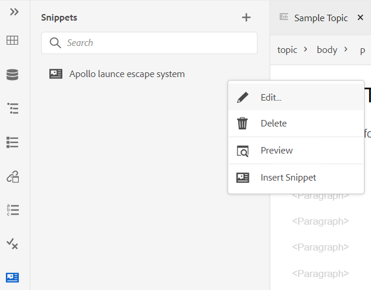{width="400" align="left"}

要添加代码片段，请使用以下任意方法：

- 单击代码片段旁边的+图标以打开“新建代码片段”对话框。

  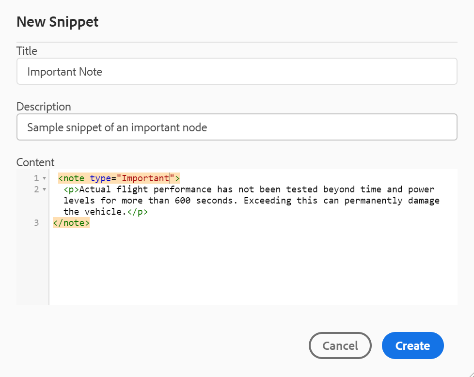{width="550" align="left"}

  在“新建代码片段”对话框中，提供出现在“代码片段”面板中的标题、描述以及要创建的代码片段内容的XML代码。 单击 **创建** 以保存并创建代码片段。

- 在内容编辑区域中，右键单击要用作片段的元素痕迹导航，然后选择 **创建代码片段** 从上下文菜单中。 此时将显示新建代码片段对话框，其中填充了所选元素的XML代码 **内容** 字段。 输入 **标题** 和 **描述** 以获取代码片段，然后单击 **创建** 以保存代码片段。

- 在内容编辑区域中，右键单击要用作代码片段的内容上的任意位置，然后选择 **创建代码片段** 从上下文菜单中。 此时将显示新建代码片段对话框，其中填充了所选元素的XML代码 **内容** 字段。 输入 **标题** 和 **描述** 以获取代码片段，然后单击 **创建** 以保存代码片段。

  以下屏幕截图突出显示痕迹导航和内容区域，您可以从中调用上下文菜单。

  {width="350" align="left"}


要插入代码片段，请使用以下任意方法：

- 从“代码片段”面板中选择一个代码片段，并将其拖放到主题中的所需位置。

- 将插入点放置在要插入代码片段的位置，从所需代码片段的“选项”菜单中选择“插入代码片段”。


>[!NOTE]
>
> 从代码片段条目的上下文菜单中，您还可以选择“编辑”、“删除”、“获取预览”或“插入代码片段”。

**模板** -  

“模板”面板仅对管理员可用。 使用此面板，管理员可以轻松创建和管理随后可供作者使用的模板。 默认情况下，模板分类为 *映射* 和 *主题* 键入模板。

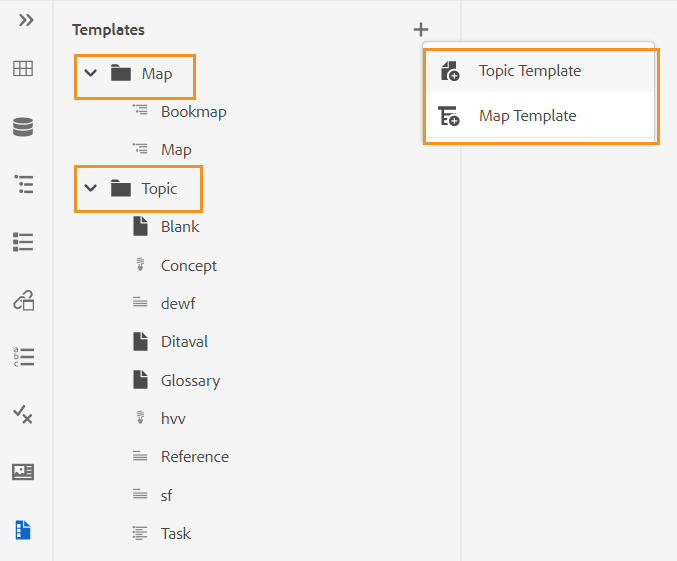{width="550" align="left"}

要创建模板，请单击“模板”旁边的+图标，然后选择要创建的模板。 如果您选择 **主题模板**，此时会显示创建新主题模板对话框：

{width="400" align="left"}

选择要从中创建的模板类型 **模板** 下拉列表。 提供 **标题**，它显示在“模板”面板中。 此 **名称** 将根据标题自动建议模板的，但是，您可以提供不同的文件名。

>[!NOTE]
>
> 如果管理员启用了基于UUID设置的自动文件名，则您将不会看到“名称”字段。

创建模板后，您需要将其添加到全局或文件夹级别的配置文件中。 添加模板后，您的作者将在主题/映射创建过程中开始看到新模板。

使用现有模板上的“选项”菜单，您可以选择 **编辑** 或 **复制** 它。 如果重复，模板的结构及类型\(document\)将保留，您可以重复使用它以从中创建另一个模板。

**审核** -  

AEM Guides提供了显示项目中所有审阅任务的功能。 您可以在查看您所属的审阅项目内查看所有审阅项目和活动审阅任务 **审核** 面板。  然后，您可以打开审阅任务以查看各种审阅人的注释。
审阅面板显示审阅任务。 作为作者，您可以使用Web编辑器处理主题中的注释。


要查看项目中存在的活动审阅任务中的审阅注释，请执行以下步骤：

1. 选择审核    ，位于左侧面板。 此 **审核** 面板打开。  系统将显示您所属的审阅项目中的所有审阅项目和活动审阅任务。

   {width="300" align="left"}
1. 选择一个审阅项目，然后从列表中选择一个审阅任务以将其打开。
1. 您还可以按以下方式筛选项目：

   - 在项目标题中输入要查找的搜索词或文本。 然后按Enter键执行搜索。 例如，您可以搜索标题中包含“space”一词的所有项目。

   - 选择   以打开 **筛选条件** 对话框。 您可以选择所有项目或仅选择特定项目。 选定的项目将列在 **审核** 面板。
     {width="300" align="left"}

     此 **由我发起的任务** 选项默认处于启用状态。 它允许您仅查看您已启动的任务。

1. 默认情况下，在审阅项目中，您将查看包含相关注释的主题平面列表。 从左边栏应用所需的过滤器，以根据主题中显示的审核注释筛选主题：

   - **查看所有主题**：列出项目中存在的所有主题。
   - **查看包含评论的主题**：仅列出包含审阅评论的主题。
1. 您还可以输入要在主题标题或文件路径中查找的搜索词或文本。 标题或文件路径中包含该术语的主题将列出。
1. 双击任何主题以在创作视图中将其打开。 您可以在 **评论** 面板。
   {width="800" align="left"}


   >[!NOTE]
   > 
   > 此 **审核** 面板和 **评论** 面板始终保持同步。 在“注释”面板中，会根据“审阅”面板中加载的审阅任务来加载注释。
   > 有关如何处理注释的详细信息，请查看 [地址审核注释](review-address-review-comments.md#).

**查找和替换** -  

“查找和替换”图标位于左侧面板的底部。 “查找和替换”面板允许您在映射或存储库内的文件夹中的文件间搜索和替换文本。 您可以查找和替换地图的所有主题以及地图内子地图中的主题。

{width="800" align="left"}

要执行全局搜索和替换，请执行以下步骤：

1. 打开全局 **查找和替换** 面板。
1. 单击 **查看** 下拉列表选择以下选项之一以执行搜索。
   - **当前映射**：要在当前打开的映射中搜索

     >[!NOTE]
     >
     > 如果您已打开映射进行编辑，则会显示此选项。

   - **路径**：要在选定的路径上搜索，请执行以下操作
   - **选择映射**：要在选定的映射中搜索，请执行以下操作

1. 您可以单击 **选项** 下拉菜单并从以下选项中进行选择：

   - **替换前签出文件**：如果您要在替换搜索词之前自动签出文件，请选择此选项。 如果您的管理员启用了配置，以在编辑之前签出文件，则此设置更相关。 启用后端设置后，您应该选择此选项。 它可防止“文件签出”对话框在做出任何更改之前提示您签出每个文件。 如果不选择此选项，则在打开文件以进行编辑之前将显示提示。
   - **仅全字**：如果要搜索整个搜索字符串，请选择此选项。 例如，如果在搜索字符串中输入over，则搜索结果将返回包含单词（如over和overview）的所有文件。 如果要限制搜索以返回输入的确切搜索词，请选择此选项。
   - **替换后创建新版本**：如果要创建新版本的主题，并且选择替换其中的文本，请选择此选项。 您还可以提供版本注释，该注释将随每个更新的文件一起添加。

     如果不选择此选项，则更改将保存在主题的当前版本中，并且不会创建新版本。

   - **包括间接引用**：如果要同时在DITA映射中搜索间接引用中的字符串，请选择此选项。 默认情况下，这是禁用的，因此仅对直接引用执行搜索。

1. 输入要查找的搜索词或文本。
1. 输入要替换搜索词的文本。
1. 按Enter键或选择 **搜索** 图标\( \)以执行搜索。
1. 从搜索结果列表中选择一个文件。 文件在内容编辑区域中打开，搜索词在内容中突出显示。
1. 打开全局 **查找和替换** 面板。
1. 单击 **查看** 下拉列表选择以下选项之一以执行搜索。

   - **当前映射**：要在当前打开的映射中搜索

     >[!NOTE]
     >
     > 如果您已打开映射进行编辑，则会显示此选项。

   - **路径**：要在选定的路径上搜索，请执行以下操作
   - **选择映射**：要在选定的映射中搜索，请执行以下操作

1. 您可以单击 **选项** 下拉菜单并从以下选项中进行选择：

   - **替换前签出文件**：如果您要在替换搜索词之前自动签出文件，请选择此选项。 如果您的管理员启用了配置，以在编辑之前签出文件，则此设置更相关。 启用后端设置后，您应该选择此选项。 它可防止“文件签出”对话框在做出任何更改之前提示您签出每个文件。 如果不选择此选项，则在打开文件以进行编辑之前将显示提示。

   - **仅全字**：如果要搜索整个搜索字符串，请选择此选项。 例如，如果在搜索字符串中输入over，则搜索结果将返回包含单词（如over和overview）的所有文件。 如果要限制搜索以返回输入的确切搜索词，请选择此选项。

   - **替换后创建新版本**：如果要创建新版本的主题，并且选择替换其中的文本，请选择此选项。 您还可以提供版本注释，该注释将随每个更新的文件一起添加。

     如果不选择此选项，则更改将保存在主题的当前版本中，并且不会创建新版本。

   - **包括间接引用**：如果要同时在DITA映射中搜索间接引用中的字符串，请选择此选项。 默认情况下，这是禁用的，因此仅对直接引用执行搜索。

1. 输入要查找的搜索词或文本。

1. 输入要替换搜索词的文本。

1. 按Enter键或选择 **搜索** 图标\( \)以执行搜索。
1. 从搜索结果列表中选择一个文件。 文件在内容编辑区域中打开，搜索词在内容中突出显示。

1. 单击 **替换单次发生次数** \( \)替换主题中当前突出显示的搜索词，或单击“下一个匹配”  或  “上一个匹配”可移动到文本的下一个或上一个匹配项。

1. 单击 **全部替换在文件中** \( \)在单击时使用替换项替换单个文件中搜索项的所有匹配项。 替换选定文件中的所有匹配项后，您会看到通知。

   >[!NOTE]
   >
   > 将鼠标悬停在搜索结果列表中的文件上，可在文件右侧看到全部替换文件图标。 您还可以获得“忽略文件”图标以从搜索结果中删除文件。 您忽略的文件将从列表中删除，搜索词不会替换在其中。

1. 单击 **全部替换** \( \)在列表顶部的任意位置，通过一次单击即可将搜索项在所有文件中出现的所有位置替换为替换项。

   >[!NOTE]
   >
   > 要启用 **全部替换** 图标，您的系统管理员必须选择选项 **启用全部替换** 在 **常规** 按Tab键进入 **编辑器设置**.


在整个系统中，一次只能执行一个“全部替换”操作，并且在执行操作之前，您会看到“全部替换”状态。 您还可以中止之间的替换所有操作或查看日志报告。 如果中止该操作，您将在收件箱中收到有关该操作的通知。 替换选定文件中的所有匹配项后，将显示一个成功通知。

{width="400" align="left"}

您还可以使用 **在地图中查找** 选项来自 **选项** 地图菜单，用于查找和替换地图中的文本。 对于在存储库面板或映射视图中打开的映射，将显示此选项。

{width="550" align="left"}

## 内容编辑区域 {#id2051EB000UI}

内容编辑区域是显示主题或地图内容的地方。 您可以在此区域中进行所有内容编辑。 它提供您正在编辑的内容的WYSIWYG视图。 您可以同时打开多个主题，这些主题会显示在各自的选项卡中。 在文件的选项卡下方，您会看到元素在当前光标位置的痕迹导航。 在内容编辑区域的右上角，将显示当前主题的版本号。

{width="650" align="left"}

## 右侧面板 {#id2051EB003YK}

右侧面板是一个永久面板，其中包含有关当前所选文档的信息。

>[!NOTE]
>
> 右侧面板可调整大小。 要调整面板的大小，请将光标置于面板边界上，光标将变为双箭头并拖动以调整面板宽度。

通过右侧面板，可访问以下功能：

**内容属性** -  

您可以通过单击右侧面板中的“内容属性”图标来访问“内容属性”功能。 “内容属性”面板包含有关文档中当前选定元素的类型及其属性的信息。 您还可以通过从下拉列表中选择属性并指定属性的值来添加属性。

>[!NOTE]
>
> 即使主题包含引用的内容，您也可以使用属性面板为其添加属性。

如果管理员为属性创建了配置文件，则您将获得这些属性及其配置的值。 使用“内容属性”面板，您可以选择这些属性，并将其分配给主题中的相关内容。 通过这种方式，您还可以创建条件内容，这些内容随后可用于创建条件输出。 有关使用条件预设生成输出的更多信息，请参阅 [使用条件预设](generate-output-use-condition-presets.md#).

{width="300" align="left"}

**文件属性** -  

通过单击右侧面板中的“文件属性”图标，查看所选文件的属性。 “文件属性”包含以下两个部分：

**常规**

通过“一般信息”部分，可访问以下功能：

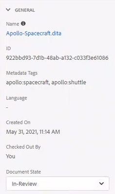{width="300" align="left"}

- **名称**：显示所选主题的文件名。 文件名会超链接至选定文件的属性页。
- **ID**：显示所选主题的ID。
- **元数据标记**：这些是主题的元数据标记。 它们是从属性页面中的标记字段设置的。
- **语言**：显示主题的语言。 它是从属性页面中的语言字段设置的。
- **创建日期**：显示创建主题的日期和时间。
- **签出者**：显示签出主题的用户。
- **文档状态**：您可以选择并更新当前打开主题的文档状态。 有关更多详细信息，请参阅 [文档状态&#x200B;](web-editor-document-states.md#)*.*

**注意：** 您可以将“文件”属性中各个字段的属性值复制到剪贴板。

**引用**

利用“参照”部分，可访问以下功能：

{width="300" align="left"}

- **使用位置**：使用位置引用列出引用或使用当前文件的文档。
- **传出链接：** “传出链接”列出当前文档中引用的文档。

将鼠标悬停在文件的引用上，并在工具提示中获取文件的文件路径和UUID。

**注意：** 所有“用于”和“传出”引用都超链接到该文档。 您可以轻松打开和编辑链接的文档。

除了打开文件之外，您还可以使用 **选项** 菜单。 您可以执行的某些操作包括编辑、预览、复制UUID、复制路径、添加到收藏夹、属性和打开映射仪表板。

**审核** -  

单击“审阅”图标会打开审阅面板，您可以在其中为当前打开的文档创建审阅任务。

{width="300" align="left"}

如果您已经创建了多个“审阅”项目，则可以从下拉列表中选择一个项目并访问审阅注释。

使用“审阅”面板，您可以查看和发布对主题评论的回复。 您可以逐一接受或拒绝注释。

有关更多信息，请参阅 [地址审核注释](review-address-review-comments.md#).

**跟踪的更改** -  

使用右侧面板的“跟踪的更改”功能，您可以查看文档中所做所有更新的信息。 您还可以搜索对文档所做的任何特定更新。

>[!NOTE]
>
> 跟踪的更改功能显示已使用主工具栏的启用/禁用跟踪更改功能跟踪的所有更新。 有关更多详细信息，请参阅 [启用/禁用跟踪更改](#id205DF0203Y4).

**父主题：**[&#x200B;使用Web编辑器](web-editor.md)
