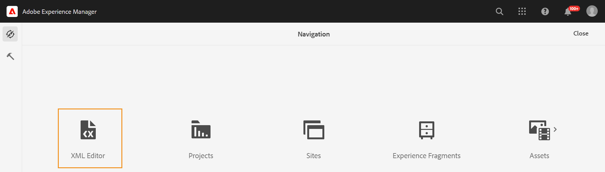

# 启动Web编辑器 {#id2056B0140HS}

您可以从以下位置启动Web编辑器：

- [AEM导航页面](#id2056BG00RZJ)
- [AEM Assets UI](#id2056BG0307U)
- [DITA映射控制台](#id2056BG090BF)

以下各节介绍了如何从不同位置访问和启动Web编辑器的详细信息。

## AEM导航页面 {#id2056BG00RZJ}

登录AEM时，将显示“导航”页面：

{width="800" align="left"}

单击 **XML编辑器** 链接会直接转到Web编辑器。

{width="800" align="left"}

在启动Web编辑器而未选择任何文件时，将显示空白的Web编辑器屏幕。 您可以从AEM存储库或收藏夹集合打开文件进行编辑。

## AEM Assets UI {#id2056BG0307U}

可以从中启动Web编辑器的另一个位置是AEM Assets UI。 您可以选择一个或多个主题，并直接在Web编辑器中打开它们。 要在Web编辑器中打开主题，请执行以下步骤：

1. 在资产UI中，导航到要编辑的主题。

   >[!NOTE]
   >
   > 您还可以看到该主题的UUID。

   。

   {width="800" align="left"}

   >[!IMPORTANT]
   >
   > 确保您对包含要编辑主题的文件夹具有读写权限。

1. 要获取该主题的独占锁定，请选择该主题并单击 **结帐**.

   >[!IMPORTANT]
   >
   > 如果您的管理员已配置 **禁用编辑而不结帐** 选项，则必须先签出文件，然后才能进行编辑。 如果未签出文件，您将看不到编辑选项。

1. 关闭资产选择模式，然后单击要编辑的主题。

   随即会显示主题的预览。

   您可以从列表视图、卡片视图和预览模式中打开Web编辑器。

   >[!IMPORTANT]
   >
   > 如果要打开多个主题进行编辑，请从资产UI中选择所需的主题，然后单击编辑。 请确保您的浏览器未启用弹出窗口阻止程序，否则只会打开选定列表中的第一个主题进行编辑。

   {width="800" align="left"}

   如果不想预览主题，但想要在Web编辑器中直接将其打开，请单击卡片视图快速操作菜单中的编辑图标：

   {width="800" align="left"}

1. 单击 **编辑** 以在Web编辑器中打开主题。

   {width="800" align="left"}

## DITA映射控制台 {#id2056BG090BF}

要从DITA映射控制台中打开Web编辑器，请执行以下步骤：

1. 在资产UI中，导航到包含要编辑的主题的DITA映射文件，然后单击该文件。

   将显示DITA映射控制台。

1. 单击 **主题**.

   将显示映射文件中的主题列表。 主题的UUID显示在主题标题的下方。

1. 选择要编辑的主题文件。

1. 单击 **编辑主题**.

   {width="800" align="left"}

1. 主题在Web编辑器中打开。

   >[!IMPORTANT]
   >
   > 如果您的管理员已配置 **禁用编辑而不结帐** 选项，则必须先签出文件，然后才能进行编辑。 如果不签出文件，则文档将在编辑器中以只读模式打开。

**父主题：**[&#x200B;使用Web编辑器](web-editor.md)

