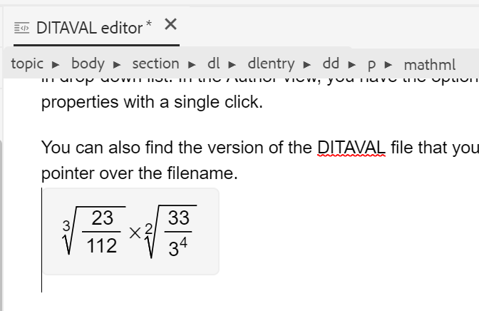
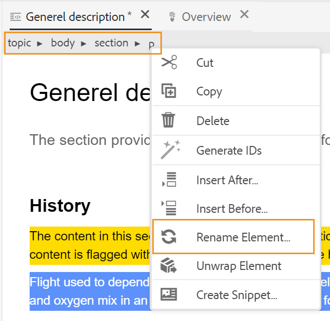

# Web编辑器中的其他功能 {#id2056B0B0YPF}

Web编辑器中还有一些其他有用功能可供您使用：

**文件选项卡上的上下文菜单函数**

在Web编辑器中打开文件时，可以从上下文菜单中执行各种操作。 您可能会看到不同的选项，具体取决于您是打开媒体文件、单个DITA文件还是多个文件。

**媒体文件**

在打开的媒体文件选项卡的上下文菜单中，您可以获得以下函数：

{width="300" align="left"}

**单个DITA文件**

在已打开文件选项卡的上下文菜单中，您可以获得以下函数：

:   {width="300" align="left"}

**多个文件**

打开多个文件后，上下文菜单中会显示更多选项：

{width="550" align="left"}

上下文菜单中的各种选项说明如下：

***保存***:您可以从以下选项中进行选择：

- **保存**:要保存文件而不创建新版本，请选择 **保存**. 每当您创建新主题时，都会在DAM中创建该主题的无版本工作副本。 保存文档会更新DAM中文档的工作副本。 对此版本执行简单保存操作不会创建主题的新版本。 如果您的主题正在审阅中，保存主题不会授予您的审阅人访问更改的主题内容的权限。

- **全部保存**:如果在Web编辑器中打开了多个文档，则您还可以选择 **全部保存** 打开的文档。

***另存为新版本***

要创建文件的新版本，请选择 **另存为新版本**. 有关 **保存** 和 **另存为新版本**，请参阅 [了解Web编辑器功能](web-editor-features.md#).

***复制***:您可以从以下选项中进行选择：

- **复制UUID**:要将当前活动文件的UUID复制到剪贴板，请选择 **复制\>复制UUID**.
- **复制路径**:要将当前活动文件的完整路径复制到剪贴板，请选择 **复制\>复制路径**.

***定位于***:您可以从以下选项中进行选择：

- **地图**:如果您已打开大型DITA映射，并想要在映射中查找文件的确切位置，请选择 **在\>映射中找到**. 当您选择在映射中查找选项时，将在映射层次结构中找到并突出显示文件\（从中调用该选项的位置\）。 要使用此功能，必须在Web编辑器中打开映射文件。 如果“映射视图”处于隐藏状态，则调用此功能将显示“映射视图”，并且文件会在映射层次结构中突出显示。

- **存储库**:与“在地图中定位”类似， **在\>存储库中找到** 显示文件在存储库\（或DAM\）中的位置。 此时将打开“存储库视图”，并在存储库中突出显示所选文件。 如果文件位于文件夹内，则将展开该文件夹以显示所选文件在存储库中的位置。

***添加到***:您可以从以下选项中进行选择：

- **收藏夹**:要将所选文件添加到收藏集，请选择 **添加到\>收藏夹**. 有关更多详细信息，请参阅 **收藏夹** 中的功能描述 [左面板](web-editor-features.md#id2051EA0M0HS) 中。

- **可重用内容**:要将所选文件复制到可重用内容列表，请选择 **添加到\>可重用内容**. 有关更多详细信息，请参阅 **可重用内容** 中的功能描述 [左面板](web-editor-features.md#id2051EA0M0HS) 中。

***属性***

要查看所选文件的AEM属性页面，请选择 **属性**.

***拆分***:您可以从以下选项中进行选择：

**上、下、左或右**

默认情况下，Web编辑器允许您一次查看一个主题。 可能存在希望同时查看两个或多个主题的实例。 拆分编辑器屏幕允许您同时查看多个主题。 例如，如果您有两个主题 — 在编辑器中打开A和B。 右键单击主题B并选择 **拆分\>向上** 将编辑器窗口分为两部分。 主题B显示在上半部分，主题A显示在下半部分。 同样，您也可以通过选择 **拆分\>左** 或 **Split \> Right**. 以下Web编辑器屏幕截图显示水平和垂直拆分的主题。 在每个拆分中，您可以有不同的视图。 例如，在以下屏幕截图中，屏幕1处于源视图模式，屏幕2在创作模式下打开了两个文档，屏幕3处于预览模式。 您可以将文档从一个屏幕移动到另一个屏幕，方法是将文件选项卡拖放到要放置它的屏幕上。 同样，您也可以根据自己的首选项通过拖动和移动文件选项卡来重新排序文件选项卡。

{width="800" align="left"}

***快速生成***

为所选文件生成输出。 只能为输出预设中包含的文件生成输出。 有关更多详细信息，请参阅 [从Web编辑器中基于文章的发布](web-editor-article-publishing.md#id218CK0U019I).

***关闭***:您可以从以下选项中进行选择：

**关闭**, **关闭其他**&#x200B;或 **全部关闭**

如果要关闭从中调用上下文菜单的文件，请选择 **关闭\>关闭**. 使用 **关闭\>关闭其他** 关闭除当前活动文件之外的所有其他打开的文件。 要关闭所有打开的文件，请选择 **关闭\>全部关闭** 选项，或者您也可以选择关闭Web编辑器。 如果会话中存在任何未保存的文件，则系统会提示您保存这些文件。

**文件关闭和保存方案**

当您尝试使用 **关闭** 按钮，或 **关闭** 选项时，AEM Guides会提示您保存所编辑内容并解锁锁定的文件。

提示基于管理员选择的以下配置：

- **在关闭时要求签入：** 当您关闭编辑器时，系统会为您提供签入文件\（您已签出该文件\）的选项。
- **关闭时请求获取新版本**:当您关闭编辑器时，系统会为您提供选项，以将文件\（您已编辑\）另存为新版本。

您的文件保存体验将取决于以下三种情况，其中您具有：

- 未对内容进行任何更改。
- 编辑了内容并保存了更改。
- 已编辑内容，但未保存更改。

根据文件是已锁定/已解锁，并且已保存还是未保存的更改，您可能会看到以下选项：

- **解锁和关闭**:文件上的锁已释放，文件随即会关闭。

   {width="400" align="left"}

- **另存为新版本**:这将保存您在内容中所做的更改并创建文件的新版本。 您还可以为新保存的版本添加标签和注释。 有关保存新版本的更多信息，请参阅 [另存为新版本](web-editor-features.md#save-as-new-version-id209ME400GXA).

- **解锁文件**:如果选择解锁文件，它将解除对文件的锁定，并且更改将保存在文件的当前版本中。

>[!NOTE]
>
> 如果取消选择解锁文件的选项，则还会获得一个选项，该选项可关闭文件而不保存更改。

例如，以下屏幕截图中显示了其中一个提示：

{width="400" align="left"}

**引用损坏的视觉提示**

- 如果您的主题包含损坏的交叉引用或内容引用，则它们将以红色文本显示。

**智能复制粘贴**

- 您可以轻松地在主题内和跨主题复制粘贴内容。 源元素结构在目标处保持。 此外，如果复制的内容包含内容引用，则即使是这些内容也会被复制。

**记住上次浏览的位置**

- Web编辑器提供了一个智能文件浏览对话框。 编辑器在插入引用或内容时会记住上次使用的位置。 首次调用文件浏览对话框\（通过插入引用或插入重用内容\）时，将转到当前文档的保存位置。 在同一会话中，如果尝试插入另一个引用，则文件浏览对话框会自动导航到插入最后一个引用的位置。

>[!NOTE]
>
> 对于图像、音频或视频文件，文件浏览对话框默认为文件的位置，而不是上次使用的位置。

**支持基于文章的发布**

- 在Web编辑器中，您可以为一个或多个主题或整个DITA映射生成输出。 您需要为DITA映射创建输出预设，然后可以轻松地为一个或多个主题生成输出。 如果您更新了映射中的几个主题，则也只能从Web编辑器中为这些主题生成输出。 有关更多详细信息，请参阅 [从Web编辑器中基于文章的发布](web-editor-article-publishing.md#id218CK0U019I).

**支持Markdown文档**

- Web编辑器允许您将Markdown文档\(.md\)与DITA文档一起使用。 您可以在Web编辑器中轻松创作和预览Markdown文档，还可以通过DITA映射编辑器将其添加到映射文件中。 有关更多详细信息，请参阅 [从Web编辑器创作Markdown文档](web-editor-markdown-topic.md#).

**支持DITA术语表主题**

- Web编辑器支持可通过添加 `term` 或 `abbreviated-form` 元素。

**插入MathML方程**

- AEM指南为您提供了开箱即用的支持，可通过与 [MathType Web](https://docs.wiris.com/en/mathtype/mathtype_web/intro) 应用程序。 要插入MathML方程式，请单击 **插入元素** 图标，然后键入mathml。 从列表中选择mathml元素时，将显示插入MathML对话框：

{width="550" align="left"}

使用MathML方程式工具创建您的方程式，然后单击“插入”(Insert)将其添加到文档中。 方程式带有浅灰色背景，如下所示：

{width="400" align="left"}

您可以随时通过右键单击现有方程式并选择 **编辑MathML** 中。

**插入脚注**

- 使用 `fn` 元素。 在创作模式下，脚注值与内容内嵌显示。 但是，当您切换“预览”模式或发布文档时，脚注将显示在主题的末尾。

**重命名或替换元素**

- Web编辑器在主题顶部显示元素的痕迹导航。 如果要将某个元素交换或替换为其他元素，则可以从痕迹导航的上下文菜单中执行此操作。 例如，您可以 `p` 元素 `note` 或上下文中的任何其他有效元素。

{width="400" align="left"}

在痕迹导航中，右键单击要替换的元素名称，然后从上下文菜单中选择重命名元素。 “重命名元素”对话框显示在当前位置允许的所有有效元素。 从“重命名元素”对话框中，选择要使用的元素。 原始元素将被替换为新元素。

除了痕迹导航的上下文菜单外，还可以从其他位置访问“重命名元素”对话框：

- 单击痕迹导航上的元素名称以选择元素的内容，然后右键单击选定的内容以显示上下文菜单。

- 启用“标记”视图，单击任何元素的开始标记，然后右键单击选定的内容以显示上下文菜单。

- 通过调用“大纲”面板中某个元素的“选项”菜单，可以访问“重命名元素”对话框。

**取消元素换行**

- 展开元素允许您从选定文本中删除元素标记，并将其与其父元素合并。 例如，如果您的 `p` 元素 `note` 元素中，您可以 `p` 元素来直接在 `note` 元素。 主题痕迹导航的上下文菜单中提供了“取消元素换行”选项。 要取消元素换行，请从主题的痕迹导航中选择元素，然后右键单击该元素以打开上下文菜单，最后选择“取消元素换行”以删除该元素，并将元素的文本与其父元素合并。

**保留换行符和缩进**

- 包含换行符和空格的DITA元素在创作、源或预览模式以及最终发布的输出中均受支持，并根据其定义进行渲染。 以下屏幕截图显示了 `msgblock` 保留换行符和空格\（缩进\）的元素：

{width="500" align="left"}

**自动生成元素ID**

- 您可以自动为DITA主题中的元素生成ID。 这些ID在DITA主题中是唯一的。 例如，如果您为段落元素生成ID，则ID将为p\_1、p2、p\_3，等等。 您可以选择多个元素并为每个选定的元素生成ID。

执行以下操作以自动为一个或多个元素生成ID:

1. 在Web编辑器中打开主题。
1. 选择要为其分配ID的内容。
1. 右键单击并选择 **从上下文菜单生成ID。**

   或者，您也可以右键单击痕迹导航，然后选择 **生成ID**.

**父主题：**[&#x200B;使用Web编辑器](web-editor.md)

