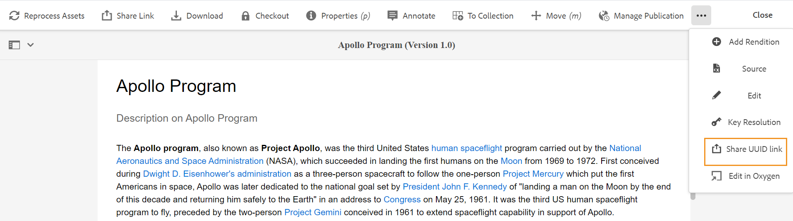
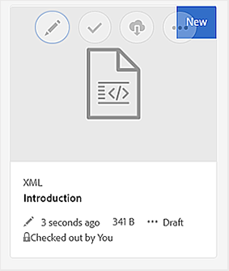

# 预览主题 {#id1696II000QR}

创建主题后，AEM指南会生成该主题的预览。 “预览”模式提供了可用于处理文档的各种功能。

执行以下步骤以预览主题：

1. 在资产UI中，导航到要查看的主题。
1. 单击要查看的主题。

   资产UI中会显示主题的预览。

   >[!NOTE]
   >
   > 您可以在主题文件选项卡的右上角看到活动主题的版本或DITA映射。

   >[!IMPORTANT]
   >
   > 以下功能在“预览”工具栏中的位置可能因AEM服务器的设置而异。 某些功能可能在主工具栏中可用，而其他功能则可能在“更多”菜单下可用。

## 预览模式下可用的功能

{width="800" align="left"}

您可以在预览模式下从工具栏中执行以下操作：

**属性**

查看所选主题的属性。 根据您的AEM版本，您可以看到诸如元数据、计划\(de\)激活、引用、文档状态等属性。

>[!NOTE]
>
> 主题的title属性将从 `title` DITA主题或映射的标记。 如果您使用属性窗口在标题中进行任何更改，则更改将丢失。 如果要更新title属性，应使用Web编辑器来执行此操作。

“属性”页面包含有关引用的有用信息，例如在何处使用映射或主题，或文档中包含哪些引用。 “属性”(Properties)页面列出了文档的两种引用类型 —  **在中使用** 和 **传出引用**.

的 **在中使用** 引用列出引用或使用当前文件的文档。 的 **传出引用** 列出当前文档中引用的文档。

在 **在中使用** “引用”部分允许您进一步向上导航，以查找正在使用或引用该主题的位置。

{width="800" align="left"}

单击 文档旁边的图标会显示引用该文档的映射文件或主题文件。

**条件筛选\(A/B\)**

如果您的主题包含条件内容，则您将在工具栏中看到A/B图标。 单击此图标会打开一个弹出窗口，通过该弹出窗口，您可以根据主题中的可用条件筛选内容。

>[!NOTE]
>
> 在Web编辑器中，条件内容使用浅色背景颜色突出显示。

{width="300" align="left"}

**编辑**

- 在Web编辑器中打开要编辑的主题。 的 **编辑** 选项在管理员已启用 **禁用编辑而不结帐** 选项。 启用选项后，您将看到 **编辑** 选项。

**关键分辨率**

- 如果要为主题使用键空间文件，请单击键分辨率图标。 然后，您可以从“键分辨率”弹出窗口中选择键空间。

**来源**

- 打开文件的XML源代码。 您可以通过在“预览”模式下打开文件并单击“源”图标，来查看映射、主题或DITAVAL文件的基础XML代码。 “XML源”弹出窗口显示XML源代码。 您可以从文件中选择特定代码，或按 `Ctrl`+`a` 来选择整个内容。

   >[!NOTE]
   >
   > 要获取DITA映射文件的源代码视图，请在资产UI中选择该文件，然后单击源。

   {width="800" align="left"}

**共享UUID链接**

- AEM指南允许您从以下位置共享DITA映射、主题和图像文件的基于UUID的链接：

   - 资产UI
   - DITA映射的控制台
   - 主题或图像的预览

新选项 **共享UUID链接** 中的“隐藏主体”(Analytics)。 以下屏幕截图显示了 **共享UUID链接** 选项：

{width="800" align="left"}

在资产UI中，当您选择文件时，会显示此选项。 在预览模式下，此选项默认位于主工具栏中。 在DITA映射控制台中，此选项显示在输出预设部分中。

复制URL后，可以与其他用户共享该URL，以便他们直接访问文件。 即使将文件移动到存储库中的其他位置，此链接仍然有效。 链接失败的唯一时间是从存储库中删除文件。

如果您从DITA映射控制台或文件的预览模式共享链接，则用户将转到同一文件视图。 但是，当您从资产UI中共享映射文件的链接时，用户会被带到映射的控制台。 同样，对于主题或图像文件，也会显示文件的预览。

>[!IMPORTANT]
>
> 该链接不能用作其他主题中的引用链接，它仅允许直接访问存储库中的文件。 此外，只要文件在存储库中可用，该链接就会保持有效。 即使将文件移动到存储库中的其他位置，该链接仍然有效。 仅当从存储库中删除文件时，链接才会失败。

**签出/签入**

- 切换“检出”和“检入”功能。 签出文件后，当前用户将获得该文件的独占写入权限。 可以在Web编辑器中打开已签出的文件进行编辑。 完成所需更改后，单击签入图标以将文件保存到DAM中。

签出主题时，文件状态会在卡片视图和列表视图中显示为已签出。

在卡片视图中签出文件：

{width="300" align="left"}

在列表视图中签出文件：

{width="550" align="left"}

如果“检出”(Checked Out)列不可见，请选择 **查看设置** 在 **列表视图** ，然后选择 **签出** 状态 **配置列** 对话框。

{width="800" align="left"}

>[!TIP]
>
> 有关使用文件签出和签入的最佳实践，请参阅最佳实践指南中的内容版本控制部分。

**基于Web的版本差异**

- 如果您的主题已经进行了一些更改，则可以轻松了解该主题不同版本中所做的更改。 要了解主题不同版本中的更改，请执行以下操作：

   >[!IMPORTANT]
   >
   > 以下过程中描述的方法仅适用于DITA文件。 对于非DITA文件，请使用“时间轴”视图创建文件版本或恢复文件的现有版本。

   1. 在预览模式下打开主题。

   1. 在左边栏中，单击 **版本历史记录** ，然后选择一个版本。

      {width="800" align="left"}

   1. 从列出的版本中，选择要用作基本版本的版本，然后单击 **预览版本**. 所选版本的预览将显示在“版本预览”窗口中。

   1. 从 **显示差异** 列表中，选择要比较基本版本的版本。

      {width="800" align="left"}

      在主题预览中会突出显示更改的内容。 以绿色突出显示的内容表示新添加的内容，以红色显示的内容表示已删除的内容。

      {width="800" align="left"}

### 分支、还原和后续版本控制 {#id193PG0Y051X}

- 在典型的创作环境中，您需要创建主题的新分支以满足特定版本的需求。 与任何其他版本管理系统一样，AEM指南允许您从主题的现有版本创建分支，或将主题还原到旧版本。 使用AEM指南提供的版本管理功能，您可以执行以下任务：

   - 从主题的现有版本创建分支
   - 在新分支中创建后续版本
   - 还原到主题的特定版本

   下图显示了典型的分支和后续版本控制系统：

   {width="550" align="center"}

   对于任何新主题，第一个版本的编号为1.0。之后，每个新版本的主题都会使用增量编号进行保存，如1.1、1.2等。 创建主题的分支后，将创建一个新分支，该分支采用创建分支的起始版本号，并在版本末尾添加。0。 如插图所示，从主题版本1.1创建了一个新分支。 新分支的版本控制为1.1.0。此后，每次在此分支中保存新版本的主题时，都会获得增量版本号，如1.1.1、1.1.2等。

   与分支类似，您还可以将工作版本或当前版本还原到存储库中存在的任何版本。 要还原到某个版本，只需选择所需的主题版本并单击 **还原到此版本** 在 **版本历史记录** 的上界。

   执行以下步骤以创建分支、还原到某个版本并维护主题的后续版本：

   >[!IMPORTANT]
   >
   > 以下过程中描述的方法仅适用于DITA文件。 对于非DITA文件，请使用“时间轴”视图创建文件版本或恢复文件的现有版本。

   1. 在资产UI中访问主题。

      >[!NOTE]
      >
      > 您还可以在预览模式下打开主题并继续执行步骤3。

   1. 选择要为其创建分支的主题。

   1. 在左边栏中，单击 **版本历史记录**.

      >[!NOTE]
      >
      > 随即会显示所选主题可用的版本列表。 每个版本都包含时间戳、用户名、版本注释和 [标签](web-editor-use-label.md#) 信息。

   1. 选择要从中创建分支的版本。 在以下屏幕截图中，选择了版本1.2以创建分支。

      {width="300" align="left"}

      >[!NOTE]
      >
      > 主题的当前版本包含 *\（当前\）* 版本号旁边。

   1. 单击 **还原到此版本**.

      此时会显示一条消息，要求您确认创建新分支。

   1. *\（可选\）* 在消息提示中，您会获得一个选项，用于选择 **将当前工作副本另存为新版本**. 根据选择的此选项，可以执行以下两项操作：

      - 如果选择此选项，则会从版本1.1中创建分支。此外，还会从主题的当前工作副本创建新版本的主题，并另存为下一个版本 — 1.4。

         {width="300" align="left"}

         版本1.2将成为您当前的主题工作副本。 创建后保存的任何版本都位于1.1的新分支下。例如，此分支中新主题的后续版本将另存为1.2.0。

         {width="300" align="left"}

      - 如果未选择此选项，则不会从主题的当前工作副本中创建新版本。 从主题版本1.2创建新分支。 该主题的任何后续版本都将另存为1.2.0、1.2.1等分支下。

         {width="300" align="left"}
   1. 单击&#x200B;**确定**。
   将根据所选主题版本创建新分支。 上述过程还适用于还原到某个主题的特定版本。 从技术上讲，还原到特定版本意味着您从所选版本创建新分支，并将该版本作为主题的当前工作副本。 您还可以在版本还原历史记录报表中查看已还原的文件的历史记录。 有关此报表的更多详细信息，请参阅 [还原的文件版本历史记录报表](reports-reverted-file-version-history.md#).

**父主题：**[&#x200B;创建和预览主题](create-preview-topics.md)

