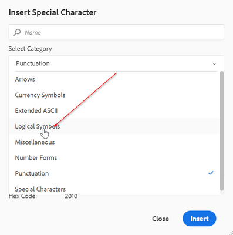

# 如何在Web编辑器工具栏中配置其他特殊字符

Web编辑器工具栏中有一个快捷方式选项，允许作者插入特殊字符。
下面的屏幕截图中也显示了这一点：


这些字符列表可在此处进行配置。 如果需要为此添加更多字符，请按照以下步骤操作：

+ 登录AEM并打开CRXDE Lite模式。

+ 在以下位置创建symbols.json文件：“/apps/fmdita/xmleditor/”(可以从 — &#39;/libs/fmdita/clientlibs/clientlibs/xmleditor/symbols.json&#39;位置复制默认值)

+ 在symbols.json文件中将特殊字符定义添加为：

```
{
      "label": "Logical Symbols",
      "items": [
        {
          "name": "≥",
          "title": "Greater-Than or Equal To"
        },
        {
          "name": "≤",
          "title": "Smaller-Than or Equal To"
        }
      ]
}
```

symbols.json文件的结构说明如下：

+ &quot;label&quot;:&quot;逻辑符号&quot;:这指定特殊字符的类别。 在代码片段中，定义了名为“逻辑符号”的类别。

+ &quot;items&quot;:它定义类别中特殊字符的集合。

+ &quot;name&quot;:&quot;≥&quot;, &quot;title&quot;:“大于或等于”：这是特殊字符的定义。 该标签以“name”标签开头，不得更改该标签。 名称后跟特殊字符。 “标题”是特殊字符的名称或标题，显示为该特殊字符的工具提示。

您可以在一个类别中定义多个特殊字符的定义。

这将在特殊字符对话框中添加其他类别：




>[!MORELIKETHIS]
>
>+ [安装和配置指南](https://helpx.adobe.com/content/dam/help/en/xml-documentation-solution/3-6/XML-Documentation-for-Adobe-Experience-Manager_Installation-Configuration-Guide_EN.pdf)

